### **Understanding the `metric_L2 MPI` Metric**  

This metric measures the **L2 cache miss rate per instruction**, accounting for all types of accesses (code, data, RFO, and prefetches). Here’s a breakdown of its components:

---

### **1. Metric Components**
| Component               | Description                                                                 |
|-------------------------|-----------------------------------------------------------------------------|
| **`L2_LINES_IN.ALL`**   | Counts all lines allocated in L2 (due to misses from L1). Includes:<br> • Demand loads/stores (data).<br> • Instruction fetches (code).<br> • RFO (Read-For-Ownership) for stores.<br> • Hardware prefetches. |
| **`INST_RETIRED.ANY`**  | Total executed instructions (normalizes misses per instruction).            |
| **Formula (`a/b`)**     | **L2 Misses per Instruction (MPI)** = `L2_LINES_IN.ALL / INST_RETIRED.ANY`. |

---

### **2. What Does This Metric Reveal?**
- **High L2 MPI** → Poor locality, thrashing, or inefficient prefetching.  
- **Low L2 MPI** → Most requests hit in L2 (good for performance).  

#### **Typical Causes of High L2 MPI**
1. **Inefficient Data Access Patterns**  
   - Strided or random memory access (e.g., linked lists).  
   - Small working sets that don’t fit in L1 but fit in L2 (e.g., 128KB–1MB).  
2. **RFO Overhead**  
   - Frequent stores to shared/modified lines (invalidations → L2 misses).  
3. **Prefetching Issues**  
   - Too aggressive (pollutes L2) or too conservative (misses opportunities).  

---

### **3. How to Optimize?**
#### **A. Reduce L2 Misses (Data/Code)**
- **Data Structure Optimization**  
  - Use contiguous arrays (not linked lists).  
  - Align to cache lines (avoid false sharing).  
  ```c
  alignas(64) int array[1024]; // 64B alignment
  ```
- **Loop Blocking (Tiling)**  
  - Break large loops into L2-friendly chunks.  
  ```c
  for (int i = 0; i < N; i += BLOCK_SIZE) { // Process BLOCK_SIZE elements at a time
      for (int j = i; j < i + BLOCK_SIZE; j++) { ... }
  }
  ```

#### **B. Reduce RFO Overhead**
- **Batch Stores**  
  - Combine small writes into larger ones (fewer RFOs).  
- **Non-Temporal Stores**  
  - Bypass caches for large writes (e.g., `memset`).  
  ```c
  _mm256_stream_ps((float*)ptr, data); // No RFO, no L2 allocation
  ```

#### **C. Tune Prefetching**
- **Enable/Disable HW Prefetch**  
  ```bash
  # Intel: Control HW prefetchers (check BIOS or MSR)
  wrmsr -a 0x1A4 0x0F  # Disable all prefetchers (for testing)
  ```
- **Software Prefetching**  
  ```c
  _mm_prefetch(&array[i + 16], _MM_HINT_T0); // Prefetch into L1/L2
  ```

---

### **4. Comparing with Other Metrics**
| Metric               | Focus                          | Formula                          |
|----------------------|--------------------------------|----------------------------------|
| **L2 MPI**           | All L2 misses (code+data+RFO)  | `L2_LINES_IN.ALL / INST_RETIRED` |
| **L2 Demand MPI**    | Only demand misses (no prefetch)| `L2_LINES_IN.DEMAND / INST_RETIRED` |
| **L2 Code MPI**      | Instruction misses             | `L2_LINES_IN.ICODE / INST_RETIRED` |

---

### **5. Example Analysis**
#### **Case 1: High L2 MPI in a Matrix Multiply**
- **Problem**: Strided access → L2 thrashing.  
- **Fix**: Use blocking/tiling.  
  ```c
  // Before: Naive loop (poor locality)
  for (int i = 0; i < N; i++)
      for (int j = 0; j < N; j++)
          C[i][j] += A[i][k] * B[k][j];
  
  // After: Tiled loop (L2-friendly)
  for (int ii = 0; ii < N; ii += BLOCK)
      for (int jj = 0; jj < N; jj += BLOCK)
          for (int kk = 0; kk < N; kk += BLOCK)
              for (int i = ii; i < ii + BLOCK; i++)
                  for (int j = jj; j < jj + BLOCK; j++)
                      for (int k = kk; k < kk + BLOCK; k++)
                          C[i][j] += A[i][k] * B[k][j];
  ```

#### **Case 2: High RFO Overhead**
- **Problem**: False sharing between threads.  
- **Fix**: Pad shared data.  
  ```c
  struct { int x; char padding[64 - sizeof(int)]; }; // 64B alignment
  ```

---

### **6. Tools to Debug L2 MPI**
- **`perf`**:  
  ```bash
  perf stat -e L2_LINES_IN.ALL,INST_RETIRED.ANY -a -- ./program
  ```
- **Intel VTune**:  
  - Profile "Cache Misses" → Identify hotspots.  
- **`likwid-perfctr`**:  
  ```bash
  likwid-perfctr -C 0 -g L2CACHE -m ./program
  ```

---

### **Key Takeaways**
1. **L2 MPI** measures how often L2 is bypassed (higher = worse).  
2. **Optimize** with:  
   - Data locality (blocking, alignment).  
   - RFO reduction (batching, NT stores).  
   - Prefetch tuning (HW/SW).  
3. **Compare** with `L2_LINES_IN.DEMAND` to isolate prefetch effects.  

Would you like help analyzing your specific workload’s L2 MPI?


### **Understanding the `metric_L2 Any local request that HITM in a sibling core (per instr)` Metric**  

This metric measures the **frequency of L2 cache requests that result in a "Hit Modified" (HITM) snoop response from a sibling core**, normalized per instruction. It highlights **cache coherence overhead** in multi-core systems.  

---

### **1. Key Components**  
| Component | Description |  
|-----------|-------------|  
| **`OCR.READS_TO_CORE.L3_HIT.SNOOP_HITM`** | Counts L2 requests where: <br> • The line was **modified (M-state)** in another core’s L1/L2.<br> • The request triggered a **snoop HITM** (core-to-core transfer). |  
| **`INST_RETIRED.ANY`** | Total executed instructions (normalization factor). |  
| **Formula (`a/c`)** | **HITM rate per instruction** = Snoop HITM events / instructions. |  

---

### **2. What Does a High HITM Rate Indicate?**  
- **False Sharing**: Cores are **fighting over the same cache line** (e.g., different vars in one line).  
- **True Sharing**: Legitimate contention (e.g., threads updating a shared counter).  
- **Inefficient Locking**: Spinlocks/atomics causing excessive coherence traffic.  

#### **Example Scenario**  
```c
// Core 1 writes to `x`, Core 2 writes to `y` (same cache line)
int x, y; // Unpadded (assume same 64B line)
```
1. Core 1 writes `x` → line marked **Modified (M)** in Core 1’s L1.  
2. Core 2 writes `y` → **RFO** triggers snoop, discovers line is **M in Core 1**.  
3. **HITM occurs**: Core 1 flushes the line to L3, Core 2 reads it.  
4. Metric increments.  

---

### **3. How to Reduce HITM Events?**  
#### **A. Fix False Sharing**  
- **Pad shared data** to separate cache lines:  
  ```c
  struct { int x; char padding[64 - sizeof(int)]; }; // 64B alignment  
  ```
- **Use thread-local storage** where possible.  

#### **B. Optimize True Sharing**  
- **Batch updates** (reduce per-line contention).  
- **Use atomic-free algorithms** (e.g., RCU, per-thread counters + reduction).  

#### **C. NUMA-Aware Placement**  
- Bind threads to cores sharing L3 (reduces cross-socket snoops).  
  ```bash
  numactl --cpunodebind=0 --membind=0 ./program
  ```

---

### **4. Tools to Debug HITM**  
#### **Linux `perf`**  
```bash
# Count HITM events
perf stat -e OCR.READS_TO_CORE.L3_HIT.SNOOP_HITM -a -- ./program
```
#### **Intel VTune**  
- Profile **"Synchronization"** or **"False Sharing"** hotspots.  

#### **`likwid-perfctr`**  
```bash
likwid-perfctr -C 0 -g CACHE -m ./program
```

---

### **5. Interpreting the Metric**  
| HITM Rate | Likely Cause | Action |  
|-----------|--------------|--------|  
| **> 0.01/instr** | Severe false sharing | Pad data, check atomics |  
| **0.001–0.01/instr** | Moderate contention | Optimize locking |  
| **< 0.001/instr** | Normal for shared workloads | Monitor for outliers |  

---

### **6. Example Optimization**  
#### **Before (False Sharing)**  
```c
int counter[4]; // Threads update counter[thread_id] (same line)
```
- **High HITM**: All threads contend on one cache line.  

#### **After (Padded)**  
```c
struct { int val; char pad[60]; } counter[4]; // Separate lines
```
- **HITM drops to near-zero**.  

---

### **Key Takeaways**  
1. **HITM = Core A needs a line modified by Core B** → Coherence overhead.  
2. **High HITM harms performance** (stalls, DRAM traffic).  
3. **Fix with padding, NUMA, and lock-free algorithms**.  

Would you like help analyzing a specific HITM-heavy workload?

Here’s a structured summary of the **CPU performance metrics** you’ve referenced earlier, along with their **experience-based thresholds** for quick identification of bottlenecks:

---

### **1. Cache Miss Metrics**
#### **(a) `metric_L1D MPI` (L1 Data Cache Misses per Instruction)**
- **Metric**:  
  ```xml
  <metric name="metric_L1D MPI (includes data+rfo w/ prefetches)">
    <event alias="a">L1D.REPLACEMENT</event>
    <event alias="b">INST_RETIRED.ANY</event>
    <formula>a/b</formula>
  </metric>
  ```
- **Thresholds**:  
  - **< 0.05** ✅ (Good)  
  - **0.05–0.1** ⚠️ (Investigate)  
  - **> 0.1** ❌ (Poor, optimize data locality)  

#### **(b) `metric_L2 MPI` (L2 Cache Misses per Instruction)**
- **Metric**:  
  ```xml
  <metric name="metric_L2 MPI (includes code+data+rfo w/ prefetches)">
    <event alias="a">L2_LINES_IN.ALL</event>
    <event alias="b">INST_RETIRED.ANY</event>
    <formula>a/b</formula>
  </metric>
  ```
- **Thresholds**:  
  - **< 0.02** ✅ (Good)  
  - **0.02–0.05** ⚠️ (Check prefetching/data layout)  
  - **> 0.05** ❌ (Thrashing, false sharing likely)  

#### **(c) `metric_L3 MPI` (L3/LLC Misses per Instruction)**
- **Typical Events**: `LLC_MISSES.ANY / INST_RETIRED.ANY`  
- **Thresholds**:  
  - **< 0.005** ✅ (Working set fits in LLC)  
  - **0.005–0.01** ⚠️ (NUMA/bandwidth may bottleneck)  
  - **> 0.01** ❌ (Excessive DRAM access)  

---

### **2. Cache Coherence Metrics**
#### **(a) `metric_L2 Any local request that HITM in a sibling core`**
- **Metric**:  
  ```xml
  <metric name="metric_L2 Any local request that HITM in a sibling core">
    <event alias="a">OCR.READS_TO_CORE.L3_HIT.SNOOP_HITM</event>
    <event alias="b">INST_RETIRED.ANY</event>
    <formula>a/b</formula>
  </metric>
  ```
- **Thresholds**:  
  - **< 0.001** ✅ (Low contention)  
  - **0.001–0.01** ⚠️ (Check false sharing)  
  - **> 0.01** ❌ (Severe coherence storms)  

#### **(b) RFOs per Instruction**
- **Typical Events**: `L1D.REPLACEMENT:DEMAND_RFO / INST_RETIRED.ANY`  
- **Thresholds**:  
  - **< 0.005** ✅ (Minimal store overhead)  
  - **0.005–0.02** ⚠️ (Optimize write batching)  
  - **> 0.02** ❌ (Use non-temporal stores)  

---

### **3. Memory Bandwidth Metrics**
#### **(a) DRAM Bandwidth Utilization**
- **Metric**: `UNC_M_CAS_COUNT.RD + WR / Time`  
- **Thresholds**:  
  - **< 50%** ✅ (Underutilized)  
  - **50–80%** ⚠️ (Healthy)  
  - **> 80%** ❌ (Saturated, may throttle)  

#### **(b) NUMA Remote Access Ratio**
- **Metric**: `UNC_M_REMOTE_ACCESS / UNC_M_LOCAL_ACCESS`  
- **Thresholds**:  
  - **< 10%** ✅ (Good locality)  
  - **10–30%** ⚠️ (Optimize thread placement)  
  - **> 30%** ❌ (Bind threads to NUMA nodes)  

---

### **4. Core Efficiency Metrics**
#### **(a) IPC (Instructions per Cycle)**
- **Metric**: `INST_RETIRED.ANY / CPU_CLK_UNHALTED.THREAD`  
- **Thresholds**:  
  - **> 2.0** ✅ (Excellent, Skylake+)  
  - **1.0–2.0** ⚠️ (Workload-dependent)  
  - **< 1.0** ❌ (Stalled, check cache/branching)  

#### **(b) Frontend Bound**
- **Metric**: `IDQ_UOPS_NOT_DELIVERED.CORE / SLOTS`  
- **Thresholds**:  
  - **< 10%** ✅ (Good)  
  - **10–30%** ⚠️ (I-cache/branch issues)  
  - **> 30%** ❌ (Decode bottlenecks)  

---

### **5. Prefetching Efficiency**
#### **(a) L2 Hardware Prefetch Hit Rate**
- **Metric**: `L2_PREFETCHES.USEFUL / L2_PREFETCHES.ISSUED`  
- **Thresholds**:  
  - **> 60%** ✅ (Effective)  
  - **30–60%** ⚠️ (Tune prefetch distance)  
  - **< 30%** ❌ (Disable prefetcher if noisy)  

---

### **Quick Reference Table**
| Metric Type           | Metric Name                          | Good | Warning | Critical |  
|-----------------------|--------------------------------------|------|---------|----------|  
| **L1D MPI**           | `L1D.REPLACEMENT / INST_RETIRED`     | <0.05| 0.05–0.1| >0.1     |  
| **L2 MPI**            | `L2_LINES_IN.ALL / INST_RETIRED`     | <0.02| 0.02–0.05| >0.05   |  
| **HITM Rate**         | `OCR.READS_TO_CORE.L3_HIT.SNOOP_HITM`| <0.001| 0.001–0.01| >0.01 |  
| **DRAM BW Utilization**| `UNC_M_CAS_COUNT.RD+WR`              | <50% | 50–80%  | >80%     |  
| **IPC**               | `INST_RETIRED / CPU_CLK_UNHALTED`    | >2.0 | 1.0–2.0 | <1.0     |  

---

### **Actionable Workflow**
1. **Profile**: Use `perf stat -e <events>`.  
2. **Compare**: Check against thresholds.  
3. **Prioritize Fixes**:  
   - High HITM? → **Fix false sharing**.  
   - High L2 MPI? → **Optimize data layout**.  
   - Low IPC? → **Reduce stalls (cache/branch)**.  
4. **Re-measure**.  

Would you like help correlating these metrics for a specific workload?

### **Understanding the `metric_L2 Any local request that HIT in a sibling core and forwarded (per instr)` Metric**

This metric measures the **frequency of L2 cache requests that hit a modified (M-state) or shared (S-state) cache line in a sibling core's L1/L2 and are forwarded directly** (avoiding L3/DRAM access). It reflects **efficient core-to-core data sharing** but can also indicate contention.

---

### **1. Key Components**
| Component | Description |
|-----------|-------------|
| **`OCR.READS_TO_CORE.L3_HIT.SNOOP_HIT_WITH_FWD`** | Counts L2 requests where:<br> • The line was **valid (S/M-state)** in another core’s L1/L2.<br> • The data was **forwarded directly** (no L3/DRAM access). |
| **`INST_RETIRED.ANY`** | Total executed instructions (normalization factor). |
| **Formula (`a/c`)** | **Forwarded HIT rate per instruction** = Snoop hits with forwarding / instructions. |

---

### **2. Interpretation and Thresholds**
#### **What Does a High Value Mean?**
- **Efficient Sharing**: Cores reuse data without DRAM access (good for latency).  
- **Potential Contention**: High rates may indicate frequent cross-core communication (e.g., shared counters).  

#### **Experience-Based Thresholds**
- **< 0.001/instr** ✅ (Low, healthy for most workloads).  
- **0.001–0.01/instr** ⚠️ (Moderate, check for unnecessary sharing).  
- **> 0.01/instr** ❌ (High, may indicate contention or false sharing).  

---

### **3. Comparison with HITM Metric**
| Metric | Scenario | Data State | Performance Impact |
|--------|----------|------------|---------------------|
| **`SNOOP_HIT_WITH_FWD`** | Line in **S (Shared)** or **M (Modified)** in another core | Data forwarded directly between cores | Lower latency (no L3/DRAM access) |
| **`SNOOP_HITM`** | Line in **M (Modified)** in another core | Core-to-core transfer + invalidation | Higher latency (coherence overhead) |

---

### **4. Optimization Strategies**
#### **A. Reduce Unnecessary Sharing**
- **Use thread-local storage** for private data.  
- **Batch updates** to shared variables (reduce frequency of cross-core requests).  

#### **B. Improve Locality**
- **NUMA-aware placement**: Bind threads sharing data to cores on the same L3 domain.  
  ```bash
  numactl --cpunodebind=0 --membind=0 ./program
  ```

#### **C. Check for False Sharing**
- **Pad shared data** to separate cache lines:  
  ```c
  struct { int x; char padding[64 - sizeof(int)]; }; // 64B alignment
  ```
- **Tools**: Use `perf c2c` to detect false sharing.  

---

### **5. Debugging Tools**
#### **Linux `perf`**
```bash
# Count forwarded snoop hits
perf stat -e OCR.READS_TO_CORE.L3_HIT.SNOOP_HIT_WITH_FWD -a -- ./program
```

#### **Intel VTune**
- Profile **"Memory Access"** → Look for "Snoop Responses" and "Core-to-Core Transfers".  

---

### **6. Example Scenario**
#### **High Forwarded HIT Rate Due to Shared Counter**
```c
// Shared counter (updated by all threads)
int counter;  // Unpadded, likely in same cache line
```
- **Behavior**:  
  - Threads frequently read/write `counter` → line stays in **S-state** in multiple L1 caches.  
  - Requests trigger **`SNOOP_HIT_WITH_FWD`** (data forwarded between cores).  
- **Fix**:  
  ```c
  // Per-thread counters + periodic reduction
  __thread int local_counter;  // Thread-local storage
  ```

---

### **Key Takeaways**
1. **This metric tracks efficient core-to-core data forwarding** (avoiding L3/DRAM).  
2. **Moderate rates are normal**, but high rates may indicate:  
   - Unnecessary sharing (optimize with thread-local storage).  
   - False sharing (pad data to 64B).  
3. **Compare with `SNOOP_HITM`** to isolate coherence overhead.  

Would you like help correlating this with other metrics (e.g., IPC, cache misses)?
### **Understanding `metric_LLC all LLC prefetches (per instr)`**

This metric measures the **number of hardware prefetches** (data + RFO) issued by the **Last-Level Cache (LLC)** per instruction. It helps identify how aggressively the CPU predicts memory access patterns.

---

### **1. Key Components**
| Component | Description |
|-----------|-------------|
| **`UNC_CHA_TOR_INSERTS.IA_MISS_LLCPREFDATA`** | Counts LLC prefetches for **data reads**. |
| **`UNC_CHA_TOR_INSERTS.IA_MISS_LLCPREFRFO`** | Counts LLC prefetches for **RFO (writes)**. |
| **`INST_RETIRED.ANY`** | Total executed instructions (normalization factor). |
| **Formula `(b + c) / d`** | **LLC prefetches per instruction**. |

---

### **2. Interpretation & Thresholds**
#### **What Does a High Value Mean?**
- **Effective Prefetching**: Useful for regular access patterns (e.g., streaming arrays).  
- **Inefficient Prefetching**: Wastes bandwidth if predictions are wrong (e.g., random access).  

#### **Experience-Based Thresholds**
- **< 0.005/instr** ✅ (Low, likely minimal prefetching).  
- **0.005–0.02/instr** ⚠️ (Moderate, check prefetch accuracy).  
- **> 0.02/instr** ❌ (High, may pollute cache if useless).  

---

### **3. Sample Program: Prefetch Impact**
#### **Code (`prefetch_demo.c`)**
```c
#include <stdio.h>
#include <stdlib.h>
#define SIZE 1000000

int main() {
    int *data = malloc(SIZE * sizeof(int));
    // Case 1: Sequential access (prefetch-friendly)
    for (int i = 0; i < SIZE; i++) data[i] = i;
    // Case 2: Random access (prefetch-unfriendly)
    for (int i = 0; i < SIZE; i++) data[rand() % SIZE] = i;
    free(data);
    return 0;
}
```

#### **Compile & Run**
```bash
gcc -O2 prefetch_demo.c -o prefetch_demo
./prefetch_demo
```

---

### **4. Measure LLC Prefetch Metrics**
```bash
# Sequential access (prefetch-friendly)
perf stat -e UNC_CHA_TOR_INSERTS.IA_MISS_LLCPREFDATA,UNC_CHA_TOR_INSERTS.IA_MISS_LLCPREFRFO,INST_RETIRED.ANY ./prefetch_demo

# Random access (prefetch-unfriendly)
perf stat -e UNC_CHA_TOR_INSERTS.IA_MISS_LLCPREFDATA,UNC_CHA_TOR_INSERTS.IA_MISS_LLCPREFRFO,INST_RETIRED.ANY ./prefetch_demo
```

#### **Expected Results**
| Scenario | `LLCPREFDATA` | `LLCPREFRFO` | Prefetches/Instr |  
|----------|---------------|--------------|-------------------|  
| Sequential | High | Moderate | ~0.01–0.02 |  
| Random | Low | Low | ~0.001–0.005 |  

---

### **5. Optimization Strategies**
#### **A. Improve Prefetch Accuracy**
- **Use `__builtin_prefetch`** for irregular but predictable patterns:  
  ```c
  for (int i = 0; i < SIZE; i++) {
      __builtin_prefetch(&data[i + 16], 1); // 1 = prepare for write (RFO)
      data[i] = i;
  }
  ```

#### **B. Disable Prefetching (If Harmful)**
- **Intel CPUs**: Disable via MSR (requires root):  
  ```bash
  wrmsr -a 0x1A4 0xF  # Disable all HW prefetchers
  ```

#### **C. NUMA-Aware Allocation**
- Bind memory to the same NUMA node as the core:  
  ```bash
  numactl --membind=0 ./program
  ```

---

### **6. Advanced: Prefetch Utility Analysis**
Check if prefetches are **actually useful** (hit in cache):  
```bash
perf stat -e UNC_CHA_TOR_OCCUPANCY.IA_MISS_LLCPREFDATA_HIT,UNC_CHA_TOR_OCCUPANCY.IA_MISS_LLCPREFRFO_HIT ./program
```
- **Low hit rate** (< 50%) → Prefetches are wasteful.  

---

### **7. Key Takeaways**
1. **High LLC prefetches/instr**:  
   - Good for **sequential workloads** (e.g., `memcpy`).  
   - Bad for **random access** (pollutes cache).  
2. **Tune with**:  
   - Software prefetch hints (`__builtin_prefetch`).  
   - HW prefetcher disabling (if noise > benefit).  

Would you like help correlating this with other metrics (e.g., cache misses)?

### **Understanding `metric_HA conflict responses per instr`**

This metric measures the **rate of cache coherence conflicts** (snoop responses due to multiple cores accessing the same cache line) **per retired instruction**. It helps identify **contention in shared memory access**, which can degrade performance in multi-core systems.

---

## **1. Key Components**
### **Events in the Formula:**
| **Event** | **Description** |
|-----------|----------------|
| `UNC_CHA_SNOOP_RESP.RSPCNFLCTS` (a) | Counts **snoop responses due to conflicts** (e.g., another core modified the cache line). |
| `INST_RETIRED.ANY` (b) | Total retired instructions (normalizes the metric per instruction). |

### **Formula:**
\[
\text{Conflict Responses per Instruction} = \frac{a}{b}
\]

---

## **2. What Does This Metric Mean?**
### **Interpretation**
- **High value (e.g., >0.01 conflicts/instruction)** → Significant **cache line contention** (e.g., false sharing, atomic operations).  
- **Low value (e.g., <0.001 conflicts/instruction)** → Minimal coherence overhead.  

### **Common Causes of High Conflict Responses**
1. **False Sharing**  
   - Threads on different cores write to **different parts of the same cache line**.  
   - Example:  
     ```c
     int array[2]; // Same cache line
     thread1 writes array[0]; thread2 writes array[1]; // Conflict!
     ```
   - **Fix**: Pad data to separate cache lines (e.g., `alignas(64)` in C++).  

2. **Atomic Operations**  
   - Frequent `atomic_add`, `CAS` (Compare-And-Swap) triggers snoops.  
   - **Fix**: Use thread-local variables or reduce atomic usage.  

3. **NUMA-Unfriendly Workloads**  
   - Cross-socket shared memory access increases snoop traffic.  
   - **Fix**: Bind threads to sockets (`numactl`).  

---

## **3. Why Does This Matter?**
### **Performance Impact**
- Each conflict response adds **latency** (core must wait for coherency resolution).  
- High conflicts can **serialize parallel workloads**.  

### **Optimization Strategies**
1. **Eliminate False Sharing**  
   - Use `alignas(64)` or `__attribute__((aligned(64)))`.  
   - Separate frequently written variables.  

2. **Reduce Atomic Operations**  
   - Replace with **thread-local accumulators** + final reduction.  

3. **Improve NUMA Locality**  
   - Use `numactl --localalloc` to keep memory local.  

---

## **4. Example Scenario**
### **High Conflict Responses in a Parallel Counter**
- **Observation**: `metric_HA conflict responses per instr` = 0.05.  
- **Diagnosis**:  
  - Multiple threads incrementing a shared counter (`atomic_int`).  
- **Fix**:  
  - Use **thread-local counters** + merge at the end.  

---

## **5. Comparison to Related Metrics**
| **Metric** | **What It Measures** | **Related To** |
|------------|----------------------|----------------|
| `metric_HA conflict responses per instr` | Snoop conflicts due to sharing | False sharing, atomics |
| `UNC_CHA_TOR_INSERTS.IA_MISS_RFO` | RFO misses (write contention) | Write-heavy conflicts |
| `UNC_CHA_SNOOP_RESP.HITM` | Snoops where another core had modified data | Severe coherency overhead |

---

### **Final Thoughts**
- This metric is **critical for multi-threaded scalability**.  
- **>0.01 conflicts/instruction** warrants investigation.  
- **Fix**: Pad data, reduce atomics, optimize NUMA.  

For deep dives, check **Intel’s Optimization Manual** or use `perf c2c` to detect false sharing. 🚀


### **Understanding `metric_HA directory lookups that spawned a snoop (per instr)`**

This metric quantifies **how often directory lookups in the Caching Home Agent (CHA) trigger snoop requests to other cores/sockets**, normalized per instruction. It measures **coherency overhead** in multi-core/multi-socket systems, helping identify contention in shared memory workloads.

---

## **1. Key Components**
### **Events in the Formula:**
| **Event** | **Description** |
|-----------|----------------|
| `UNC_CHA_DIR_LOOKUP.SNP` (a) | Counts directory lookups that **required a snoop** (e.g., another core held the cache line in Modified/Shared state). |
| `INST_RETIRED.ANY` (b) | Total retired instructions (normalizes the metric). |

### **Formula:**
\[
\text{Snoop-Triggering Directory Lookups per Instruction} = \frac{a}{b}
\]

---

## **2. What Does This Metric Mean?**
### **Interpretation**
- **High value (e.g., >0.01 snoops/instruction)** → Significant **cross-core/cross-socket sharing** (coherency bottleneck).  
- **Low value (e.g., <0.001 snoops/instruction)** → Mostly private data (minimal coherency overhead).  

### **Common Causes of High Snoop Rates**
1. **True/False Sharing**  
   - Multiple cores **write to the same cache line** (e.g., a shared counter or array).  
   - **Fix**: Pad data to separate cache lines (`alignas(64)`).  

2. **NUMA-Unfriendly Access**  
   - Threads on different sockets access **remote shared data**.  
   - **Fix**: Use `numactl --localalloc` or partition data by socket.  

3. **Atomic Operations**  
   - `atomic_add`, `CAS` (Compare-And-Swap) force snoops.  
   - **Fix**: Replace with thread-local accumulators.  

4. **Inefficient Locking**  
   - High contention on spinlocks/mutexes.  
   - **Fix**: Use finer-grained locks or lock-free algorithms.  

---

## **3. Why Does This Matter?**
### **Performance Impact**
- Each snoop adds **latency** (core stalls waiting for coherency resolution).  
- High snoop rates **serialize parallel workloads** and **increase UPI traffic** (in multi-socket systems).  

### **Optimization Strategies**
1. **Reduce Sharing**  
   - Use **thread-local storage** for temporary data.  
   - **Pad hot variables** to avoid false sharing.  

2. **NUMA Optimizations**  
   - Bind threads to sockets (`taskset`, `numactl`).  
   - Allocate memory locally (`numactl --localalloc`).  

3. **Replace Atomics**  
   - Use per-thread counters + merge results later.  

4. **Monitor Snoop Types**  
   - Check `UNC_CHA_SNOOP_RESP.HITM` (snoops where another core had modified data) for severe cases.  

---

## **4. Example Scenario**
### **High Snoops in a Shared Hash Table**
- **Observation**: `metric_HA directory lookups that spawned a snoop` = 0.02.  
- **Diagnosis**:  
  - Threads on different cores frequently access **the same hash buckets**.  
- **Fix**:  
  - Use **per-thread sharding** (e.g., separate hash tables per core).  
  - Pad bucket entries to **avoid false sharing**.  

---

## **5. Comparison to Related Metrics**
| **Metric** | **What It Measures** | **Related To** |
|------------|----------------------|----------------|
| `UNC_CHA_DIR_LOOKUP.SNP` | Snoops triggered by directory lookups | Coherency overhead |
| `UNC_CHA_SNOOP_RESP.HITM` | Snoops where data was modified | Severe coherency stalls |
| `metric_HA conflict responses per instr` | Snoop responses due to conflicts | False sharing, atomics |
| `UNC_UPI_TxL_FLITS.NON_DATA` | UPI control traffic (snoop-related) | Cross-socket coherency cost |

---

### **Final Thoughts**
- This metric is **critical for scalability** in multi-core/socket systems.  
- **>0.01 snoops/instruction** indicates a bottleneck.  
- **Solutions**: Reduce sharing, optimize NUMA, replace atomics.  

For deep analysis, use **`perf c2c` (Linux) to detect false sharing** or Intel VTune’s **Memory Access analysis**. 🚀


### **Key Differences Between `metric_HA conflict responses per instr` and `metric_HA directory lookups that spawned a snoop (per instr)`**

These two metrics both measure **cache coherency overhead** in Intel multi-core/socket systems, but they track **different phases of the coherency protocol** and have distinct implications for performance tuning. Here’s a breakdown:

---

## **1. Definition and Scope**
| **Metric** | **What It Measures** | **Protocol Phase** |
|------------|----------------------|--------------------|
| `metric_HA conflict responses per instr` (`UNC_CHA_SNOOP_RESP.RSPCNFLCTS`) | Counts **snoop responses** where a core *could not immediately fulfill* a coherency request due to contention (e.g., line was locked, in transition, or another core was modifying it). | **Resolution Phase** (after a snoop is issued). |
| `metric_HA directory lookups that spawned a snoop (per instr)` (`UNC_CHA_DIR_LOOKUP.SNP`) | Counts **directory lookups** where the CHA *had to issue a snoop* to other cores because the cache line was potentially shared/modified elsewhere. | **Lookup Phase** (before snoops are sent). |

---

## **2. When They Occur in the Coherency Pipeline**
1. **Directory Lookup (Triggers Snoop)**  
   - A core requests a cache line (read/write).  
   - The **CHA checks its directory** to see if other cores might have a copy.  
   - If the line is **Shared (S)** or **Modified (M)** elsewhere:  
     - `UNC_CHA_DIR_LOOKUP.SNP` increments (a snoop is spawned).  

2. **Snoop Response (Conflict Detected)**  
   - The snooped core(s) respond, but **cannot immediately comply** (e.g., line is locked, mid-transaction, or another core is racing).  
   - `UNC_CHA_SNOOP_RESP.RSPCNFLCTS` increments (a conflict response is sent).  

---

## **3. Performance Implications**
| **Metric** | **High Value Indicates** | **Common Causes** | **Optimizations** |
|------------|-------------------------|------------------|-------------------|
| `UNC_CHA_DIR_LOOKUP.SNP` | Excessive **cross-core/socket sharing** (coherency traffic). | - False sharing.<br>- Atomic operations.<br>- NUMA-unfriendly access. | - Pad data (`alignas(64)`).<br>- Use thread-local storage.<br>- Bind threads to NUMA nodes. |
| `UNC_CHA_SNOOP_RESP.RSPCNFLCTS` | **Contention** during coherency resolution (cores fighting over lines). | - Locked cache lines.<br>- Heavy atomics.<br>- Core-to-core races. | - Reduce lock granularity.<br>- Replace atomics with thread-local accumulators.<br>- Use non-temporal stores. |

---

## **4. Example Scenario**
### **Shared Counter in Multi-Threaded Code**
```c
atomic_int counter;  // Shared across threads
void increment() { counter++; }
```
- **`UNC_CHA_DIR_LOOKUP.SNP`** ↑  
  - The CHA directory sees the line is shared, so it **snoops all cores** holding the line.  
- **`UNC_CHA_SNOOP_RESP.RSPCNFLCTS`** ↑  
  - Multiple cores try to modify the line simultaneously, causing **conflict responses**.  

### **Fix**
- Use **per-thread counters** + merge results later.  
- Or pad the counter to its own cache line:  
  ```c
  alignas(64) atomic_int counter;  // No false sharing.
  ```

---

## **5. Relationship to Other Metrics**
| **Metric** | **Complements** | **Used Together For** |
|------------|-----------------|-----------------------|
| `UNC_CHA_DIR_LOOKUP.SNP` | `UNC_UPI_TxL_FLITS.NON_DATA` (snoop traffic) | Diagnosing **coherency bandwidth overhead**. |
| `UNC_CHA_SNOOP_RESP.RSPCNFLCTS` | `UNC_CHA_TOR_INSERTS.IA_MISS_RFO` (RFO stalls) | Diagnosing **write contention**. |

---

### **Summary**
- **`DIR_LOOKUP.SNP`** → Measures **how often snoops are needed** (shared/remote data).  
- **`SNOOP_RESP.RSPCNFLCTS`** → Measures **how often snoops fail due to contention** (cores fighting over lines).  
- **Tune both** to reduce coherency overhead in parallel workloads.  

For deep analysis, combine with:  
- `perf c2c` (false sharing detection).  
- VTune’s **Memory Access analysis**.

The **MESI protocol** (Modified, Exclusive, Shared, Invalid) operates through **distinct phases** to maintain cache coherency in multi-core systems. While the exact implementation can vary by architecture, the protocol generally follows **4 core phases** during a cache line transaction:

---

### **1. Lookup Phase**  
- **Purpose**: Determine the current state of the cache line in the directory/other caches.  
- **Actions**:  
  - A core requests a cache line (read/write).  
  - The **Caching Home Agent (CHA)** checks its directory to see if other cores hold the line.  
  - Events:  
    - `UNC_CHA_DIR_LOOKUP.SNP` (if a snoop is spawned).  

### **2. Snoop Phase**  
- **Purpose**: Resolve ownership/consistency by querying other cores.  
- **Actions**:  
  - If the line is **Shared (S)** or **Modified (M)** elsewhere, snoops are sent to other cores.  
  - Cores respond with their copy’s state (e.g., "I have it in Modified").  
  - Events:  
    - `UNC_CHA_SNOOP_RESP.HIT*` (hit in another core’s cache).  
    - `UNC_CHA_SNOOP_RESP.RSPCNFLCTS` (if conflicts occur).  

### **3. Resolution Phase**  
- **Purpose**: Finalize the line’s state and permissions.  
- **Actions**:  
  - The CHA arbitrates conflicting requests (e.g., two cores trying to write).  
  - The line transitions to a new state:  
    - **Exclusive (E)** → Only this core has a clean copy.  
    - **Modified (M)** → This core has exclusive write permission.  
    - **Shared (S)** → Multiple cores can read.  
    - **Invalid (I)** → Line is evicted/stale.  
  - Events:  
    - `UNC_CHA_TOR_INSERTS.IA_MISS_*` (LLC misses).  

### **4. Completion Phase**  
- **Purpose**: Fulfill the original request.  
- **Actions**:  
  - The requesting core receives the line in the correct state.  
  - Writebacks occur if needed (e.g., evicting a **Modified** line).  
  - Events:  
    - `UNC_CHA_TOR_OCCUPANCY.IA_MISS` (LLC occupancy during completion).  

---

### **Key Intel-Specific Events per Phase**  
| Phase          | Intel UNCORE Events                          | Description |  
|----------------|---------------------------------------------|-------------|  
| **Lookup**     | `UNC_CHA_DIR_LOOKUP.SNP`                    | Directory lookup triggered a snoop. |  
| **Snoop**      | `UNC_CHA_SNOOP_RESP.HITM`                   | Another core had the line in Modified. |  
| **Resolution** | `UNC_CHA_SNOOP_RESP.RSPCNFLCTS`             | Snoop responses conflicted. |  
| **Completion** | `UNC_CHA_TOR_INSERTS.IA_MISS_RFO`           | RFO completed (write access granted). |  

---

### **Why It Matters**  
- **Performance Impact**:  
  - **Lookup/Snoop Phases** add latency (cross-core/socket traffic).  
  - **Resolution Phase** stalls cores during contention.  
- **Optimizations**:  
  - Reduce `DIR_LOOKUP.SNP` (minimize sharing).  
  - Reduce `SNOOP_RESP.RSPCNFLCTS` (avoid atomic/lock contention).  

For NUMA systems, monitor **UPI traffic** (`UNC_UPI_TxL_FLITS.NON_DATA`) to quantify snoop overhead.  

---

### **Summary**  
The MESI protocol’s **4 phases** ensure coherency but introduce overhead. Use Intel’s uncore metrics to pinpoint bottlenecks in each phase.


### **Understanding `metric_HA directory lookups that did not spawn a snoop (per instr)`**

This metric measures the **proportion of directory lookups in the Caching Home Agent (CHA) that did not require snooping other cores**, normalized per instruction. It reflects **efficient cache access patterns** where data is either:  
- **Exclusive (E)** to the requesting core, or  
- **Not shared** with other cores (no coherency overhead).  

---

## **1. Key Components**
### **Events in the Formula:**
| **Event** | **Description** |
|-----------|----------------|
| `UNC_CHA_DIR_LOOKUP.NO_SNP` (a) | Counts directory lookups where **no snoop was needed** (line was Exclusive/Invalid in other caches). |
| `INST_RETIRED.ANY` (b) | Total retired instructions (normalizes the metric). |

### **Formula:**
\[
\text{Non-Snoop Directory Lookups per Instruction} = \frac{a}{b}
\]

---

## **2. What Does This Metric Mean?**
### **Interpretation**
- **High value (e.g., >0.9)** → Most memory accesses **avoid coherency traffic** (ideal for scalability).  
  - Indicates:  
    - Data is **private** to the requesting core (E/I states dominate).  
    - Low false sharing/contention.  
- **Low value (e.g., <0.5)** → Frequent snooping due to **shared data** (coherency overhead).  

### **MESI Protocol Context**
- **No-snoop lookups occur when**:  
  - The line is **Exclusive (E)** (only this core has a clean copy).  
  - The line is **Invalid (I)** (no other core has a copy).  
- **Snoop is avoided**, reducing latency and UPI traffic.  

---

## **3. Why Does This Matter?**
### **Performance Impact**
- **High `NO_SNP`** → Efficient core-local memory access (low latency, minimal cross-core traffic).  
- **Low `NO_SNP`** → Snoop storms degrade performance (common in shared-memory workloads).  

### **Optimization Strategies**
1. **Increase Core-Locality**  
   - Use **thread-private data** (avoid sharing).  
   - Allocate memory with `numactl --localalloc`.  

2. **Reduce False Sharing**  
   - Pad hot variables to separate cache lines:  
     ```c
     alignas(64) int thread_data[NUM_THREADS]; // No false sharing
     ```

3. **Minimize Atomic Operations**  
   - Replace atomics with **thread-local accumulators**.  

4. **Monitor Complementary Metrics**  
   - Compare with `UNC_CHA_DIR_LOOKUP.SNP` (snoop-triggering lookups).  

---

## **4. Example Scenario**
### **Efficient Private Data Access**
```c
// Thread-local data (no sharing)
__thread int local_counter;  // Each core gets its own copy
void increment() { local_counter++; }
```
- **Metric**: `NO_SNP` ≈ 1.0 (no snoops needed).  

### **Inefficient Shared Data Access**
```c
// Shared counter (high snooping)
atomic_int shared_counter;  
void increment() { shared_counter++; }
```
- **Metric**: `NO_SNP` ≈ 0.1 (most lookups spawn snoops).  

---

## **5. Comparison to Related Metrics**
| **Metric** | **What It Measures** | **Relationship** |
|------------|----------------------|------------------|
| `UNC_CHA_DIR_LOOKUP.NO_SNP` | Efficient private accesses | Inverse of `UNC_CHA_DIR_LOOKUP.SNP`. |
| `UNC_CHA_DIR_LOOKUP.SNP` | Snoop-triggering lookups | Coherency overhead. |
| `UNC_CHA_SNOOP_RESP.HITM` | Snoops where another core modified data | Severe coherency stalls. |

---

### **Final Thoughts**
- **Goal**: Maximize `NO_SNP` (minimize snoops).  
- **High `NO_SNP`** indicates **scalable, low-latency memory access**.  
- **Debug low `NO_SNP`** with `perf c2c` (false sharing) or VTune’s **Memory Access analysis**.  

For NUMA systems, combine with **UPI utilization metrics** to quantify cross-socket effects. 🚀


### **Understanding `metric_B2CMI directory updates (per instr)`**

This metric quantifies the **rate of directory updates in the Caching Home Agent (CHA) and B2CMI (Box-to-Core/Memory Interconnect)**, normalized per instruction. It reflects how frequently the coherence directory is modified due to cache line state changes, which is critical for **multi-socket coherency overhead** in Intel systems.

---

## **1. Key Components**
### **Events in the Formula:**
| **Event** | **Description** |
|-----------|----------------|
| `UNC_CHA_DIR_UPDATE.HA` (a) | Directory updates from **Home Agent (HA)** (e.g., local socket changes). |
| `UNC_CHA_DIR_UPDATE.TOR` (b) | Directory updates from **Tracker Occupancy Register (TOR)** (demand requests). |
| `UNC_B2CMI_DIRECTORY_UPDATE.ANY` (c) | Directory updates from **B2CMI** (cross-socket coherency traffic). |
| `INST_RETIRED.ANY` (d) | Total retired instructions (normalization factor). |

### **Formula:**
\[
\text{B2CMI Directory Updates per Instruction} = \frac{(a + b + c)}{d}
\]

---

## **2. What Does This Metric Mean?**
### **Interpretation**
- **High value (e.g., >0.05 updates/instr)** → Frequent directory updates due to:  
  - **Cross-socket sharing** (NUMA overhead).  
  - **Cache line state thrashing** (MESI transitions).  
  - **Atomic operations** (e.g., `LOCK` prefixes, `CAS`).  
- **Low value (e.g., <0.001 updates/instr)** → Mostly core-local data (minimal coherency traffic).  

### **MESI Protocol Context**
Directory updates occur when:  
1. A cache line transitions between **M/E/S/I** states.  
2. A core **writes to a shared line** (triggering `RFO` + invalidation).  
3. A **remote socket accesses a line** (B2CMI updates).  

---

## **3. Why Does This Matter?**
### **Performance Impact**
- **High directory updates** → Increased **coherency latency** and **UPI bandwidth usage**.  
- **B2CMI updates** (`c`) are especially expensive (cross-socket traffic).  

### **Optimization Strategies**
1. **Reduce Cross-Socket Sharing**  
   - Use `numactl --localalloc` to keep memory local.  
   - Partition data by socket (e.g., sharded hash tables).  

2. **Minimize Atomic Operations**  
   - Replace `atomic_inc` with **thread-local counters**.  

3. **Avoid False Sharing**  
   - Pad shared variables to cache lines:  
     ```c
     alignas(64) int padded_data[THREADS];
     ```

4. **Monitor Complementary Metrics**  
   - `UNC_UPI_TxL_FLITS.NON_DATA` (snoop traffic).  
   - `UNC_CHA_SNOOP_RESP.HITM` (modified line snoops).  

---

## **4. Example Scenario**
### **High B2CMI Updates in a Database**
- **Observation**: `metric_B2CMI directory updates` = 0.1 (high `c`).  
- **Diagnosis**:  
  - Threads on Socket 0 frequently access data owned by Socket 1.  
- **Fix**:  
  - Bind threads to sockets (`taskset`/`numactl`).  
  - Replicate read-only data locally.  

---

## **5. Comparison to Related Metrics**
| **Metric** | **What It Measures** | **Relationship** |
|------------|----------------------|------------------|
| `UNC_CHA_DIR_LOOKUP.SNP` | Snoop-triggering lookups | Coherency probes. |
| `UNC_UPI_TxL_FLITS.NON_DATA` | UPI control flits | Cross-socket overhead. |
| `UNC_CHA_TOR_INSERTS.IA_MISS_RFO` | RFO misses | Write contention. |

---

### **Final Thoughts**
- **Goal**: Minimize `(a+b+c)/d` (reduce directory thrashing).  ###
-
  
 ### **Understanding `metric_B2CMI XPT prefetches (per instr)`** 

This metric measures the **rate of cross-package (XPT) prefetches** issued by the **B2CMI (Box-to-Core/Memory Interconnect)** per retired instruction. These prefetches aim to reduce latency by proactively fetching data from a **remote socket's memory** into the **local socket's cache hierarchy**.

---

## **1. Key Components**
### **Events in the Formula:**
| **Event** | **Description** |
|-----------|----------------|
| `UNC_B2CMI_PREFCAM_INSERTS.XPT_ALLCH` (a) | Counts **cross-package (XPT) prefetches** that target *all* cache levels (L1/L2/LLC). |
| `INST_RETIRED.ANY` (c) | Total retired instructions (normalizes the metric). |

### **Formula:**
\[
\text{XPT Prefetches per Instruction} = \frac{a}{c}
\]

---

## **2. What Does This Metric Mean?**
### **Interpretation**
- **High value (e.g., >0.01 prefetches/instr)** → Significant **cross-socket prefetching activity**, indicating:  
  - Frequent **remote memory access** (NUMA overhead).  
  - The hardware prefetcher is aggressively trying to hide remote latency.  
- **Low value (e.g., <0.001 prefetches/instr)** → Mostly **local memory access** (minimal cross-socket prefetching).  

### **Types of XPT Prefetches**
1. **Demand-Based Prefetching**  
   - Triggered by **load misses** to remote memory.  
   - Example: A core on Socket 0 misses a cache line owned by Socket 1.  
2. **Streaming/Stride Prefetching**  
   - Predicts future remote accesses (e.g., sequential array traversal).  

---

## **3. Why Does This Matter?**
### **Performance Impact**
- **Benefits**:  
  - Reduces **stall time** for remote memory accesses.  
  - Can improve throughput in **NUMA-aware workloads**.  
- **Drawbacks**:  
  - **Wasted bandwidth** if prefetches are incorrect.  
  - **Cache pollution** if prefetched data isn’t used.  

### **Optimization Strategies**
1. **Improve NUMA Locality**  
   - Use `numactl --localalloc` to minimize remote accesses.  
   - Partition data by socket (e.g., sharded databases).  
2. **Tune Prefetchers**  
   - Disable XPT prefetching if it causes pollution (BIOS/`msr` settings).  
3. **Monitor Effectiveness**  
   - Check `UNC_B2CMI_PREF_HIT` (prefetch hits) vs. `UNC_B2CMI_PREF_MISS`.  

---

## **4. Example Scenario**
### **High XPT Prefetches in a Multi-Socket Workload**
- **Observation**: `metric_B2CMI XPT prefetches` = 0.05.  
- **Diagnosis**:  
  - Threads on Socket 0 frequently access memory allocated on Socket 1.  
- **Fix**:  
  - Bind threads to sockets (`numactl --cpunodebind`).  
  - Use **replication** for read-heavy data.  

---

## **5. Comparison to Related Metrics**
| **Metric** | **What It Measures** | **Relationship** |
|------------|----------------------|------------------|
| `UNC_B2CMI_DIRECTORY_UPDATE.ANY` | Cross-socket coherency updates | High correlation with XPT prefetches. |
| `UNC_UPI_TxL_FLITS.ALL_DATA` | UPI data traffic | Prefetches contribute to this. |
| `UNC_CHA_TOR_INSERTS.IA_MISS_REMOTE` | Remote LLC misses | XPT prefetches try to mitigate these. |

---

### **Final Thoughts**
- **Ideal Use Case**:  
  - NUMA-optimized workloads where **predictable remote access** occurs.  
- **Red Flags**:  
  - High XPT prefetches + low cache hit rate → **Inefficient prefetching**.  
- **Debug Tools**:  
  - VTune’s **Memory Access analysis**.  
  - `perf stat -e UNC_B2CMI_PREFCAM_INSERTS.XPT_ALLCH,UNC_B2CMI_PREF_HIT`.  

For maximum performance, **balance prefetching with NUMA locality**. 🚀


# **Conditions Triggering Hardware Prefetches in Modern CPUs** #

Hardware prefetchers are designed to predict and fetch data/instructions before they are explicitly demanded by the program. The exact triggers vary by architecture (Intel, AMD, ARM), but the following are common conditions that activate prefetching:

---

## **1. Sequential Access Pattern**
- **Trigger**:  
  - Detects **linear memory access** (e.g., iterating through an array).  
- **Mechanism**:  
  - Prefetcher fetches the next *N* cache lines ahead of the current access.  
- **Examples**:  
  ```c
  for (int i = 0; i < N; i++) sum += array[i];  // Sequential reads
  ```
- **Prefetchers**:  
  - **Stream Prefetcher** (Intel/AMD).  
  - **Spatial Prefetcher** (ARM).  

---

## **2. Strided Access Pattern**
- **Trigger**:  
  - Detects **fixed-offset strides** (e.g., `array[i + 64]`).  
- **Mechanism**:  
  - Predicts future addresses based on stride size.  
- **Examples**:  
  ```c
  for (int i = 0; i < N; i += 16) array[i] = 0;  // Stride-16 writes
  ```
- **Prefetchers**:  
  - **Stride Prefetcher** (Intel/AMD).  

---

## **3. Read-For-Ownership (RFO) Prefetching**
- **Trigger**:  
  - Anticipates **write requests** (stores) that will require exclusive cache line ownership (RFO).  
- **Mechanism**:  
  - Prefetches lines in **Exclusive (E)** or **Modified (M)** state to avoid stalls.  
- **Examples**:  
  ```c
  for (int i = 0; i < N; i++) buffer[i] = 0;  // Streaming writes
  ```
- **Prefetchers**:  
  - **RFO Prefetcher** (Intel).  

---

## **4. Cross-Package (NUMA) Prefetching**
- **Trigger**:  
  - Remote memory accesses in **multi-socket systems**.  
- **Mechanism**:  
  - Prefetches data from a remote socket’s memory into the local LLC.  
- **Examples**:  
  - Thread on Socket 0 accesses memory allocated on Socket 1.  
- **Prefetchers**:  
  - **B2CMI XPT Prefetcher** (Intel).  

---

## **5. Instruction Prefetching**
- **Trigger**:  
  - Predicts **branch targets** or sequential instruction streams.  
- **Mechanism**:  
  - Fetches next instructions ahead of the pipeline.  
- **Examples**:  
  - Loops, function calls.  
- **Prefetchers**:  
  - **Next-Line Prefetcher** (ARM/Intel).  
  - **Branch Target Buffer (BTB)**.  

---

## **6. TLB-Based Prefetching**
- **Trigger**:  
  - Detects **page-table walks** (TLB misses).  
- **Mechanism**:  
  - Prefetches translations for adjacent virtual addresses.  
- **Examples**:  
  - Large, sparse memory accesses.  
- **Prefetchers**:  
  - **Adjacent Page Prefetcher** (Intel).  

---

## **7. Hardware Prefetching Disabling Conditions**
Prefetchers may be disabled when:  
1. **Memory bandwidth saturation** (prefetches compete with demand requests).  
2. **Irregular access patterns** (prefetch accuracy drops).  
3. **Software overrides** (via BIOS/MSR settings, e.g., Intel’s `MSR 0x1A4`).  

---

### **How to Monitor Prefetch Behavior**
| **Tool**               | **Use Case**                                  |
|-------------------------|----------------------------------------------|
| `perf stat -e prefetch*` | Count prefetch requests (Linux).             |
| VTune/AMProfiler       | Visualize prefetch efficiency.               |
| `likwid-perfctr`       | Measure prefetch hits/misses (HPC).          |

---

### **Optimization Guidelines**
1. **For Sequential Workloads**:  
   - Rely on hardware prefetchers (no action needed).  
2. **For Irregular Workloads**:  
   - Use **software prefetching** (`_mm_prefetch`).  
3. **For NUMA Systems**:  
   - Minimize cross-socket traffic (`numactl`).  
4. **For Write-Heavy Code**:  
   - Use non-temporal stores (`_mm_stream_ps`) to bypass RFO prefetches.  

---

### **Summary**
Hardware prefetchers activate under **predictable access patterns** (sequential, strided, RFO, etc.). Understanding these triggers helps:  
- **Maximize performance** in regular workloads.  
- **Avoid wasted bandwidth** in irregular cases.  
- **Tune prefetchers** via BIOS/MSR when necessary.  

For deep analysis, combine **performance counters** with tools like VTune. 🚀


- **High values** indicate **NUMA/unscalable patterns**.  
- **Debug tools**:  
  - `perf c2c` (false sharing).  
  - VTune’s **Memory Access analysis**.  

For multi-socket systems, prioritize **localizing memory access** and **reducing atomics**.


### **Where Hardware Prefetchers Fetch Data From**

Hardware prefetchers in modern CPUs fetch data from **different levels of the memory hierarchy**, depending on the prefetcher type, the current cache state, and the system architecture. Here’s a breakdown:

---

## **1. From L1/L2 Cache (Local Core)**
- **Scenario**:  
  - Data is already cached locally but not yet needed by the pipeline.  
- **Example**:  
  - **L1 Streamer Prefetcher** (Intel) detects sequential reads and prefetches into **L1**.  
  - **L2 Stride Prefetcher** predicts strides and fills **L2**.  
- **Use Case**:  
  - Low-latency reuse (e.g., looping over an array).  

---

## **2. From Last-Level Cache (LLC)**
- **Scenario**:  
  - Data is present in another core’s L1/L2 or the shared LLC.  
- **Example**:  
  - **LLC Hardware Prefetcher** (Intel) fetches into the **shared L3** to serve multiple cores.  
  - **XPT Prefetcher** (cross-socket) pulls from the **remote socket’s LLC**.  
- **Use Case**:  
  - Reducing access latency for shared data.  

---

## **3. From Main Memory (DRAM)**
- **Scenario**:  
  - Data is not in any cache (cold miss).  
- **Example**:  
  - **DRAM Prefetchers** detect page-local patterns and fetch entire cache lines into **LLC** or **L2**.  
  - **Non-temporal prefetches** bypass caches (rare, used for streaming workloads).  
- **Use Case**:  
  - Hiding DRAM latency for first-time accesses.  

---

## **4. From Remote Sockets (NUMA Systems)**
- **Scenario**:  
  - Data resides in another NUMA node’s memory.  
- **Example**:  
  - **Intel B2CMI XPT Prefetcher** fetches from **remote socket’s DRAM** into the **local LLC**.  
- **Use Case**:  
  - Multi-socket workloads with cross-NUMA access.  

---

## **5. From Disk (OS-Assisted Prefetching)**
- **Scenario**:  
  - Data is not yet in memory (e.g., memory-mapped files).  
- **Example**:  
  - **Linux `readahead`** or **Windows SuperFetch** preloads data into **DRAM**.  
- **Use Case**:  
  - Reducing disk I/O latency for file operations.  

---

### **Prefetcher Hierarchy in Intel CPUs**
| **Prefetcher**          | **Fetches From**       | **Stores To**       |
|--------------------------|------------------------|---------------------|
| L1 Streamer              | L2/LLC/DRAM            | L1                  |
| L2 Stride                | LLC/DRAM               | L2                  |
| LLC Prefetcher           | DRAM/Remote LLC        | LLC (L3)            |
| B2CMI XPT (NUMA)         | Remote Socket’s DRAM   | Local LLC           |
| Non-Temporal Prefetcher  | DRAM                   | Direct to core (bypass cache) |

---

### **Key Considerations**
1. **Cache Pollution**:  
   - Aggressive prefetching can evict useful data. Tune with:  
     - **BIOS settings** (disable useless prefetchers).  
     - **`_mm_prefetch` hints** (software-guided).  
2. **Bandwidth Saturation**:  
   - Prefetches compete with demand requests. Monitor:  
     - `UNC_M_PREFTCH_REQUESTS` (Intel).  
3. **NUMA Overhead**:  
   - Cross-socket prefetches consume UPI bandwidth. Use `numactl` to localize data.  

---

### **When Prefetchers *Don’t* Fetch**
- **Irregular patterns** (e.g., random access).  
- **Cache thrashing** (prefetcher gives up if accuracy drops).  
- **Software overrides** (e.g., `MOVNT` instructions bypass caches).  

---

### **Debugging Tools**
- **`perf stat -e prefetch*`** (Linux).  
- **Intel VTune**: Analyze prefetch efficiency.  
- **`likwid-perfctr`**: Measure cache/prefetch stats (HPC).  

Prefetchers are powerful but imperfect. Balance them with **software prefetching** and **NUMA optimizations** for peak performance. 🚀


### **Understanding `metric_M3UPI UPI prefetches (per instr)`**

This metric measures the **rate of UPI (Ultra Path Interconnect) prefetches** issued by the **B2CMI (Box-to-Core/Memory Interconnect)** per retired instruction. These prefetches aim to reduce latency by proactively fetching data from **remote sockets** over the UPI link in multi-socket Intel systems.

---

## **1. Key Components**
### **Events in the Formula:**
| **Event** | **Description** |
|-----------|----------------|
| `UNC_B2CMI_PREFCAM_INSERTS.UPI_ALLCH` (a) | Counts **UPI prefetches** that target *all* cache levels (L1/L2/LLC). |
| `INST_RETIRED.ANY` (c) | Total retired instructions (normalizes the metric). |

### **Formula:**
\[
\text{UPI Prefetches per Instruction} = \frac{a}{c}
\]

---

## **2. What Does This Metric Mean?**
### **Interpretation**
- **High value (e.g., >0.01 prefetches/instr)** → Significant **cross-socket prefetching activity**, indicating:  
  - Frequent **remote memory access** (NUMA overhead).  
  - The hardware prefetcher is aggressively trying to hide remote latency.  
- **Low value (e.g., <0.001 prefetches/instr)** → Mostly **local memory access** (minimal cross-socket prefetching).  

### **How UPI Prefetches Work**
1. **Trigger**:  
   - A core on Socket 0 misses a cache line that resides in **Socket 1's memory**.  
2. **Action**:  
   - The **B2CMI prefetcher** issues a UPI request to prefetch the line into the **local LLC/L2**.  
3. **Goal**:  
   - Hide the latency of remote DRAM accesses (~100–200 ns vs. ~10 ns for local cache hits).  

---

## **3. Why Does This Matter?**
### **Performance Impact**
- **Benefits**:  
  - Reduces **stall time** for remote memory accesses.  
  - Improves throughput in **NUMA-aware workloads**.  
- **Drawbacks**:  
  - **Wastes UPI bandwidth** if prefetches are incorrect.  
  - **Cache pollution** if prefetched data isn’t used.  

### **Optimization Strategies**
1. **Improve NUMA Locality**  
   - Use `numactl --localalloc` to minimize remote accesses.  
   - Partition data by socket (e.g., sharded databases).  
2. **Tune Prefetchers**  
   - Disable UPI prefetching if it causes pollution (BIOS/`MSR` settings).  
3. **Monitor Effectiveness**  
   - Check `UNC_B2CMI_PREF_HIT` (prefetch hits) vs. `UNC_B2CMI_PREF_MISS`.  

---

## **4. Example Scenario**
### **High UPI Prefetches in a Multi-Socket Workload**
- **Observation**: `metric_M3UPI UPI prefetches` = 0.05.  
- **Diagnosis**:  
  - Threads on Socket 0 frequently access memory allocated on Socket 1.  
- **Fix**:  
  - Bind threads to sockets (`numactl --cpunodebind`).  
  - Replicate read-only data locally.  

---

## **5. Comparison to Related Metrics**
| **Metric** | **What It Measures** | **Relationship** |
|------------|----------------------|------------------|
| `UNC_B2CMI_PREFCAM_INSERTS.XPT_ALLCH` | Cross-package (XPT) prefetches | Similar to UPI prefetches but broader scope. |
| `UNC_UPI_TxL_FLITS.ALL_DATA` | UPI data traffic | Prefetches contribute to this. |
| `UNC_CHA_TOR_INSERTS.IA_MISS_REMOTE` | Remote LLC misses | UPI prefetches try to mitigate these. |

---

### **Final Thoughts**
- **Ideal Use Case**:  
  - NUMA-optimized workloads where **predictable remote access** occurs.  
- **Red Flags**:  
  - High UPI prefetches + low cache hit rate → **Inefficient prefetching**.  
- **Debug Tools**:  
  - VTune’s **Memory Access analysis**.  
  - `perf stat -e UNC_B2CMI_PREFCAM_INSERTS.UPI_ALLCH,UNC_B2CMI_PREF_HIT`.  

For maximum performance, **balance prefetching with NUMA locality**. 🚀

### **Understanding `metric_B2CMI extra reads from XPT-UPI prefetches (per instr)`**

This metric quantifies **inefficient cross-socket prefetches**—specifically, the rate of redundant or useless prefetches issued by the **B2CMI (Box-to-Core/Memory Interconnect)** that did *not* merge with actual demand requests, normalized per instruction. It helps identify wasted bandwidth in multi-socket systems.

---

## **1. Key Components**
### **Events in the Formula:**
| **Event** | **Description** |
|-----------|----------------|
| `UNC_B2CMI_PREFCAM_INSERTS.XPT_ALLCH` (a) | Total **cross-package (XPT) prefetches** (remote socket → local cache). |
| `UNC_B2CMI_PREFCAM_INSERTS.UPI_ALLCH` (b) | Total **UPI prefetches** (inter-socket coherence traffic). |
| `UNC_B2CMI_PREFCAM_DEMAND_MERGE.XPT_ALLCH` (c) | XPT prefetches that **merged with a demand request** (useful). |
| `UNC_B2CMI_PREFCAM_DEMAND_MERGE.UPI_ALLCH` (d) | UPI prefetches that **merged with a demand request** (useful). |
| `INST_RETIRED.ANY` (e) | Total retired instructions (normalization factor). |

### **Formula:**
\[
\text{Useless Prefetches per Instruction} = \frac{(a + b) - (c + d)}{e}
\]

---

## **2. What Does This Metric Mean?**
### **Interpretation**
- **High value (e.g., >0.005 useless prefetches/instr)** → Significant **prefetch inefficiency**:  
  - Prefetched data was **not used** by the core (cache pollution).  
  - Wasted **UPI bandwidth** and **LLC space**.  
- **Low value (e.g., ~0)** → Prefetches are **highly accurate** (most merged with demand requests).  

### **Why Useless Prefetches Happen**
1. **Over-Aggressive Prefetching**  
   - Hardware prefetcher mispredicts access patterns (e.g., irregular strides).  
2. **Premature Eviction**  
   - Prefetched data is evicted from cache before use.  
3. **NUMA-Unfriendly Workloads**  
   - Threads access random remote memory, confusing the prefetcher.  

---

## **3. Why Does This Matter?**
### **Performance Impact**
- **Wasted Bandwidth**: Useless prefetches consume **UPI links** and **memory controller cycles**.  
- **Cache Pollution**: Displaces useful data, increasing misses.  
- **Energy Overhead**: Unnecessary DRAM/UPI activation.  

### **Optimization Strategies**
1. **Tune Prefetchers**  
   - Disable XPT/UPI prefetching in BIOS if useless prefetches dominate.  
   - Use `MSR` settings to reduce prefetch distance (Intel).  
2. **Improve NUMA Locality**  
   - Bind threads to sockets (`numactl --cpunodebind`).  
   - Allocate memory locally (`numactl --localalloc`).  
3. **Monitor Demand Merge Rate**  
   - Aim for high `(c + d)/(a + b)` (e.g., >80%).  

---

## **4. Example Scenario**
### **High Useless Prefetches in a Multi-Socket App**
- **Observation**:  
  - `metric_B2CMI useless prefetches` = 0.01 (high).  
  - `(c + d)/(a + b)` = 40% (low merge rate).  
- **Diagnosis**:  
  - Prefetcher is fetching remote data that is **rarely used**.  
- **Fix**:  
  - Reduce cross-socket traffic (partition data).  
  - Disable UPI prefetching if metrics don’t improve.  

---

## **5. Comparison to Related Metrics**
| **Metric** | **What It Measures** | **Relationship** |
|------------|----------------------|------------------|
| `UNC_B2CMI_PREFCAM_INSERTS.XPT_ALLCH` | Total XPT prefetches | Raw prefetch volume. |
| `UNC_B2CMI_PREF_HIT` | Useful prefetches | Complement to useless prefetches. |
| `UNC_UPI_TxL_FLITS.ALL_DATA` | UPI data traffic | Includes useless prefetch traffic. |

---

### **Final Thoughts**
- **Goal**: Minimize `((a + b) - (c + d))/e` (reduce useless prefetches).  
- **Debug Tools**:  
  - VTune’s **Memory Access analysis** to visualize prefetch accuracy.  
  - `perf stat -e UNC_B2CMI_PREFCAM_*` for raw counts.  
- **Trade-off**:  
  - Aggressive prefetching helps **regular workloads** but hurts **irregular ones**.  

For NUMA systems, balance prefetching with **data locality** and **bandwidth conservation**. 🚀


### **Understanding `metric_memory extra write b/w due to directory updates (MB/sec)`**

This metric quantifies the **additional memory write bandwidth consumed by directory coherence updates** in Intel's Caching Home Agent (CHA) and B2CMI (Box-to-Core/Memory Interconnect). It reflects the overhead of maintaining cache coherency in multi-core/socket systems.

---

## **1. Key Components**
### **Events in the Formula:**
| **Event** | **Description** |
|-----------|----------------|
| `UNC_CHA_DIR_UPDATE.HA` (a) | Directory updates from the **Home Agent** (local socket coherency). |
| `UNC_CHA_DIR_UPDATE.TOR` (b) | Directory updates from the **Tracker Occupancy Register** (demand requests). |
| `UNC_B2CMI_DIRECTORY_UPDATE.ANY` (c) | Directory updates from **cross-socket (NUMA) coherency traffic**. |

### **Formula:**
\[
\text{Directory Write BW (MB/sec)} = \frac{(a + b + c) \times 64}{1,000,000}
\]
- **`64`**: Cache line size (bytes).  
- **`1,000,000`**: Converts bytes to MB.  

---

## **2. What Does This Metric Mean?**
### **Interpretation**
- **High value (e.g., >500 MB/sec)** → Significant coherency overhead due to:  
  - **Frequent shared writes** (false sharing, atomics).  
  - **Cross-socket traffic** (NUMA-unfriendly access).  
- **Low value (e.g., <100 MB/sec)** → Efficient coherency (mostly private data).  

### **Why Directory Updates Consume Bandwidth**
1. **Writeback Overhead**  
   - When a cache line transitions from **Modified (M)** to **Shared (S)** or **Invalid (I)**, the directory must be updated.  
2. **NUMA Penalty**  
   - Cross-socket directory updates (`UNC_B2CMI_DIRECTORY_UPDATE.ANY`) use **UPI bandwidth**.  
3. **Atomic Operations**  
   - `LOCK` prefixes or `CAS` trigger directory writes.  

---

## **3. Why Does This Matter?**
### **Performance Impact**
- **Memory Bandwidth Saturation**: Directory updates compete with application data.  
- **Increased Latency**: Coherency stalls slow down writes.  
- **NUMA Scalability**: Cross-socket updates degrade performance.  

### **Optimization Strategies**
1. **Reduce False Sharing**  
   - Pad shared variables to cache lines:  
     ```c
     alignas(64) int padded_data[THREADS];  // 64-byte alignment
     ```
2. **Minimize Atomic Operations**  
   - Replace `atomic_inc` with **thread-local counters**.  
3. **Improve NUMA Locality**  
   - Use `numactl --localalloc` to keep memory local.  
4. **Monitor Complementary Metrics**  
   - `UNC_CHA_SNOOP_RESP.HITM` (modified line snoops).  
   - `UNC_UPI_TxL_FLITS.NON_DATA` (coherency traffic).  

---

## **4. Example Scenario**
### **High Directory BW in a Multi-Threaded App**
- **Observation**:  
  - `metric_memory extra write b/w` = 800 MB/sec.  
  - `UNC_B2CMI_DIRECTORY_UPDATE.ANY` dominates (`c`).  
- **Diagnosis**:  
  - Threads on Socket 0 frequently write to shared data owned by Socket 1.  
- **Fix**:  
  - Partition data by socket (sharding).  
  - Use `numactl --cpunodebind` to bind threads.  

---

## **5. Comparison to Related Metrics**
| **Metric** | **What It Measures** | **Relationship** |
|------------|----------------------|------------------|
| `UNC_CHA_DIR_LOOKUP.SNP` | Snoop-triggering lookups | Coherency probes. |  
| `UNC_CHA_TOR_INSERTS.IA_MISS_RFO` | RFO misses | Write contention. |  
| `UNC_UPI_TxL_FLITS.ALL_DATA` | UPI data traffic | Includes directory updates. |  

---

### **Final Thoughts**
- **Goal**: Minimize `(a + b + c)` to reduce coherency overhead.  
- **Debug Tools**:  
  - **`perf c2c`**: Detect false sharing.  
  - **VTune Memory Analysis**: Profile NUMA access patterns.  
- **Trade-off**:  
  - **Write-heavy workloads** inherently generate more directory traffic.  

For optimal performance, **balance coherency overhead with data locality**. 🚀


### **1. What is the TOR (Tracker Occupancy Register)?**
The **TOR (Tracker Occupancy Register)** is a hardware structure in Intel's **Caching Home Agent (CHA)** that tracks pending memory requests (e.g., loads, stores, prefetches) to manage cache coherence and memory access ordering.  

#### **Key Roles of the TOR:**
- **Request Tracking**:  
  - Monitors outstanding cache misses, RFOs (Read-For-Ownership), and prefetches.  
  - Ensures correct ordering of memory operations (e.g., prevents race conditions).  
- **Resource Management**:  
  - Limits the number of concurrent requests to avoid overloading the memory subsystem.  
- **Coherency Participation**:  
  - Helps resolve conflicts when multiple cores request the same cache line.  

#### **Relationship to `UNC_CHA_DIR_UPDATE.TOR`:**
- The `UNC_CHA_DIR_UPDATE.TOR` event counts directory updates triggered by **demand requests** tracked by the TOR (e.g., cache misses needing coherency actions).  

---

### **2. Directory Update Events: Local vs. Remote**
#### **`UNC_CHA_DIR_UPDATE.HA` (Home Agent)**
- **Scope**: **Local socket** (intra-socket coherency).  
- **Triggered by**:  
  - Core-local cache line state changes (e.g., `M` → `S`, `E` → `I`).  
  - Snoops from other cores *within the same socket*.  
- **Example**:  
  ```c
  // Thread 0 (Core 0) writes to a cache line shared with Thread 1 (Core 1, same socket).
  // Directory updates are recorded in `UNC_CHA_DIR_UPDATE.HA`.
  ```

#### **`UNC_B2CMI_DIRECTORY_UPDATE.ANY` (B2CMI)**
- **Scope**: **Cross-socket** (inter-socket coherency via UPI).  
- **Triggered by**:  
  - Remote socket accesses (e.g., a core on Socket 0 reads a line owned by Socket 1).  
  - NUMA-unfriendly workloads.  
- **Example**:  
  ```c
  // Thread 0 (Socket 0) writes to a cache line owned by Socket 1.
  // Directory updates are recorded in `UNC_B2CMI_DIRECTORY_UPDATE.ANY`.
  ```

#### **Key Difference:**
| **Event**                          | **Scope**       | **Traffic Type**               |  
|------------------------------------|-----------------|--------------------------------|  
| `UNC_CHA_DIR_UPDATE.HA`            | Local socket    | Intra-socket coherency         |  
| `UNC_B2CMI_DIRECTORY_UPDATE.ANY`   | Remote socket   | Inter-socket (UPI) coherency   |  

---

### **3. Why This Matters for Performance**
#### **Optimization Guidelines**
1. **Reduce `UNC_B2CMI_DIRECTORY_UPDATE.ANY` (Remote Updates)**  
   - Use **NUMA-aware allocation** (`numactl --localalloc`).  
   - Partition data by socket (e.g., sharded databases).  

2. **Minimize `UNC_CHA_DIR_UPDATE.TOR` (Demand-Induced Updates)**  
   - Avoid false sharing (pad shared variables to cache lines).  
   - Replace atomic operations with thread-local accumulators.  

3. **Monitor `UNC_CHA_DIR_UPDATE.HA` (Local Overhead)**  
   - High values indicate intra-socket contention (e.g., core-to-core sharing).  

---

### **4. Example Scenario**
#### **High Remote Directory Updates**
- **Observation**:  
  - `UNC_B2CMI_DIRECTORY_UPDATE.ANY` dominates.  
  - `metric_memory extra write b/w` is high (~1 GB/sec).  
- **Diagnosis**:  
  - Threads on Socket 0 frequently write to memory allocated on Socket 1.  
- **Fix**:  
  - Bind threads to their local socket (`numactl --cpunodebind`).  
  - Replicate read-only data.  

---

### **Summary**
- **TOR**: Tracks pending memory requests to manage coherency.  
- **`UNC_CHA_DIR_UPDATE.HA`**: Local socket directory updates.  
- **`UNC_B2CMI_DIRECTORY_UPDATE.ANY`**: Cross-socket directory updates (NUMA overhead).  
- **Actionable Insight**:  
  - Minimize remote updates for NUMA scalability.  
  - Use `perf c2c` or VTune to diagnose false sharing.  

For deep dives, consult Intel’s *Uncore Performance Monitoring Guide*. 🚀


### **Understanding `metric_memory avg entries in RPQ`**

This metric calculates the **average number of entries in the Read Pending Queue (RPQ)** per memory controller clock tick. The RPQ is a critical structure in Intel's memory subsystem that manages outstanding read requests to DRAM. High RPQ occupancy can indicate memory bandwidth saturation or latency bottlenecks.

---

## **1. Key Components**
### **Events in the Formula:**
| **Event** | **Description** |
|-----------|----------------|
| `UNC_M_CLOCKTICKS` (a) | Memory controller clock ticks (normalizes the metric over time). |
| `UNC_M_RPQ_OCCUPANCY_SCH0_PCH0` (b) | RPQ occupancy for **Scheduler 0, Channel 0**. |
| `UNC_M_RPQ_OCCUPANCY_SCH1_PCH0` (c) | RPQ occupancy for **Scheduler 1, Channel 0**. |
| `UNC_M_RPQ_OCCUPANCY_SCH0_PCH1` (d) | RPQ occupancy for **Scheduler 0, Channel 1**. |
| `UNC_M_RPQ_OCCUPANCY_SCH1_PCH1` (e) | RPQ occupancy for **Scheduler 1, Channel 1**. |

### **Formula:**
\[
\text{Average RPQ Entries} = \frac{(b + c + d + e)}{(a / 2)}
\]
- **Numerator**: Total RPQ occupancy across all schedulers/channels.  
- **Denominator**: Half the memory controller clock ticks (adjusts for dual-channel sampling).  

---

## **2. What Does This Metric Mean?**
### **Interpretation**
- **High value (e.g., >10 entries)** → Memory bandwidth saturation:  
  - Read requests are piling up due to **slow DRAM** or **excessive demand**.  
  - May cause **core stalls** (visible as high `CPU_STALLS_ON_MEMORY` in `perf`).  
- **Low value (e.g., <2 entries)** → Healthy memory subsystem:  
  - Reads are serviced quickly.  

### **Why RPQ Matters**
1. **Latency Impact**:  
   - Each RPQ entry represents a **pending read request**.  
   - High occupancy → Longer latency for subsequent reads.  
2. **Bandwidth Saturation**:  
   - RPQ fills up when the memory controller cannot keep up with demand.  
3. **Channel Imbalance**:  
   - If one channel has much higher RPQ occupancy than others, it may indicate **NUMA imbalance** or **channel contention**.  

---

## **3. Optimization Strategies**
### **If RPQ Occupancy is High:**
1. **Reduce Read Traffic**  
   - Improve cache locality (e.g., loop blocking, prefetching).  
   - Use smaller data types (e.g., `int16_t` instead of `int32_t`).  
2. **Increase DRAM Bandwidth**  
   - Enable higher memory speeds (BIOS settings).  
   - Use **multi-channel configurations** (e.g., dual/quad-channel RAM).  
3. **NUMA-Aware Placement**  
   - Bind threads to local NUMA nodes (`numactl --cpunodebind`).  
   - Allocate memory locally (`numactl --localalloc`).  

### **Debug Tools**
- **`perf stat -e UNC_M_RPQ_OCCUPANCY_*`**: Track RPQ per channel.  
- **`likwid-perfctr`**: Measure memory bandwidth/load.  
- **VTune Memory Analysis**: Identify bandwidth bottlenecks.  

---

## **4. Example Scenario**
### **High RPQ in a Database Workload**
- **Observation**:  
  - `metric_memory avg entries in RPQ` = 15.  
  - `UNC_M_RPQ_OCCUPANCY_SCH0_PCH0` dominates (channel imbalance).  
- **Diagnosis**:  
  - Threads on NUMA node 0 are overloading Channel 0.  
- **Fix**:  
  - Distribute memory access evenly across channels (e.g., interleave allocation).  
  - Bind threads to cores near the underutilized channel.  

---

## **5. Related Metrics**
| **Metric** | **What It Measures** | **Relationship** |
|------------|----------------------|------------------|
| `UNC_M_WPQ_OCCUPANCY` | Write Pending Queue | Write bandwidth saturation. |  
| `UNC_M_CAS_COUNT.RD` | DRAM read CAS counts | Correlates with RPQ occupancy. |  
| `UNC_M_DRAM_BANDWIDTH` | Total DRAM bandwidth | Context for RPQ saturation. |  

---

### **Final Thoughts**
- **RPQ is a leading indicator of memory bottlenecks**.  
- **Goal**: Keep average RPQ low (<5 entries) for optimal latency.  
- **Tune**: Balance read traffic across channels/NUMA nodes.  

For deep analysis, combine with **DRAM bandwidth metrics** and `perf mem`. 🚀


### **Understanding `metric_CHA % OSB Loc InvItoE`**

This metric measures the **percentage of "InvItoE" (Invalidate-to-Exclusive) snoop requests** that were **resolved locally by the OSB (Opportunistic Snoop Broadcast)** mechanism in Intel's Caching Home Agent (CHA). It reflects the efficiency of the coherence protocol in handling local cache invalidations.

---

## **1. Key Components**
### **Events in the Formula:**
| **Event** | **Description** |
|-----------|----------------|
| `UNC_CHA_OSB.LOCAL_INVITOE` (a) | Counts **local** snoop invalidations resolved by OSB (no cross-socket traffic). |
| `UNC_CHA_REQUESTS.INVITOE_LOCAL` (b) | Total **local** "Invalidate-to-Exclusive" (InvItoE) snoop requests. |

### **Formula:**
\[
\text{OSB Local InvItoE (\%)} = 100 \times \frac{a}{b}
\]

---

## **2. What Does This Metric Mean?**
### **Interpretation**
- **High value (e.g., >90%)** → Most invalidations are resolved **locally** (efficient).  
  - Indicates **low cross-socket snoop traffic** (good NUMA locality).  
- **Low value (e.g., <50%)** → Many invalidations require **remote snoops** (inefficient).  
  - Suggests **NUMA-unfriendly sharing** or **false sharing**.  

### **Background: InvItoE and OSB**
- **InvItoE (Invalidate-to-Exclusive)**:  
  - A coherence request to **invalidate** other copies of a cache line and transition it to **Exclusive (E)** state for a writer.  
- **OSB (Opportunistic Snoop Broadcast)**:  
  - A hardware optimization that **resolves snoops locally** if possible, avoiding costly cross-socket UPI traffic.  

---

## **3. Why Does This Matter?**
### **Performance Impact**
- **High OSB Local %** → Minimal coherency overhead (ideal).  
- **Low OSB Local %** → Excessive **cross-socket snoops**, increasing:  
  - **Latency**: Remote snoops take ~100–200 ns vs. ~10 ns for local.  
  - **UPI Bandwidth**: Snoops consume inter-socket links.  

### **Optimization Strategies**
1. **Improve NUMA Locality**  
   - Bind threads to sockets (`numactl --cpunodebind`).  
   - Allocate memory locally (`numactl --localalloc`).  
2. **Reduce False Sharing**  
   - Pad shared variables to cache lines:  
     ```c
     alignas(64) int padded_data[THREADS];  // 64-byte alignment
     ```  
3. **Minimize Atomic Operations**  
   - Replace `atomic` variables with **thread-local accumulators**.  

---

## **4. Example Scenario**
### **Low OSB Local % in a Multi-Socket App**
- **Observation**:  
  - `metric_CHA % OSB Loc InvItoE` = 40%.  
  - `UNC_CHA_SNOOP_RESP.HITM` is high.  
- **Diagnosis**:  
  - Threads on Socket 0 frequently invalidate lines owned by Socket 1.  
- **Fix**:  
  - Partition data by socket (sharding).  
  - Use `__thread` or thread-local storage.  

---

## **5. Related Metrics**
| **Metric** | **What It Measures** | **Relationship** |
|------------|----------------------|------------------|
| `UNC_CHA_SNOOP_RESP.HITM` | Snoops hitting modified lines | High HITM → Low OSB Local %. |  
| `UNC_UPI_TxL_FLITS.NON_DATA` | UPI snoop traffic | Correlates with remote invalidations. |  
| `UNC_CHA_DIR_UPDATE.HA` | Local directory updates | Part of coherency overhead. |  

---

### **Final Thoughts**
- **Goal**: Maximize `a/b` (resolve invalidations locally).  
- **Debug Tools**:  
  - **`perf c2c`**: Detect false sharing.  
  - **VTune Memory Analysis**: Profile NUMA access patterns.  
- **NUMA Matters**: This metric is **critical for multi-socket performance**.  

For Intel-specific tuning, consult the *Uncore Performance Monitoring Guide*. 🚀

### **Understanding `metric_IO_number of partial PCI writes per sec`**

This metric measures the **rate of partial PCIe writes** (typically smaller than a full cache line) issued by the CPU to I/O devices (e.g., NICs, GPUs, or storage controllers). It sums two types of I/O write operations that bypass full cache-line commits, providing insight into **I/O efficiency** and **potential bottlenecks** in PCIe traffic.

---

## **1. Key Components**
### **Events in the Formula:**
| **Event** | **Description** |
|-----------|----------------|
| `UNC_CHA_TOR_INSERTS.IO_ITOMCACHENEAR` (a) | Counts **"I/O to Memory, Cache Near"** partial writes (non-temporal, bypassing LLC). |
| `UNC_CHA_TOR_INSERTS.IO_RFO` (b) | Counts **Read-For-Ownership (RFO) writes** to I/O space (full cache-line writes). |

### **Formula:**
\[
\text{Partial PCI Writes/sec} = a + b
\]

#### **Why These Events?**
- **`IO_ITOMCACHENEAR`**:  
  - Partial writes (e.g., 32-byte writes to a NIC register).  
  - Bypass the LLC ("Cache Near" implies L1/L2 caching).  
- **`IO_RFO`**:  
  - Full cache-line (64B) writes to I/O space.  
  - Requires RFO to ensure coherence (rare for PCIe devices).  

---

## **2. What Does This Metric Mean?**
### **Interpretation**
- **High value (e.g., >1M/sec)** → Frequent small I/O writes, indicating:  
  - **I/O-heavy workloads** (e.g., packet processing, GPU commands).  
  - **Inefficient PCIe traffic** (partial writes waste bandwidth).  
- **Low value (e.g., <10K/sec)** → Minimal I/O write activity (or batched writes).  

### **Performance Implications**
1. **PCIe Bandwidth Saturation**:  
   - Partial writes underutilize the 64B/128B PCIe protocol, increasing overhead.  
2. **CPU Stalls**:  
   - Frequent I/O writes may stall cores waiting for acknowledgments.  
3. **Coherency Overhead**:  
   - `IO_RFO` writes trigger unnecessary snoops (rare but costly).  

---

## **3. Optimization Strategies**
### **Reduce Partial Writes**
1. **Batch Small Writes**  
   - Combine multiple writes into a single cache-line operation (e.g., use DMA buffers).  
   - Example: NIC ring buffers should align to 64B.  
2. **Use Non-Temporal Stores**  
   - For device registers, use `_mm_stream_ps` (bypass cache, avoid RFOs).  
3. **Enable PCIe Relaxed Ordering**  
   - Reduce stalls by tagging writes as "non-coherent" (device-dependent).  

### **Monitor Complementary Metrics**
| **Metric** | **What It Measures** | **Relationship** |
|------------|----------------------|------------------|
| `UNC_P_PCIE_WR_REQUESTS` | PCIe write requests | Correlates with partial writes. |  
| `UNC_CHA_TOR_INSERTS.IO_HIT_ITOM` | Cached I/O writes | Contrast with partial writes. |  

---

## **4. Example Scenario**
### **High Partial Writes in a Network Application**
- **Observation**:  
  - `metric_IO_number of partial PCI writes` = 2M/sec.  
  - `UNC_P_PCIE_WR_REQUESTS` is also high.  
- **Diagnosis**:  
  - The app sends small TCP packets (e.g., 32B payloads) via NIC registers.  
- **Fix**:  
  - Batch packets into larger buffers (e.g., 64B-aligned).  
  - Use kernel bypass (DPDK) to optimize NIC writes.  

---

## **5. Why This Matters**
- **Efficiency**: Full cache-line writes are **~2x faster** on PCIe.  
- **Latency**: Partial writes increase **PCIe protocol overhead**.  
- **Scalability**: Critical for high-performance I/O (e.g., NVMe, GPUDirect).  

### **Debug Tools**
- **`perf stat -e UNC_CHA_TOR_INSERTS.IO_*`**  
- **`lspci -vvv`**: Check PCIe device capabilities (e.g., relaxed ordering).  
- **VTune**: Profile I/O-bound workloads.  

---

### **Final Thoughts**
- **Goal**: Minimize `a + b` by batching writes or using non-temporal stores.  
- **For NVMe/GPU workloads**: Align writes to 64B/128B boundaries.  
- **For NICs**: Enable scatter-gather DMA to reduce CPU writes.  

For deep PCIe tuning, consult your device’s **performance guidelines** and Intel’s *Uncore Manual*. 🚀


### **Why `UNC_CHA_TOR_INSERTS.IO_ITOMCACHENEAR` Represents Partial Writes**

The event `UNC_CHA_TOR_INSERTS.IO_ITOMCACHENEAR` is classified as a "partial write" in Intel's performance monitoring for two key reasons:

---

## **1. Definition of `ITOM` (I/O to Memory)**
- **`ITOM`** stands for **I/O to Memory**, indicating a write operation initiated by the CPU to **I/O device memory** (e.g., NIC registers, GPU command buffers, or PCIe-mapped storage).  
- Unlike regular memory writes (which target DRAM), `ITOM` writes go to **MMIO (Memory-Mapped I/O) space**, which has different semantics.  

## **2. "Cache Near" Implies Partial Commit**
- **`CACHENEAR`** means the write is **cached in L1/L2** but **bypasses the LLC (Last-Level Cache)**.  
- **Why it’s "partial"**:  
  - **Size**: PCIe devices often use **smaller-than-cache-line (64B) writes** (e.g., 4B/8B register updates).  
  - **Coherency**: These writes don’t require a full cache-line RFO (Read-For-Ownership), as they target non-coherent I/O space.  
  - **Atomicity**: The CPU may merge multiple small writes into a single PCIe transaction, but the initial request is still logged as "partial."  

---

### **Contrast with Full Cache-Line Writes**
| **Feature**               | `IO_ITOMCACHENEAR` (Partial) | `IO_RFO` (Full)               |
|---------------------------|-----------------------------|-------------------------------|
| **Target**                | MMIO space (NIC/GPU registers) | I/O or memory-mapped regions  |
| **Size**                  | <64B (e.g., 4B/8B)          | Full cache-line (64B)         |
| **Cache Policy**          | L1/L2 cached, LLC bypass    | LLC-coherent (RFO required)   |
| **PCIe Efficiency**       | Lower (protocol overhead)   | Higher (full payload utilized) |

---

## **3. Performance Implications**
### **Why Partial Writes Are Inefficient**
1. **PCIe Protocol Overhead**  
   - PCIe operates most efficiently with **64B/128B packets**. Smaller writes waste bandwidth.  
   - Example: A 4B write still consumes a PCIe transaction layer packet (TLP) header.  

2. **CPU Stalls**  
   - Frequent small writes can stall the CPU waiting for acknowledgment from the device.  

3. **Cache Pollution**  
   - While `CACHENEAR` bypasses LLC, L1/L2 caching of I/O writes can still displace useful data.  

---

## **4. When Does This Happen?**
### **Common Workloads**
- **Network Packet Processing**:  
  - Updating NIC tail registers (e.g., 4B writes per packet).  
- **GPU Command Submission**:  
  - Writing small GPU command descriptors.  
- **Storage Controllers**:  
  - Sending NVMe queue doorbell registers (8B writes).  

### **Example Code**
```c
// Partial write (4B update to a NIC register)
volatile uint32_t* nic_reg = (uint32_t*)0xMMIO_ADDR;
*nic_reg = 0x1234;  // Triggers IO_ITOMCACHENEAR
```

---

## **5. Optimization Strategies**
### **Reduce Partial Writes**
1. **Batch Small Writes**  
   - Combine updates into a single 64B write (e.g., use DMA buffers).  
2. **Use Non-Temporal Stores**  
   - `_mm_stream_ps` avoids caching and reduces stalls.  
3. **Enable PCIe Relaxed Ordering**  
   - Tag writes as non-coherent to avoid CPU stalls.  

### **Monitor with Related Metrics**
| **Metric** | **What It Measures** | **Relationship** |
|------------|----------------------|------------------|
| `UNC_P_PCIE_WR_REQUESTS` | PCIe write volume | Correlates with partial writes. |  
| `UNC_CHA_TOR_INSERTS.IO_RFO` | Full cache-line I/O writes | Contrast with partial writes. |  

---

### **Key Takeaway**
`IO_ITOMCACHENEAR` is a "partial write" because it represents **small, non-coherent writes to I/O space** that bypass LLC and underutilize PCIe bandwidth. Optimizing these can significantly improve I/O performance.  

For deep dives, consult Intel’s *Uncore Performance Monitoring Guide* or PCIe device manuals. 🚀

### **Understanding `metric_B2CMI Rd Trk avg entries`**

This metric calculates the **average number of entries in the B2CMI (Box-to-Core/Memory Interconnect) read tracker queues** per clock tick, normalized by the number of memory controllers (MCS) and sockets. It helps diagnose **memory read congestion** in multi-socket Intel systems (e.g., Skylake-SP, Ice Lake-SP).

---

## **1. Key Components**
### **Events & Constants**
| **Symbol** | **Description** |
|------------|----------------|
| `UNC_B2CMI_TRACKER_OCCUPANCY.CH0` (a) | Occupancy of read tracker entries for **Channel 0**. |
| `UNC_CHA_CLOCKTICKS` (c) | CHA clock ticks (time normalization). |
| `system.cha_count/system.socket_count` (d) | CHAs (Caching Home Agents) per socket. |
| `mcs_populated_per_socket` | Memory controllers per socket (fixed at 8 for typical Intel CPUs). |
| `socket_count` | Total sockets in the system. |

### **Formula:**
\[
\text{Avg Read Tracker Entries} = \frac{\left(\frac{a}{\text{mcs\_populated\_per\_socket}}\right)}{\left(\frac{c}{d \times \text{socket\_count}}\right)}
\]
- **Numerator**: Read tracker occupancy per memory controller.  
- **Denominator**: Clock ticks normalized per CHA.  

---

## **2. What Does This Metric Mean?**
### **Interpretation**
- **High value (e.g., >5 entries)** → High read congestion:  
  - Memory bandwidth saturation (DRAM cannot keep up with requests).  
  - NUMA-unfriendly access patterns (remote reads dominate).  
- **Low value (e.g., <1 entry)** → Healthy read throughput (minimal queuing).  

### **Why It Matters**
1. **Latency Impact**:  
   - Each tracker entry represents a **pending read request**. High occupancy increases latency.  
2. **Bandwidth Saturation**:  
   - Correlates with `UNC_M_RPQ_OCCUPANCY` (DRAM read queue congestion).  
3. **NUMA Overhead**:  
   - Cross-socket reads (`B2CMI`) exacerbate tracker occupancy.  

---

## **3. Optimization Strategies**
### **If Tracker Occupancy is High**
1. **Improve Memory Locality**  
   - Use `numactl --localalloc` to bind memory to local sockets.  
   - Reduce cross-socket traffic (partition data).  
2. **Increase DRAM Bandwidth**  
   - Enable higher memory speeds (BIOS tuning).  
   - Use all populated memory channels (check `numactl -H`).  
3. **Batch Remote Reads**  
   - Use software prefetching (`_mm_prefetch`) for predictable access patterns.  

### **Debug Tools**
- **`perf stat -e UNC_B2CMI_TRACKER_OCCUPANCY.*`**  
- **`numactl -H`**: Verify memory channel utilization.  
- **VTune Memory Analysis**: Identify bandwidth bottlenecks.  

---

## **4. Example Scenario**
### **High Tracker Occupancy in a Database**
- **Observation**:  
  - `metric_B2CMI Rd Trk avg entries` = 8.  
  - `UNC_M_RPQ_OCCUPANCY` is also high.  
- **Diagnosis**:  
  - Threads on Socket 0 frequently read remote data from Socket 1.  
- **Fix**:  
  - Replicate read-only data across sockets.  
  - Bind threads to local NUMA nodes.  

---

## **5. Related Metrics**
| **Metric** | **What It Measures** | **Relationship** |
|------------|----------------------|------------------|
| `UNC_M_RPQ_OCCUPANCY` | DRAM read queue congestion | Direct correlation. |  
| `UNC_B2CMI_DIRECTORY_UPDATE.ANY` | Cross-socket coherency | Adds tracker pressure. |  
| `UNC_UPI_RxL_FLITS.ALL_DATA` | UPI read traffic | Remote reads increase tracker usage. |  

---

### **Final Thoughts**
- **Goal**: Keep tracker occupancy low (<2 entries) for optimal latency.  
- **Critical for**:  
  - Memory-bound workloads (HPC, databases).  
  - NUMA-optimized applications.  
- **Debug**: Combine with `perf` and NUMA tools.  

For Intel-specific tuning, consult the *Uncore Performance Monitoring Guide*. 🚀


### **Understanding `metric_IO read cache miss (disk/network writes) bandwidth (MB/sec)`**

This metric estimates the **bandwidth consumed by I/O read operations that missed the CPU cache** (requiring data fetches from disk/network devices), converted to **MB/sec**. It helps quantify the impact of I/O-bound workloads on memory bandwidth.

---

## **1. Key Components**
### **Event in the Formula:**
| **Event** | **Description** |
|-----------|----------------|
| `UNC_CHA_TOR_INSERTS.IO_MISS_PCIRDCUR` (a) | Counts I/O read requests that missed the CPU cache (PCIe/device reads). |

### **Formula:**
\[
\text{Bandwidth (MB/sec)} = \frac{a \times 64}{1,000,000}
\]
- **`64`**: Assumes 64-byte cache lines (standard x86).  
- **`1,000,000`**: Converts bytes to MB.  

---

## **2. What Does This Metric Mean?**
### **Interpretation**
- **High value (e.g., >500 MB/sec)** → Significant I/O read traffic bypassing CPU caches:  
  - Frequent **disk/network reads** (e.g., database scans, packet processing).  
  - **Inefficient caching** (working set exceeds cache capacity).  
- **Low value (e.g., <50 MB/sec)** → Most I/O reads are cached (optimal).  

### **Why It Matters**
1. **Latency Impact**:  
   - Cache misses force reads from **slower PCIe devices** (NVMe, NICs).  
2. **Bandwidth Saturation**:  
   - Competes with application memory traffic for **DRAM bandwidth**.  
3. **NUMA Overhead**:  
   - Remote I/O reads (e.g., GPU/NIC on another socket) add cross-socket latency.  

---

## **3. Optimization Strategies**
### **Reduce I/O Read Cache Misses**
1. **Increase Cache Efficiency**  
   - Use `posix_fadvise` (Linux) or `_mm_prefetch` to hint at access patterns.  
   - Optimize I/O block sizes to match cache lines (e.g., 64B/128B aligned).  
2. **Reduce Unnecessary I/O Reads**  
   - Cache frequently accessed device data (e.g., NIC ring buffers).  
   - Use zero-copy techniques (e.g., `mmap` for file I/O).  
3. **NUMA-Aware I/O**  
   - Bind NICs/GPUs to the same socket as processing threads (`numactl`).  

### **Debug Tools**
- **`perf stat -e UNC_CHA_TOR_INSERTS.IO_MISS_PCIRDCUR`**  
- **`iostat -x`**: Check disk I/O bandwidth.  
- **VTune**: Analyze I/O-bound workloads.  

---

## **4. Example Scenario**
### **High I/O Read Misses in a Database**
- **Observation**:  
  - `metric_IO read cache miss bandwidth` = 800 MB/sec.  
  - `iostat` shows high disk read activity.  
- **Diagnosis**:  
  - Database performs full-table scans without caching.  
- **Fix**:  
  - Increase `innodb_buffer_pool_size` (MySQL) or enable filesystem caching.  

---

## **5. Related Metrics**
| **Metric** | **What It Measures** | **Relationship** |
|------------|----------------------|------------------|
| `UNC_CHA_TOR_INSERTS.IO_HIT_PCIRDCUR` | Cached I/O reads | Contrast with misses. |  
| `UNC_P_PCIE_RD_REQUESTS` | PCIe read requests | Direct correlation. |  
| `UNC_M_RPQ_OCCUPANCY` | DRAM read queue pressure | Misses increase occupancy. |  

---

### **Final Thoughts**
- **Goal**: Minimize `IO_MISS_PCIRDCUR` to reduce I/O latency.  
- **Critical for**:  
  - Storage/network-heavy workloads (databases, packet processing).  
  - Low-latency systems (HFT, real-time analytics).  
- **Debug**: Combine with `perf` and I/O monitoring tools.  

For tuning, refer to Intel’s *Uncore Manual* and device-specific guidelines. 🚀

### **Understanding `metric_IO inbound read requests per sec`**

This metric measures the **rate of inbound read requests from I/O devices (e.g., NICs, GPUs, storage controllers) to the CPU/memory system**, directly using the raw count of `UNC_I_FAF_INSERTS` events. It helps quantify I/O read traffic pressure on the system.

---

## **1. Key Components**
### **Event in the Formula:**
| **Event** | **Description** |
|-----------|----------------|
| `UNC_I_FAF_INSERTS` (a) | Counts **"Fast Accept Fills"** (FAF) – inbound read requests from I/O devices to the CPU/memory hierarchy. |

### **Formula:**
\[
\text{Inbound IO Reads/sec} = a
\]

---

## **2. What Does This Metric Mean?**
### **Interpretation**
- **High value (e.g., >1M/sec)** → Heavy I/O read traffic:  
  - Common in **network-heavy** (e.g., packet processing) or **storage-intensive** (e.g., NVMe reads) workloads.  
  - May indicate **bottlenecks** in PCIe bandwidth or memory latency.  
- **Low value (e.g., <10K/sec)** → Minimal I/O read activity (or efficient caching).  

### **Technical Context**
- **FAF (Fast Accept Fills)**:  
  - A mechanism for I/O devices (like NICs/GPUs) to **fetch data from CPU caches/DRAM** efficiently.  
  - Bypasses some coherence overhead for performance.  
- **Direction**:  
  - "Inbound" means **device-initiated reads** (e.g., DMA reads, GPU texture fetches).  

---

## **3. Why Does This Matter?**
### **Performance Impact**
1. **PCIe Bandwidth Saturation**:  
   - High inbound reads compete with CPU-initiated traffic.  
2. **Memory Latency**:  
   - Frequent I/O reads can pollute CPU caches.  
3. **NUMA Effects**:  
   - Remote I/O devices (e.g., GPU on another socket) add cross-UPI latency.  

### **Optimization Strategies**
1. **Batch Small Reads**  
   - Use larger DMA buffers (e.g., 64B+ aligned) to reduce request count.  
2. **Cache Control**  
   - Use `_mm_clflush` or non-temporal reads to avoid cache pollution.  
3. **NUMA-Aware I/O**  
   - Bind devices to local sockets (e.g., `numactl --cpunodebind` + PCIe NUMA).  

---

## **4. Example Scenario**
### **High Inbound Reads in a Network App**
- **Observation**:  
  - `metric_IO inbound read requests` = 2M/sec.  
  - `UNC_P_PCIE_RD_REQUESTS` is also high.  
- **Diagnosis**:  
  - NIC DMA engines fetch packet data aggressively.  
- **Fix**:  
  - Enable **interrupt coalescing** (`ethtool -C eth0 rx-usecs 100`).  
  - Use **kernel bypass** (DPDK/SPDK) to optimize NIC access.  

---

## **5. Related Metrics**
| **Metric** | **What It Measures** | **Relationship** |
|------------|----------------------|------------------|
| `UNC_P_PCIE_RD_REQUESTS` | PCIe read requests | Correlates with FAF inserts. |  
| `UNC_CHA_TOR_INSERTS.IO_MISS_PCIRDCUR` | Uncached I/O reads | Part of inbound traffic. |  
| `UNC_UPI_RxL_FLITS.ALL_DATA` | Cross-socket reads | Adds latency for remote I/O. |  

---

### **Final Thoughts**
- **Goal**: Balance inbound reads with system bandwidth (PCIe/UPI/DRAM).  
- **Critical for**:  
  - **Network/storage offload** (e.g., SmartNICs, NVMe-oF).  
  - **GPU workloads** (texture fetches, CUDA Unified Memory).  
- **Debug Tools**:  
  - **`perf stat -e UNC_I_FAF_INSERTS`**  
  - **`lspci -vvv`**: Check PCIe device capabilities.  
### **Understanding `metric_IO % of inbound reads that miss L3`**

This metric calculates the **percentage of I/O read requests that miss the CPU's last-level cache (LLC/L3)**, forcing data to be fetched from memory or I/O devices (e.g., NVMe SSDs, NICs). It quantifies the efficiency of caching for I/O workloads.

---

## **1. Key Components**
### **Events in the Formula:**
| **Event** | **Description** |
|-----------|----------------|
| `UNC_CHA_TOR_INSERTS.IO_MISS_PCIRDCUR` (a) | Counts I/O reads that **missed the LLC** (required DRAM/PCIe access). |
| `UNC_CHA_TOR_INSERTS.IO_PCIRDCUR` (b) | Counts **all I/O read requests** (both cache hits and misses). |

### **Formula:**
\[
\text{L3 Miss Rate (\%)} = 100 \times \frac{a}{b}
\]

---

## **2. What Does This Metric Mean?**
### **Interpretation**
- **High value (e.g., >50%)** → Poor cache efficiency:  
  - Most I/O reads bypass the LLC, increasing latency and bandwidth pressure.  
  - Common in **uncached workloads** (e.g., streaming NVMe reads, packet processing).  
- **Low value (e.g., <10%)** → Healthy cache utilization:  
  - Most I/O reads are served from the LLC (optimal).  

### **Why It Matters**
1. **Latency Impact**:  
   - LLC hits: ~10–40 ns.  
   - LLC misses: ~100–300 ns (DRAM) or **microseconds** (PCIe devices).  
2. **Bandwidth Saturation**:  
   - Frequent misses consume **DRAM bandwidth**, starving CPU cores.  
3. **NUMA Overhead**:  
   - Remote I/O reads (e.g., GPU/NIC on another socket) worsen latency.  

---

## **3. Optimization Strategies**
### **Reduce LLC Misses for I/O Reads**
1. **Increase Cache Reuse**  
   - Use `posix_fadvise` (Linux) to hint at access patterns (e.g., `POSIX_FADV_SEQUENTIAL`).  
   - Optimize I/O block sizes to match cache lines (e.g., 64B/128B aligned).  
2. **Cache Critical Data**  
   - Pin frequently accessed I/O buffers (e.g., NIC ring descriptors) in LLC with `mlock`.  
3. **Avoid NUMA Penalties**  
   - Bind I/O devices to local sockets (`numactl --cpunodebind`).  
4. **Use Non-Temporal Reads Sparingly**  
   - `_mm_stream_load` bypasses cache but reduces pollution for streaming workloads.  

### **Debug Tools**
- **`perf stat -e UNC_CHA_TOR_INSERTS.IO_{MISS_}PCIRDCUR`**  
- **`perf c2c`**: Detect false sharing in I/O buffers.  
- **VTune Memory Analysis**: Profile cache efficiency.  

---

## **4. Example Scenario**
### **High LLC Misses in a Database**
- **Observation**:  
  - `metric_IO % of inbound reads that miss L3` = 70%.  
  - `iostat` shows high NVMe read throughput.  
- **Diagnosis**:  
  - Full-table scans bypass cache due to large working sets.  
- **Fix**:  
  - Increase database cache size (e.g., `innodb_buffer_pool_size` in MySQL).  
  - Use `O_DIRECT` + aligned buffers for predictable I/O.  

---

## **5. Related Metrics**
| **Metric** | **What It Measures** | **Relationship** |
|------------|----------------------|------------------|
| `UNC_M_CACHE_FILL.L3_MISS` | Total LLC misses | Includes I/O misses. |  
| `UNC_P_PCIE_RD_REQUESTS` | PCIe read traffic | Direct source of misses. |  
| `UNC_CHA_TOR_INSERTS.IO_HIT_PCIRDCUR` | Cached I/O reads | Inverse of misses. |  

---

### **Final Thoughts**
- **Goal**: Minimize `a/b` (reduce LLC misses for I/O reads).  
- **Critical for**:  
  - Low-latency storage (NVMe, PMem).  
  - High-throughput networking (DPDK, RDMA).  
- **Debug**: Combine with `perf` and I/O monitoring tools.  

For tuning, refer to:  
- Intel’s *Uncore Performance Monitoring Guide*.  
- Device-specific optimization guides (e.g., NVMe, NICs). 🚀

### **Understanding `metric_memory Page Empty vs. all requests`**

This metric evaluates the **efficiency of DRAM page management** by comparing "page empty" states (where a DRAM row is already open) to total memory requests. It helps diagnose how well the memory controller leverages **row locality** to minimize latency.

---

## **1. Key Components**
### **Events in the Formula:**
| **Event** | **Description** |
|-----------|----------------|
| `UNC_M_CAS_COUNT_SCH0.ALL` (a) | Column Access Strobe (CAS) operations on **Scheduler 0** (read/write commands). |
| `UNC_M_CAS_COUNT_SCH1.ALL` (e) | CAS operations on **Scheduler 1** (read/write commands). |
| `UNC_M_ACT_COUNT.ALL` (b) | **ACTIVATE** commands (opens a DRAM row). |
| `UNC_M_PRE_COUNT.ALL` (c) | **PRECHARGE** commands (closes a DRAM row). |
| `UNC_M_PRE_COUNT.PGT` (d) | **PRECHARGE due to page-empty** (no row conflict). |

### **Formula:**
\[
\text{Page Empty Efficiency (\%)} = \frac{b \times d}{(a + e) \times c}
\]

---

## **2. What Does This Metric Mean?**
### **Interpretation**
- **High value (e.g., >0.8)** → Strong row locality:  
  - Most accesses target **already-open rows** (low latency).  
  - Common in **sequential workloads** (e.g., streaming reads).  
- **Low value (e.g., <0.3)** → Poor row locality:  
  - Frequent row conflicts (**"page empty" misses**).  
  - Indicates **random access patterns** (e.g., hash tables, sparse matrices).  

### **DRAM Background**
- **ACTIVATE (ACT)**: Opens a row (~40 ns latency).  
- **PRECHARGE (PRE)**: Closes a row (~30 ns latency).  
- **Page Empty (PGT)**: No row conflict; next access avoids `ACT`.  

---

## **3. Why Does This Matter?**
### **Performance Impact**
1. **Latency**:  
   - **Page-empty hits**: ~15 ns (fast).  
   - **Row conflicts**: ~70 ns (ACT + CAS).  
2. **Bandwidth**:  
   - Fewer row switches → Higher effective bandwidth.  

### **Optimization Strategies**
1. **Improve Access Locality**  
   - Use **blocking** for matrices (e.g., 64x64 tiles).  
   - Align data to DRAM rows (typically 4–8 KB).  
2. **Reduce Random Accesses**  
   - Replace hash tables with **B-trees** for cache-friendliness.  
3. **Monitor with `perf`**  
   - `perf stat -e UNC_M_{ACT,PRE,CAS}_COUNT*`  

---

## **4. Example Scenario**
### **Low Page Empty Efficiency in a Database**
- **Observation**:  
  - `metric_memory Page Empty vs. all requests` = 0.2.  
  - `UNC_M_ACT_COUNT.ALL` is high.  
- **Diagnosis**:  
  - Random index lookups cause row thrashing.  
- **Fix**:  
  - Optimize indexes (e.g., use clustered indexes).  
  - Increase buffer pool size to reduce disk I/O.  

---

## **5. Related Metrics**
| **Metric** | **What It Measures** | **Relationship** |
|------------|----------------------|------------------|
| `UNC_M_ACT_COUNT.ALL` | Row activations | Directly impacts page-empty rate. |  
| `UNC_M_DRAM_BANDWIDTH` | Total bandwidth | Efficiency affects usable bandwidth. |  
| `UNC_M_CAS_COUNT.RD` | Read CAS count | Part of total requests. |  

---

### **Final Thoughts**
- **Goal**: Maximize the ratio (aim for >0.7).  
- **Critical for**:  
  - **HPC** (stencil codes, FEM).  
  - **Databases** (OLAP scans).  
- **Debug**: Use VTune’s **Memory Access Analysis**.  

For DRAM tuning, consult your CPU’s **datasheet** (e.g., Intel® Xeon® Scalable Memory Guidelines). 🚀


### **Understanding `metric_NUMA % all reads to remote cluster cache`**

This metric quantifies the **percentage of memory read requests served by a *remote* sub-NUMA cluster's (SNC) cache**, relative to total read requests. It helps identify inefficiencies in cache utilization across NUMA nodes, which can degrade performance due to higher latency and UPI bandwidth consumption.

---

## **1. Key Components**
### **Events in the Formula:**
| **Event** | **Description** |
|-----------|----------------|
| `OCR.READS_TO_CORE.SNC_CACHE.HITM` (a) | Reads from a **remote SNC cache** where the line was in **Modified (M)** state (requires writeback). |
| `OCR.READS_TO_CORE.SNC_CACHE.HIT_WITH_FWD` (b) | Reads from a **remote SNC cache** where the line was in **Shared (S)** state (no writeback). |
| `L2_LINES_IN.ALL` (c) | Total L2 cache line fills (all reads). |

### **Formula:**
\[
\text{Remote Cache Reads (\%)} = 100 \times \frac{a + b}{c}
\]

---

## **2. What Does This Metric Mean?**
### **Interpretation**
- **High value (e.g., >15%)** → Significant cross-socket cache traffic:  
  - Threads frequently access data cached by **remote cores** (NUMA-unfriendly pattern).  
  - **Latency penalty**: ~100–150 ns (vs. ~5 ns for local L1/L2 hits).  
  - **UPI bandwidth pressure**: Snoops and cache-line transfers consume inter-socket links.  
- **Low value (e.g., <5%)** → Healthy NUMA locality (most reads are local).  

### **Breakdown of Remote Cache Hits**
1. **`HITM` (Modified state)**:  
   - The line was **dirty** in the remote cache, requiring a writeback to memory.  
   - *Example*: Core on Socket 1 reads a line last modified by Core on Socket 0.  
2. **`HIT_WITH_FWD` (Shared state)**:  
   - The line was **clean** in the remote cache (no writeback needed).  
   - *Example*: Multiple sockets read the same data (e.g., read-only workload).  

---

## **3. Why Does This Matter?**
### **Performance Impact**
1. **Latency**:  
   - Remote cache hits are **~10–20x slower** than local L1 hits.  
2. **Coherency Overhead**:  
   - `HITM` triggers writebacks, further stalling the requesting core.  
3. **Scalability**:  
   - High cross-socket cache traffic limits multi-threaded scaling.  

### **Common Causes**
1. **Non-NUMA-Aware Data Placement**  
   - Threads on Socket 0 access data last touched by Socket 1.  
   - *Fix*: Use `numactl --localalloc` or `first-touch` policy.  
2. **False Sharing**  
   - Cores on different sockets compete for the same cache line.  
   - *Fix*: Pad shared data to cache-line size (`alignas(64)`).  
3. **Inefficient Workload Distribution**  
   - Workloads with shared read-write data (e.g., global counters).  
   - *Fix*: Use thread-local storage or sharding.  

---

## **4. Optimization Strategies**
### **Reduce Remote Cache Reads**
1. **Improve Data Locality**  
   - Bind threads to NUMA nodes (`numactl --cpunodebind`).  
   - Allocate memory locally (`numactl --localalloc`).  
2. **Minimize Shared Writes**  
   - Replace atomic counters with **per-thread accumulators**.  
   - Use `__thread` or `thread_local` for thread-private data.  
3. **Monitor with `perf`**  
   ```bash
   perf stat -e \
     OCR.READS_TO_CORE.SNC_CACHE.HITM, \
     OCR.READS_TO_CORE.SNC_CACHE.HIT_WITH_FWD, \
     L2_LINES_IN.ALL \
     ./your_program
   ```

### **Debug Tools**
| **Tool** | **Command** | **Purpose** |
|----------|------------|-------------|
| `numastat` | `numastat -p <PID>` | Show NUMA memory distribution. |  
| `likwid` | `likwid-perfctr -g NUMA` | Profile NUMA access patterns. |  
| `vtune` | `vtune -collect memory-access` | Identify remote access hotspots. |  

---

## **5. Example Scenario**
### **High Remote Cache Reads in a Workload**
- **Observation**:  
  - `metric_NUMA % remote cache reads` = 25%.  
  - `OCR.READS_TO_CORE.SNC_CACHE.HITM` dominates.  
- **Diagnosis**:  
  - Threads on Socket 1 frequently read data modified by Socket 0.  
- **Fix**:  
  - Partition data by socket (e.g., sharded hash tables).  
  - Use `numactl --preferred=0` to prioritize local allocation.  

---

## **6. Related Metrics**
| **Metric** | **What It Measures** | **Relationship** |
|------------|----------------------|------------------|
| `metric_NUMA % remote DRAM reads` | Remote DRAM accesses | Part of total remote reads. |  
| `UNC_UPI_RxL_FLITS.ALL_DATA` | Cross-socket data traffic | Includes cache-line transfers. |  
| `UNC_CHA_SNOOP_RESP.HITM` | Snoops for modified lines | Correlates with `HITM`. |  

---

### **Final Thoughts**
- **Goal**: Minimize remote cache reads (aim for <10%).  
- **Critical for**:  
  - **Latency-sensitive apps** (HFT, real-time systems).  
  - **Throughput workloads** (databases, HPC).  
- **Debug**: Combine with `perf c2c` to detect false sharing.  

For Intel-specific tuning:  
- **Uncore Performance Monitoring Guide** (for event details).  
- **`likwid`** for NUMA-aware thread pinning. 🚀


### **Understanding `metric_TMA_Frontend_Bound(%)`**

This metric quantifies the **percentage of execution cycles where the CPU's frontend (instruction fetch/decode) cannot supply enough micro-operations (µops) to the backend (execution units)**, causing performance bottlenecks. It’s part of Intel’s **Top-Down Microarchitecture Analysis (TMA)** methodology.

---

## **1. Key Components**
### **Events in the Formula:**
| **Event** | **Description** |
|-----------|----------------|
| `PERF_METRICS.FRONTEND_BOUND` (a) | Cycles stalled due to frontend bottlenecks. |
| `PERF_METRICS.BAD_SPECULATION` (b) | Cycles wasted on incorrect predictions (e.g., branch mispredicts). |
| `PERF_METRICS.RETIRING` (c) | Cycles executing useful work (optimal). |
| `PERF_METRICS.BACKEND_BOUND` (d) | Cycles stalled due to backend bottlenecks (e.g., cache misses). |
| `INT_MISC.UOP_DROPPING` (e) | Dropped µops (e.g., from decoder overflows). |
| `TOPDOWN.SLOTS:perf_metrics` (f) | Total pipeline slots (normalization factor). |

### **Formula:**
\[
\text{Frontend Bound (\%)} = 100 \times \left(\frac{a}{a + b + c + d} - \frac{e}{f}\right)
\]

---

## **2. What Does This Metric Mean?**
### **Interpretation**
- **High value (e.g., >30%)**:  
  - The frontend is a **major bottleneck** (e.g., instruction cache misses, decode stalls).  
  - The backend is often idle waiting for work.  
- **Low value (e.g., <10%)**:  
  - The frontend keeps the backend well-fed (ideal).  

### **Frontend Bound Subcategories**
1. **Fetch Latency**:  
   - Instruction cache misses (`ICACHE.MISSES`).  
   - ITLB misses (`ITLB_MISSES.WALK_COMPLETION`).  
2. **Fetch Bandwidth**:  
   - Limited fetch width (e.g., legacy code with many prefixes).  
3. **Decode Latency**:  
   - Complex instructions (e.g., `DIV`, `CPUID`) or decoder inefficiencies.  
4. **MITE vs. DSB**:  
   - High `IDQ.MITE_UOPS` (legacy decode) vs. `IDQ.DSB_UOPS` (decoded µop cache).  

---

## **3. Why Does This Matter?**
### **Performance Impact**
- **Frontend stalls directly limit IPC** (Instructions Per Cycle).  
- **Wasted cycles**: The backend could execute more µops if the frontend delivered them.  

### **Common Causes**
1. **I-Cache Misses**:  
   - Large or scattered code (e.g., jump tables).  
   - *Fix*: Align hot code to 64B (`-falign-loops=64`).  
2. **Branch Mispredicts**:  
   - Unpredictable branches (`PERF_METRICS.BAD_SPECULATION`).  
   - *Fix*: Use `likely()`/`unlikely()` hints or rewrite branches.  
3. **Decoder Inefficiency**:  
   - Mix of legacy and modern instructions.  
   - *Fix*: Favor AVX over SSE, simplify complex ops.  

---

## **4. Optimization Strategies**
### **Reduce Frontend Bound**
1. **Improve Code Locality**  
   - Profile with `perf record -e cycles:pp --call-graph=lbr` to find hot code.  
   - Use `-fprofile-use` (PGO) to guide compiler optimizations.  
2. **Optimize Branches**  
   - Replace `if-else` chains with lookup tables.  
   - Use `__builtin_expect` for branch hints.  
3. **Leverage the DSB (Decoded Stream Buffer)**  
   - Reduce code size in hot loops (<1.5KB for DSB fit).  
   - Avoid `call`/`ret` in tight loops (breaks DSB streaming).  

### **Debug Tools**
| **Tool** | **Command** | **Purpose** |
|----------|------------|-------------|
| `perf` | `perf stat -e FRONTEND_RETIRED.ANY` | Count frontend stalls. |  
| `vtune` | `vtune -collect hotspots` | Identify fetch/decode bottlenecks. |  
| `objdump` | `objdump -d --no-show-raw-insn` | Check instruction alignment. |  

---

## **5. Example Scenario**
### **High Frontend Bound in a Database**
- **Observation**:  
  - `metric_TMA_Frontend_Bound` = 40%.  
  - `ICACHE.MISSES` is high.  
- **Diagnosis**:  
  - Query planner code is scattered across memory.  
- **Fix**:  
  - Reorder functions with `-ffunction-sections` + linker script.  
  - Use `__attribute__((hot))` for critical sections.  

---

## **6. Related Metrics**
| **Metric** | **What It Measures** | **Relationship** |
|------------|----------------------|------------------|
| `DSB_UOPS` | µops from decoded cache | High % reduces frontend bound. |  
| `IDQ.MITE_UOPS` | Legacy decode µops | High % increases frontend bound. |  
| `BR_MISP_RETIRED.ALL_BRANCHES` | Branch mispredicts | Part of bad speculation. |  

---

### **Final Thoughts**
- **Goal**: Minimize frontend bound (aim for <15%).  
- **Critical for**:  
  - **Latency-sensitive apps** (games, HFT).  
  - **Throughput workloads** (databases, HPC).  
- **Debug**: Use VTune’s **Microarchitecture Exploration** analysis.  

For deeper tuning:  
- **Intel Optimization Manual** (§2.4, §3.4).  
- **LLVM/Clang optimization guides** (PGO, BOLT). 🚀

### **Understanding the `e/f` Term in `metric_TMA_Frontend_Bound(%)`**

The formula for `metric_TMA_Frontend_Bound(%)` is:  
\[
\text{Frontend Bound (\%)} = 100 \times \left(\frac{a}{a + b + c + d} - \frac{e}{f}\right)
\]  
where:  
- `a = PERF_METRICS.FRONTEND_BOUND`  
- `e = INT_MISC.UOP_DROPPING`  
- `f = TOPDOWN.SLOTS:perf_metrics`  

The term **`e/f`** represents the **fraction of pipeline slots wasted due to dropped micro-ops (µops)**, and it’s subtracted from the raw frontend-bound percentage to isolate *true* frontend bottlenecks. Here’s why:

---

## **1. What Does `e/f` Measure?**
- **`INT_MISC.UOP_DROPPING` (e)**:  
  Counts **µops dropped by the frontend** (e.g., due to decoder overflows, branch mispredictions, or resource stalls). These are µops the frontend *could not deliver* to the backend.  
- **`TOPDOWN.SLOTS:perf_metrics` (f)**:  
  Total pipeline slots available for µop execution (normalization factor).  

Thus:  
\[
\frac{e}{f} = \text{Fraction of slots wasted by dropped µops}
\]

---

## **2. Why Subtract `e/f` from Frontend Bound?**
The subtraction corrects for **double-counting**:  
- **Raw Frontend Bound (`a/(a+b+c+d)`)** includes *all* cycles where the frontend under-delivered µops.  
- **Dropped µops (`e/f`)** are a subset of frontend stalls where the frontend *actively failed* to deliver µops (e.g., due to decoder bottlenecks).  

By subtracting `e/f`:  
- The metric isolates **pure frontend bottlenecks** (e.g., instruction fetch latency) from **frontend drop-induced stalls**.  
- This avoids conflating "the frontend was slow" with "the frontend failed catastrophically."  

---

### **Example Scenario**
- **Raw Frontend Bound**: 30% (of total slots).  
- **Dropped µops (`e/f`)**: 5%.  
- **Adjusted Frontend Bound**: 30% – 5% = **25%**.  

Here, the 5% dropped µops are *part of* the 30% frontend-bound cycles, but they represent a distinct failure mode (e.g., decoder overflow) rather than generic fetch latency.

---

## **3. Practical Implications**
### **When `e/f` is High (>5%)**  
- Indicates **severe frontend issues** like:  
  - **Decoder stalls**: Too many complex instructions (e.g., `DIV`, `CPUID`).  
  - **Branch mispredicts**: Flooding the frontend with wrong paths.  
  - **µop cache (DSB) overflow**: Hot loops > ~1.5KB.  
- **Fix**:  
  - Simplify code (reduce branches, use AVX over SSE).  
  - Align loops to 32B for DSB efficiency (`-falign-loops=32`).  

### **When `e/f` is Low (~0%)**  
- Frontend bound is dominated by **fetch latency** (e.g., I-cache misses).  
- **Fix**:  
  - Improve code locality (`-fprofile-use` for PGO).  
  - Prefetch instructions (`__builtin_prefetch`).  

---

## **4. Key Takeaways**
1. **`e/f` accounts for µop drops**, which are a *subset* of frontend stalls.  
2. **Subtracting it isolates "true" frontend bottlenecks** (fetch/decode latency).  
3. **Debug with**:  
   - `perf stat -e INT_MISC.UOP_DROPPING,TOPDOWN.SLOTS`  
   - VTune’s **Microarchitecture Analysis**.  

For Intel CPUs, this adjustment ensures the metric reflects *architectural* frontend limits, not transient drop events. 🚀  

**Reference**: Intel® 64 and IA-32 Architectures Optimization Manual (§B.4.1).


# Explanation of `metric_TMA_..Fetch_Latency(%)` Metric

This metric measures the percentage of CPU execution slots stalled due to frontend latency issues, which occur when the CPU's frontend fails to deliver micro-operations (uops) to the backend execution units.

## Key Components

1. **PERF_METRICS.FETCH_LATENCY**: Counts cycles where the frontend is the bottleneck due to instruction fetch latency
2. **PERF_METRICS.FRONTEND_BOUND + BAD_SPECULATION + RETIRING + BACKEND_BOUND**: Represents the total "Top-Down" pipeline slots
3. **INT_MISC.UOP_DROPPING**: Counts uops that were dropped (not delivered to the backend)
4. **TOPDOWN.SLOTS:perf_metrics**: Total pipeline slots available

## Metric Formula

The formula calculates:
```
100 * ((Fetch_Latency_Cycles / Total_Pipeline_Cycles) - (Dropped_Uops / Total_Slots))
```

This gives the percentage of execution slots lost due to frontend fetch latency issues.

## Common Causes

- Instruction cache misses
- ITLB misses
- Fetch stalls after branch mispredictions
- Other frontend bottlenecks preventing uop delivery

## Source Code Example

Here's a C++ example that would likely trigger high Fetch Latency:

```cpp
// Bad code pattern causing high fetch latency
void highFetchLatencyExample() {
    // Large function with many branches (causing I-cache misses)
    volatile int result = 0;
    for (int i = 0; i < 1000000; i++) {
        // Many unpredictable branches
        if (i % 37 == 0) {
            result += i;
        } else if (i % 19 == 0) {
            result -= i;
        } else if (i % 7 == 0) {
            result *= i;
        }
        // ... more branches
    }
}
```

## Optimization Recommendations

1. **Improve code locality**:
```cpp
// Better version - improved locality and branch predictability
void optimizedExample() {
    volatile int result = 0;
    // Split into phases with predictable branches
    for (int i = 0; i < 1000000; i += 64) {
        // Process blocks with similar patterns
        for (int j = 0; j < 64; j++) {
            if ((i+j) % 37 == 0) {
                result += (i+j);
            }
        }
    }
}
```

2. **Use profile-guided optimization** to improve branch layout

3. **Consider prefetching** for critical instruction streams

4. **Reduce code size** of hot functions to fit in cache

5. **Use likely/unlikely hints** for branches:
```cpp
if (likely(condition)) { /* most probable path */ }
```

The metric helps identify when frontend fetch issues are becoming a significant bottleneck in your application's performance.


# Pipeline Slots in CPU Architecture: A Detailed Explanation

## Fundamental Concept

Pipeline slots represent the theoretical maximum number of operations (micro-ops or uops) that could be processed by the CPU pipeline in a given cycle. They're a fundamental concept in modern out-of-order (OoO) superscalar processors.

## Architectural Perspective

### 1. Pipeline Stages and Slot Allocation

Modern CPUs have multiple pipeline stages (e.g., 14-20 stages in Intel architectures). At each clock cycle:
- The frontend (fetch/decode) can deliver **N** uops
- The backend (scheduler/execution units) can execute **M** uops
- The retirement unit can retire **K** uops

A "slot" represents one of these parallel processing opportunities. For example, in a 4-wide architecture, there are 4 slots per cycle.

### 2. Slot Types in Top-Down Methodology

The Top-Down Analysis (TMA) model categorizes slots into four primary categories:
1. **Frontend Bound**: Slots wasted due to instruction fetch/decode bottlenecks
2. **Bad Speculation**: Slots wasted on incorrect speculative execution
3. **Retiring**: Slots successfully completing useful work
4. **Backend Bound**: Slots stalled due to execution unit contention or memory delays

### 3. Physical Implementation

In hardware, slots correspond to:
- **Allocation stations** in the reservation station
- **Ports** to execution units
- **Entries** in the reorder buffer (ROB)

For example, Intel Sunny Cove microarchitecture has:
- 8-wide allocation (8 slots/cycle)
- 10 ports to execution units
- 224-entry ROB

## Why Slots Matter for Performance

1. **Throughput Measure**: Total slots = Clock cycles × Pipeline width
   - A 4GHz 4-wide CPU has 16 billion slots/second

2. **Efficiency Metric**: 
   ```
   Pipeline Efficiency = Retiring Slots / Total Slots
   ```

3. **Bottleneck Analysis**: When slots go to categories other than Retiring, it indicates performance issues

## Practical Example

Consider this code and its slot utilization:

```cpp
// Example with mixed slot utilization
void processArray(int* arr, int size) {
    for (int i = 0; i < size; i++) {
        if (arr[i] > 0) {       // Frontend slot (branch)
            arr[i] *= 2;         // Backend slot (ALU)
        } else {
            arr[i] = 0;          // Backend slot (ALU)
        }
    }
}
```

Slot allocation per iteration might be:
- 1 slot: Branch instruction (could become Bad Speculation if mispredicted)
- 1 slot: ALU operation (Retiring if data ready, Backend Bound if stalled)
- Potential lost slots due to frontend fetch delays

## Microarchitecture Specifics

Different architectures handle slots differently:

**Intel** (Golden Cove):
- 6-wide decode
- 12-port execution engine
- 512-entry ROB

**AMD** (Zen 4):
- 8-wide frontend
- 12 execution pipes
- 256-entry ROB

**ARM** (Cortex-X3):
- 9-wide decode
- 15 execution units
- 320-entry ROB

## Measuring Slots

You can count total slots using CPU performance counters:
```bash
# Linux perf command to measure total slots
perf stat -e cpu/event=0xa4,umask=0x1,name=TOPDOWN.SLOTS/ -a -- sleep 1
```

## Optimization Implications

Understanding slots helps with:
1. **Frontend optimization**: Ensuring steady uop delivery
   - Example: Loop unrolling to reduce branch slots

2. **Backend optimization**: Balancing execution port pressure
   - Example: Mixing ALU and memory ops to use different ports

3. **Speculation control**: Reducing wasted slots
   - Example: Using `__builtin_expect` for branch hints

The concept of pipeline slots is crucial for understanding modern CPU performance characteristics and identifying optimization opportunities at the microarchitectural level.


# The Reorder Buffer (ROB): Core of Out-of-Order Execution

## What is the ROB?

The Reorder Buffer (ROB) is a critical hardware structure in modern out-of-order (OoO) processors that maintains the **architectural illusion of in-order execution** while allowing for aggressive out-of-order execution. It's essentially a circular buffer that tracks all in-flight instructions from dispatch to retirement.

## Key Purposes

1. **Maintains Sequential Semantics**: Ensures instructions appear to execute in program order
2. **Enables Precise Interrupts**: Allows the processor to recover to a known state after exceptions
3. **Manages Instruction Lifetime**: Tracks instructions from issue to retirement
4. **Supports Speculative Execution**: Holds results until they can be safely committed

## How the ROB Works: Step-by-Step

### 1. Allocation Phase
When an instruction passes through the frontend (fetch/decode):
```plaintext
Frontend (Fetch/Decode) → Rename → Allocate ROB Entry
```
- Each incoming instruction gets a ROB entry
- Entries contain:
  - Instruction type (ALU, load, store, etc.)
  - Architectural register destinations
  - Physical register assignments
  - Status flags (executed, exception, etc.)

### 2. Execution Phase
Instructions wait in the ROB until:
- Their operands become available
- An execution unit is free
- They reach the head of the scheduler

Once executed:
```plaintext
ROB Entry Status: Issued → Executing → Completed
```

### 3. Retirement Phase
Instructions retire in-order from the ROB head:
```plaintext
Head of ROB → Check Completion → Commit Results → Free Entry
```
- Only completed instructions can retire
- Retires up to the processor's retirement width per cycle (typically 3-4 in modern CPUs)
- Updates architectural state (registers/memory)

## ROB Microarchitecture

### Physical Implementation
```cpp
// Simplified ROB structure
struct ROB_Entry {
    uint64_t pc;            // Program counter
    uint8_t  dest_reg;      // Architectural register
    uint8_t  phys_reg;      // Physical register
    uint8_t  exception;     // Exception status
    bool     completed;     // Execution finished
    bool     can_retire;    // Ready for retirement
};

class ReorderBuffer {
    ROB_Entry entries[ROB_SIZE];  // Typically 224-512 entries
    uint32_t head;                // Retirement pointer
    uint32_t tail;                // Allocation pointer
    uint32_t count;               // Occupied entries
};
```

### Key Parameters in Modern CPUs
| Microarchitecture | ROB Size | Retirement Width |
|-------------------|----------|------------------|
| Intel Golden Cove | 512      | 6                |
| AMD Zen 4         | 256      | 8                |
| ARM Cortex-X3     | 320      | 8                |

## Why ROB Size Matters

1. **Instruction Window**: Larger ROB = more parallel instructions
   - Enables finding more independent instructions to execute
   - Helps hide memory latency

2. **Speculative Execution**: More space for speculative work
   - Important for branch prediction

3. **Throughput vs. Latency**:
   ```plaintext
   Small ROB → Lower latency (mobile chips)
   Large ROB → Higher throughput (server chips)
   ```

## ROB in Action: Code Example

Consider this sequence:
```asm
1: ADD R1, R2, R3    ; R1 = R2 + R3
2: LD  R4, [R1]      ; Load from address in R1
3: SUB R5, R4, R6    ; R5 = R4 - R6
4: BNE R5, label      ; Branch
```

The ROB would:
1. Allocate entries for all 4 instructions
2. Allow out-of-order execution when possible:
   - If R2/R3 are ready, ADD can execute before earlier loads complete
3. Ensure SUB doesn't read R4 until the load completes
4. Retire instructions in order (1 → 2 → 3 → 4)

## Advanced ROB Features

1. **Memory Order Buffer (MOB) Integration**:
   - Coordinates with load/store buffers for memory consistency

2. **Micro-op Fusion**:
   - Some instructions share ROB entries (e.g., compare+branch)

3. **Power Management**:
   - ROB occupancy helps determine CPU power states

## Performance Implications

1. **ROB Stalls** occur when:
   - All entries are allocated (frontend stalls)
   - Retirement is blocked (e.g., by a cache miss)

2. **Optimization Techniques**:
   ```cpp
   // Bad: Causes ROB to fill with dependent ops
   for(int i=0; i<N; i++) {
       sum += arr[i];  // Serial chain of dependencies
   }
   
   // Better: Allows parallel ROB occupancy
   for(int i=0; i<N; i+=4) {
       sum1 += arr[i];
       sum2 += arr[i+1];  // Independent ops
       sum3 += arr[i+2];
       sum4 += arr[i+3];
   }
   ```

The ROB is fundamental to modern CPU performance, enabling the magic of out-of-order execution while maintaining precise architectural state. Its size and efficiency directly impact a processor's ability to exploit instruction-level parallelism.


# Understanding the Branch Resteers Metric in CPU Performance

## What is Branch Resteers?

Branch Resteers measure the performance penalty incurred when the CPU's branch prediction mechanism fails and the pipeline must redirect ("resteer") instruction fetching to the correct path. This metric quantifies the percentage of cycles lost due to these pipeline flushes and redirections.

## Key Components Explained

### 1. Performance Events
- **INT_MISC.CLEAR_RESTEER_CYCLES**: Counts cycles spent recovering from mispredicted branches
- **CPU_CLK_UNHALTED.THREAD**: Total elapsed core cycles
- **INT_MISC.UNKNOWN_BRANCH_CYCLES**: Cycles spent on branches without prediction history

### 2. The Formula
```
100 * (Clear_Resteer_Cycles / Total_Cycles + Unknown_Branch_Cycles / Total_Cycles)
```
This calculates the percentage of total execution time wasted on branch redirections.

## Architectural Impact

### Pipeline Effects
When a branch resteers occurs:
1. **Pipeline Flush**: All instructions after the mispredicted branch are discarded
2. **Frontend Bubble**: Fetch/decode stages must restart from correct address
3. **Resource Waste**: Execution resources used for wrong path are wasted

### Performance Penalties
- Typical cost: 15-20 cycles per misprediction (varies by microarchitecture)
- Affects both frontend (fetch stalls) and backend (wasted execution)

## Code Examples

### High Resteers Code (Bad)
```cpp
// Random branching pattern causes many resteers
void processData(int* data, int size) {
    for (int i = 0; i < size; i++) {
        if ((data[i] % 37) == 0) {  // Hard-to-predict branch
            data[i] *= 2;
        } else if ((data[i] % 13) == 0) {
            data[i] /= 2;
        }
    }
}
```

### Optimized Version (Better)
```cpp
// Branchless version eliminates resteers
void processDataOptimized(int* data, int size) {
    for (int i = 0; i < size; i++) {
        int mod37 = (data[i] % 37) == 0;
        int mod13 = (data[i] % 13) == 0 && !mod37;
        data[i] = mod37 ? data[i] * 2 : 
                 mod13 ? data[i] / 2 : data[i];
    }
}
```

## Optimization Strategies

1. **Branch Prediction Friendly Code**:
   ```cpp
   // Make branches more predictable
   void sortThenProcess(int* data, int size) {
       std::sort(data, data + size);  // Sort first
       for (int i = 0; i < size; i++) {
           if (data[i] > threshold) {  // Now more predictable
               processLarge(data[i]);
           }
       }
   }
   ```

2. **Branch Hinting**:
   ```cpp
   if (__builtin_expect(condition, 0)) { 
       // Cold path
   }
   ```

3. **Loop Unrolling**:
   ```cpp
   // Reduces branch frequency
   for (int i = 0; i < size; i += 4) {
       process(data[i]);
       process(data[i+1]);
       process(data[i+2]);
       process(data[i+3]);
   }
   ```

4. **Profile-Guided Optimization**:
   ```bash
   # Compile with profiling
   g++ -fprofile-generate ./code.cpp
   # Run with training data
   ./a.out
   # Recompile with profile data
   g++ -fprofile-use ./code.cpp
   ```

## Microarchitectural Considerations

### Modern Branch Predictors
- **TAGE Predictors**: Use geometric history lengths (Intel since Haswell)
- **Perceptron Predictors**: Neural-inspired (AMD Zen)
- **Loop Detectors**: Special handling for loop branches

### Typical Prediction Rates
- Well-predicted code: >95% accuracy
- Badly-predicted code: <80% accuracy
- First-time branches: Often mispredicted (covered by UNKNOWN_BRANCH_CYCLES)

## Monitoring and Analysis

### Linux perf Commands
```bash
# Measure branch misses
perf stat -e branches,branch-misses ./program

# Detailed branch analysis
perf record -e branch-misses -c 1000 ./program
perf annotate
```

### Interpreting Results
- >5% branch miss rate: Likely needs optimization
- High unknown_branch_cycles: Consider warming up predictors
- Frequent resteers: Examine branch patterns

The Branch Resteers metric is crucial for identifying code that stresses the CPU's prediction mechanisms, providing concrete data to guide optimization efforts targeting branch-heavy code sections.


# Understanding ICache_Misses(%) Metric: Instruction Cache Performance Impact

## What Does This Metric Measure?

The `ICache_Misses(%)` metric quantifies the percentage of CPU cycles stalled waiting for instructions to be fetched from memory due to instruction cache (L1-ICache) misses. This is a critical frontend bottleneck metric in modern CPU performance analysis.

## Deep Dive into the Components

### 1. Key Performance Events
- **ICACHE_DATA.STALLS**: Counts cycles where the frontend is stalled because the requested instructions aren't in the L1 instruction cache
- **CPU_CLK_UNHALTED.THREAD**: Total elapsed core cycles (the denominator for percentage calculation)

### 2. The Formula
```
ICache_Misses(%) = 100 * (ICACHE_DATA.STALLS / CPU_CLK_UNHALTED.THREAD)
```
This gives the percentage of total execution time spent waiting for instruction fetch.

## Architectural Impact of ICache Misses

### Pipeline Effects
When an ICache miss occurs:
1. **Fetch Stage Stalls**: The instruction fetch unit cannot provide new instructions
2. **Pipeline Bubble**: Subsequent pipeline stages starve for instructions
3. **Memory Hierarchy Access**: Must access L2/L3 cache or main memory (high latency)

### Typical Latencies
- L1 ICache hit: 1-3 cycles
- L2 cache access: ~12 cycles
- L3 cache access: ~35 cycles
- DRAM access: ~100-300 cycles

## Code Patterns That Cause ICache Misses

### Problematic Patterns
```cpp
// Example 1: Large function with poor locality
void processData() {
    // 500+ lines of complex logic
    if (condition1) { /* rare case */ }
    else if (condition2) { /* another rare case */ }
    // ...
    for (int i = 0; i < 1000; i++) {
        // Complex loop with many branches
    }
    // Another 500 lines
}

// Example 2: Jumping between distant code locations
void hotLoop() {
    for (int i = 0; i < N; i++) {
        if (rare_condition) handleRareCase(); // Cold function
        else handleCommonCase();
    }
}
```

### Optimized Solutions
```cpp
// Solution 1: Split large function
void processData() {
    handleCommonPath();
    if (unlikely(condition1)) handleCondition1();
    if (unlikely(condition2)) handleCondition2();
}

// Solution 2: Improve locality
__attribute__((always_inline)) void handleCommonCase() {
    // Small inlineable function
}

void hotLoopOptimized() {
    for (int i = 0; i < N; i++) {
        handleCommonCase(); // Now more cache-friendly
    }
}
```

## Optimization Strategies

### 1. Code Layout Techniques
```cpp
// Group hot code together
void __attribute__((hot)) processHotPath() {
    // Frequently executed code
}

void __attribute__((cold)) handleErrors() {
    // Rare error handling
}
```

### 2. Prefetching
```cpp
// Software prefetching hints
__builtin_prefetch(&function_to_call_next, 0, 0);
```

### 3. Function Splitting
```cpp
// Before: Large function
void process() { /* 200 lines */ }

// After: Split by frequency
void processHot() { /* 20 lines (90% cases) */ }
void processCold() { /* 180 lines (10% cases) */ }
```

### 4. Loop Optimizations
```cpp
// Before: Complex loop
for (int i = 0; i < N; i++) {
    if (a[i]) x(); else y();
}

// After: Split loops
for (int i = 0; i < N; i++) {
    if (a[i]) x();
}
for (int i = 0; i < N; i++) {
    if (!a[i]) y();
}
```

## Microarchitectural Considerations

### Modern ICache Designs
- **Typical L1-ICache Sizes**:
  - Intel: 32KB 8-way
  - AMD: 32KB 8-way
  - ARM: 64KB 4-way
- **Fetch Width**: 16-32 bytes per cycle
- **Prefetchers**: Next-line and target-based prefetching

### Performance Monitoring
```bash
# Linux perf commands for ICache analysis
perf stat -e L1-icache-load-misses ./program
perf record -e L1-icache-load-misses -c 1000 ./program
```

## Interpretation Guidelines

- **<2%**: Generally acceptable
- **2-5%**: Potential optimization opportunity
- **>5%**: Serious frontend bottleneck

## Case Study: Real-world Optimization

**Before Optimization**:
```cpp
// Large polymorphic interface
class Processor {
public:
    virtual void process() = 0;
    // 20 other virtual methods
};

// Scattered implementations cause ICache thrashing
```

**After Optimization**:
```cpp
// Segregated by frequency
class FastProcessor {
public:
    void process() { /* hot path */ }
    // Non-virtual
};

class FullProcessor : public FastProcessor {
    // Cold implementations
};
```

The ICache_Misses metric is crucial for identifying frontend bottlenecks in instruction fetch, particularly important for large applications with complex control flow or poor code locality. Optimizations should focus on improving spatial locality of frequently executed code paths.


# Understanding the Bad Speculation Metric in CPU Performance

## What is Bad Speculation?

Bad Speculation measures the percentage of wasted CPU pipeline slots due to incorrect speculative execution, primarily from branch mispredictions and incorrect memory disambiguation. It represents cycles where the CPU executed instructions that ultimately had to be discarded.

## Breaking Down the Formula

The complex formula can be decomposed into several key components:

```
100 * max(
  [
    (1 - (
      (Frontend_Bound_Portion - Uop_Dropping_Ratio) +
      Backend_Bound_Portion +
      Retiring_Portion
    )),
    0
  ]
)
```

Where:
1. `Frontend_Bound_Portion = a / (a + b + c + d)`
2. `Uop_Dropping_Ratio = e / f`
3. `Backend_Bound_Portion = d / (a + b + c + d)`
4. `Retiring_Portion = c / (a + b + c + d)`

## Key Performance Events

- **PERF_METRICS.FRONTEND_BOUND**: Cycles stalled due to frontend limitations
- **PERF_METRICS.BAD_SPECULATION**: Wasted cycles from incorrect speculation
- **PERF_METRICS.RETIRING**: Useful work being completed
- **PERF_METRICS.BACKEND_BOUND**: Cycles stalled due to backend limitations
- **INT_MISC.UOP_DROPPING**: Micro-ops discarded due to pipeline flushes
- **TOPDOWN.SLOTS:perf_metrics**: Total pipeline slots available

## Architectural Impact

### Pipeline Effects of Bad Speculation
1. **Frontend Pipeline Flush**: Wrong-path instructions must be discarded
2. **Execution Resource Waste**: Wrong-path uops consume execution units
3. **Memory System Pollution**: Wrong-path loads pollute caches
4. **Recovery Penalty**: 15-20 cycle penalty on modern CPUs

### Common Causes
- Branch mispredictions
- Incorrect memory disambiguation
- Wrong speculative memory loads
- Incorrect hardware prefetches

## Code Examples

### High Bad Speculation Code (Problematic)
```cpp
// Random branch pattern causes mispredictions
void processData(int* data, int size) {
    for (int i = 0; i < size; i++) {
        if ((data[i] % 101) < 50) {  // Hard-to-predict
            data[i] *= 3;
        } else {
            data[i] /= 3;
        }
    }
}
```

### Optimized Version (Better)
```cpp
// More predictable branch pattern
void processDataOptimized(int* data, int size) {
    std::sort(data, data + size);  // Make branches predictable
    for (int i = 0; i < size; i++) {
        if (data[i] > 0) {  // Now predictable
            data[i] *= 3;
        }
    }
}
```

## Optimization Strategies

### 1. Branch Prediction Friendly Code
```cpp
// Use likely/unlikely hints
for (int i = 0; i < size; i++) {
    if (likely(data[i] > threshold)) {
        processCommonCase();
    } else {
        processRareCase();
    }
}
```

### 2. Branchless Programming
```cpp
// Replace branches with arithmetic
void process(int* data, int size) {
    for (int i = 0; i < size; i++) {
        int mask = (data[i] > threshold) ? 1 : 0;
        data[i] = (mask & (data[i] * 3)) | (~mask & (data[i] / 3));
    }
}
```

### 3. Loop Unrolling
```cpp
// Reduce branch frequency
for (int i = 0; i < size; i += 4) {
    process(data[i]);
    process(data[i+1]);
    process(data[i+2]);
    process(data[i+3]);
}
```

### 4. Memory Access Ordering
```cpp
// Avoid memory disambiguation issues
std::atomic_thread_fence(std::memory_order_acquire);
```

## Performance Monitoring

### Linux perf Commands
```bash
# Measure branch misses
perf stat -e branches,branch-misses ./program

# Detailed branch analysis
perf record -e branch-misses -c 1000 ./program
perf annotate
```

### Interpretation Guide
- **<2%**: Excellent prediction
- **2-5%**: Potential optimization opportunity
- **>5%**: Serious performance issue

## Advanced Considerations

### Modern CPU Features
- **Speculative Store Bypass**: Can cause bad speculation
- **Memory Disambiguation**: Predicts load/store dependencies
- **RSB (Return Stack Buffer)**: Predicts return addresses

### Microarchitecture Specifics
- **Intel**: Deep buffering for speculative execution
- **AMD**: Larger branch target buffers
- **ARM**: Shorter pipelines reduce misprediction penalties

The Bad Speculation metric is crucial for identifying code that stresses the CPU's speculative execution mechanisms, providing concrete data to guide optimization efforts targeting branch-heavy code sections and memory access patterns.

Let me break down these three advanced CPU optimization concepts in detail:

### 1. Incorrect Memory Disambiguation
**What it is**: 
When the CPU incorrectly predicts that memory operations can be reordered or executed in parallel when they actually have dependencies.

**What happens**:
- CPU sees a load after a store and speculates "these probably don't overlap"
- Executes load before store completes
- Later discovers the addresses actually did overlap (store was to same location the load needed)
- Must flush pipeline and re-execute

**Example**:
```cpp
// Store to A
*A = 10;  

// Load from B - CPU speculates this can execute early
int x = *B;  

// Turns out B == A (actual dependency)
```
*Penalty*: 10-30 cycle pipeline flush

**How to fix**:
```cpp
std::atomic_thread_fence(std::memory_order_release);
// or use restrict keyword when pointers are independent
```

### 2. Wrong Speculative Memory Loads
**What it is**: 
When the CPU prefetches data or executes loads down the wrong path of a branch prediction.

**What happens**:
- CPU predicts branch will go left
- Speculatively loads data needed for left path
- Branch actually goes right
- Wasted memory bandwidth and cache pollution

**Example**:
```cpp
if (likely(x < threshold)) { // 90% true
    // CPU prefetches data for this path
    processA(data); 
} else {
    // But this time x >= threshold
    processB(data); // Now must wait for correct data
}
```

**How to fix**:
```cpp
// Use prefetch hints only after branch resolution
if (x < threshold) {
    __builtin_prefetch(&dataA);
    processA(data);
}
```

### 3. Incorrect Hardware Prefetches
**What it is**: 
When the CPU's automatic prefetcher fetches wrong data patterns into cache.

**What happens**:
- Prefetcher detects "stride pattern" (e.g., every 64 bytes)
- Starts prefetching next expected cache lines
- Actual access pattern changes (e.g., random access)
- Wasted memory bandwidth and evicts useful cache lines

**Example**:
```cpp
// Starts with regular pattern
for (int i=0; i<100; i+=8) {
    process(data[i]); // Prefetcher learns stride
}

// Suddenly switches to random
for (int i : random_indices) {
    process(data[i]); // Prefetcher now fetching wrong lines
}
```

**How to fix**:
```cpp
// Disable hardware prefetch for irregular patterns
_mm_clflushopt(data); // Manually manage cache
// Or use NT (non-temporal) stores for streaming data
_mm_stream_ps(data); 
```

### Performance Impact Comparison

| Issue                      | Typical Penalty | Common in...          | Debugging Method               |
|----------------------------|-----------------|-----------------------|---------------------------------|
| Memory Disambiguation      | 15-30 cycles    | Pointer-heavy code    | Memory disambiguation counters |
| Wrong Speculative Loads    | 10-20 cycles    | Branch-heavy code     | BR_MISP_RETIRED counters       |
| Incorrect Hardware Prefetch| Cache pollution | Irregular access patterns | LLC-load-misses counters     |

### Advanced Optimization Techniques

For memory disambiguation:
```cpp
// Use __restrict to promise no aliasing
void process(int* __restrict a, int* __restrict b) {
    *a = 10;
    int x = *b; // Compiler/hardware can now reorder safely
}
```

For speculative loads:
```cpp
// Use likely/unlikely to help predictor
if (__builtin_expect(ptr != nullptr, 1)) {
    // Prefetch only after confirmation
    __builtin_prefetch(ptr); 
}
```

For prefetcher issues:
```cpp
// Use software prefetch carefully
for (int i=0; i<N; i++) {
    if (i % prefetch_ahead == 0) {
        __builtin_prefetch(&data[i+prefetch_ahead]);
    }
    process(data[i]);
}
```

These issues become particularly important in:
- High-frequency trading systems
- Game engines
- Database kernels
- Numerical computing
Where small pipeline inefficiencies get magnified across billions of operations.


# Deep Dive into Machine_Clears(%) Metric

## Understanding Machine Clears

Machine Clears represent pipeline flushes where the CPU must completely clear its execution pipeline due to various architectural violations. These are more severe than branch mispredictions and incur significant performance penalties.

## Formula Breakdown

The complex formula calculates:

```
Machine_Clears(%) = max(0, (Bad_Speculation - Branch_Mispredictions))
```

Where:
1. `Bad_Speculation` is calculated as `max(0, (1 - (Frontend_Portion + Backend_Portion + Retiring_Portion)))`
2. `Branch_Mispredictions` is `g / (a + b + c + d)`

This isolates machine clears by subtracting regular branch mispredictions from total bad speculation.

## Key Performance Events

- **PERF_METRICS.BRANCH_MISPREDICTS**: Standard branch prediction failures
- **Other events**: Same as Bad_Speculation metric (a-f)
- **Machine Clear events**: Implicitly calculated by the subtraction

## Types of Machine Clears

### 1. Memory Ordering Nukes
**Cause**: Violation of memory disambiguation (incorrect load-store reordering)
**Example**:
```cpp
// Thread 1
x = 1;  // Store
flag = 1;

// Thread 2
while (!flag);  // Load
print(x);  // May see x == 0 if cleared
```

### 2. Self-Modifying Code (SMC)
**Cause**: Code modification detected after speculation
**Example**:
```cpp
void foo() {
    // Dynamically modify code
    *((uint8_t*)foo + offset) = 0xC3; // RET instruction
}
```

### 3. Memory Access Violations
**Cause**: Speculative execution of unauthorized accesses
**Example**:
```cpp
if (untrusted_offset < array_size) {
    // May speculatively read out-of-bounds
    return array[untrusted_offset]; 
}
```

## Performance Impact

| Clear Type               | Penalty (cycles) | Frequency |
|--------------------------|------------------|-----------|
| Memory Disambiguation    | 15-30            | Common    |
| SMC Detection           | 50-100           | Rare      |
| Memory Violation        | 100+             | Very rare |

## Code Examples

### Memory Disambiguation Issue
```cpp
// Problematic pattern
void process(int* a, int* b) {
    *a = 10;         // Store
    int x = *b;      // Load - CPU may speculate no alias
    // If (a == b), pipeline flush occurs
}
```

**Solution**:
```cpp
// Use restrict keyword
void process(int* __restrict a, int* __restrict b) {
    *a = 10;
    int x = *b;  // Now safe to reorder
}
```

### SMC Detection
```cpp
// Self-modifying code
void __attribute__((hot)) hotFunc() {
    // JIT-like behavior
    if (condition) {
        patchInstruction(hotFunc);  // Modifies own code
    }
}
```

**Solution**:
```cpp
// Separate code generation from execution
void (*jitFunc)() = generateCode();
jitFunc();  // Execute generated code
```

## Optimization Strategies

### 1. Memory Access Patterns
```cpp
// Group loads before stores
void process(int* out, int* in, int size) {
    // Load all inputs first
    int x = in[0], y = in[1];
    
    // Then do stores
    out[0] = x + y;
    out[1] = x - y;
}
```

### 2. Avoid SMC Patterns
```cpp
// Instead of runtime code modification:
void process() {
    static std::function<void()> func;
    func = [](){ /* impl */ };  // Use function pointers
    func();
}
```

### 3. Memory Fencing
```cpp
// When needed, explicit control
std::atomic_thread_fence(std::memory_order_release);
```

## Monitoring Tools

### Linux perf Commands
```bash
# Check machine clears
perf stat -e machine_clears.memory_ordering -e machine_clears.smc ./program

# Detailed SMC detection
perf stat -e self_modifying_code ./program
```

## Interpretation Guide

- **<0.5%**: Normal
- **0.5-2%**: Investigate
- **>2%**: Serious issue needing optimization

## Advanced Scenarios

### Memory Disambiguation in HPC
```cpp
// Scientific computing pattern
for (int i = 0; i < N; i++) {
    // Potential store-to-load forwarding stall
    a[i] = b[i] * c[i];
    sum += a[i];  // Load may alias with a[i] store
}

// Solution: Temporary variable
for (int i = 0; i < N; i++) {
    double temp = b[i] * c[i];
    a[i] = temp;
    sum += temp;
}
```

### JIT Compilation
```cpp
// Instead of:
void recompile() {
    modifyCodeInPlace();
}

// Better:
void* newCode = allocateNewPage();
generateCode(newCode);
switchToCode(newCode);
```

Machine clears represent one of the most expensive pipeline operations in modern CPUs. Understanding and minimizing them is crucial for high-performance code, especially in low-latency systems and parallel computing scenarios.


# Understanding Memory Fences: std::atomic_thread_fence

Memory fences (also called memory barriers) are low-level synchronization primitives that control memory ordering and visibility in multithreaded programs. The `std::atomic_thread_fence` function is a crucial tool for managing how memory operations become visible across threads.

## What Memory Fences Do

### Core Functions
1. **Ordering Control**: Enforce specific ordering of memory operations
2. **Visibility Guarantee**: Ensure memory writes become visible to other threads
3. **Compiler Restriction**: Prevent compiler reordering of operations

## Memory Ordering Types

### `std::memory_order_release` Fence
When you use:
```cpp
std::atomic_thread_fence(std::memory_order_release);
```

It creates a **one-way barrier** with these effects:

1. **Prevents reordering**:
   - All memory operations (loads/stores) **before** the fence cannot be moved **after** it
   - But operations **after** the fence can move **before** it

2. **Visibility guarantee**:
   - All non-atomic and relaxed atomic writes before the fence will be visible to other threads that observe writes after an acquire fence

### Common Use Case: Producer-Consumer Pattern
```cpp
// Shared data
int data[100];
std::atomic<bool> ready{false};

// Thread 1 (Producer)
void producer() {
    // Fill data
    for (int i = 0; i < 100; i++) {
        data[i] = compute_value(i);
    }
    
    std::atomic_thread_fence(std::memory_order_release);
    ready.store(true, std::memory_order_relaxed);
}

// Thread 2 (Consumer)
void consumer() {
    while (!ready.load(std::memory_order_relaxed)) {
        // Spin wait
    }
    
    std::atomic_thread_fence(std::memory_order_acquire);
    // Now guaranteed to see all data writes
    for (int i = 0; i < 100; i++) {
        process(data[i]);
    }
}
```

## Other Memory Ordering Fences

### `std::memory_order_acquire`
```cpp
std::atomic_thread_fence(std::memory_order_acquire);
```
- Opposite of release
- Prevents subsequent operations from moving before the fence
- Makes all writes from other threads visible

### `std::memory_order_seq_cst`
```cpp
std::atomic_thread_fence(std::memory_order_seq_cst);
```
- Strongest ordering
- Creates a full barrier (no operations can cross in either direction)
- Provides sequential consistency

## Hardware-Level Effects

On x86:
```asm
; std::atomic_thread_fence(std::memory_order_release)
; Typically compiles to nothing (x86 has strong memory model)

; std::atomic_thread_fence(std::memory_order_seq_cst)
mfence  ; Full memory fence instruction
```

On ARM:
```asm
; std::atomic_thread_fence(std::memory_order_release)
dmb ish  ; Data Memory Barrier

; std::atomic_thread_fence(std::memory_order_acquire)
dmb ish
```

## When to Use Fences

1. **Lock-Free Data Structures**
   ```cpp
   // Push to lock-free queue
   void push(T item) {
       node* n = new node(item);
       n->next = head.load(std::memory_order_relaxed);
       std::atomic_thread_fence(std::memory_order_release);
       head.store(n, std::memory_order_relaxed);
   }
   ```

2. **Memory Reclamation**
   ```cpp
   // Safe memory reclamation
   std::atomic_thread_fence(std::memory_order_acquire);
   if (object->ref_count == 0) {
       delete object;
   }
   ```

3. **Performance-Sensitive Code**
   - When atomic operations are too expensive
   - Need fine-grained control over memory ordering

## Fences vs. Atomic Operations

| Characteristic       | Fence                     | Atomic Operation           |
|----------------------|---------------------------|----------------------------|
| Scope                | Affects all memory ops    | Only affects one variable  |
| Performance          | Lighter (when used right) | Heavier                    |
| Readability          | More obscure              | More explicit              |
| Compiler Impact      | Affects all nearby code   | Localized effect           |

## Common Pitfalls

1. **Mixing Ordering Models**
   ```cpp
   // Dangerous mix
   std::atomic_thread_fence(std::memory_order_release);
   x.store(1, std::memory_order_relaxed);  // May not provide expected ordering
   ```

2. **Overusing Fences**
   ```cpp
   // Unnecessary fence
   std::atomic_thread_fence(std::memory_order_seq_cst);
   x.store(1);  // std::memory_order_seq_cst already implies full ordering
   ```

3. **Incorrect Pairing**
   ```cpp
   // Thread 1
   std::atomic_thread_fence(std::memory_order_release);
   
   // Thread 2
   // Missing acquire fence - may not see updates
   ```

Memory fences are powerful tools but should be used judiciously. They're most valuable in performance-critical lock-free code where you need precise control over memory visibility and ordering. For most high-level synchronization, standard mutexes and atomic variables with default ordering are safer and more maintainable.

# Understanding the Other_Mispredicts(%) Metric

## What This Metric Measures

The `Other_Mispredicts(%)` metric quantifies pipeline stalls caused by mispredictions that aren't captured by standard branch prediction counters, including:

1. **Non-retired x86 branches**: Branches that were speculatively executed but never retired
2. **Other prediction failures**: Mispredictions in specialized predictors beyond the main branch predictor

## Formula Breakdown

The formula calculates:
```
Other_Mispredicts(%) = max(
  (Branch_Mispredicts_Ratio * (1 - Retired_Branches_Ratio)),
  0.0001
)
```

Where:
- `Branch_Mispredicts_Ratio = a / (b + c + d + e)`
- `Retired_Branches_Ratio = f / (g - h)`

## Key Components Explained

### Performance Events
1. **PERF_METRICS.BRANCH_MISPREDICTS (a)**: Total branch mispredictions
2. **FRONTEND_BOUND + BAD_SPECULATION + RETIRING + BACKEND_BOUND (b-e)**: Pipeline slot components
3. **BR_MISP_RETIRED.ALL_BRANCHES (f)**: Retired mispredicted branches
4. **INT_MISC.CLEARS_COUNT (g)**: Total pipeline clears
5. **MACHINE_CLEARS.COUNT (h)**: Clears due to machine clears (non-branch causes)

### The Subtle Calculation
The term `(1 - f / (g - h))` isolates mispredictions that:
1. Caused pipeline clears (`g - h`)
2. But weren't from retired branches (`f`)

## Architectural Context

Modern CPUs have multiple specialized predictors:

1. **Main Branch Predictor**
   - Handles conditional branches
   - Tracked by BR_MISP_RETIRED events

2. **Other Predictors**
   - Return Address Stack (RAS)
   - Indirect Branch Predictor
   - Loop Detectors
   - Memory Disambiguation Predictor

When these *other* predictors fail, they cause pipeline clears but may not increment standard branch misprediction counters.

## Code Patterns That Trigger This Metric

### 1. Indirect Call Mispredictions
```cpp
// Virtual function calls with random patterns
for (auto obj : objects) {
    obj->virtualMethod();  // Indirect call misprediction
}
```

### 2. Return Address Stack Corruption
```cpp
// Deep recursion with varying patterns
void recursiveFunc(int depth) {
    if (depth <= 0) return;
    // Alternating call patterns confuse RAS
    (depth % 2) ? recursiveFuncA(depth-1) 
                : recursiveFuncB(depth-1);
}
```

### 3. Complex Loop Patterns
```cpp
// Irregular loop control flow
for (int i = begin; i != end; ) {
    if (condition) i += step1;
    else i += step2;  // Hard for loop predictor
}
```

## Optimization Strategies

### 1. Indirect Call Optimization
```cpp
// Before
std::vector<Base*> objects;

// After: Type-sorted execution
std::vector<Derived1*> type1;
std::vector<Derived2*> type2;
// Process each type batch sequentially
```

### 2. Return Address Stack Management
```cpp
// Limit recursion depth
void processTree(Node* node) {
    while (node) {
        process(node);
        if (node->left) {
            processTree(node->left);  // Recursion
            node = node->right;       // Tail recursion
        } else {
            node = node->right;
        }
    }
}
```

### 3. Loop Predictor Friendly Code
```cpp
// Make loops regular
for (int i = 0; i < N; i += fixed_step) {
    process(i);
}
```

## Performance Monitoring

### Linux perf Commands
```bash
# Check indirect branch misses
perf stat -e branches,branch-misses,indirect-branch-misses ./program

# Detailed analysis
perf record -e cpu/event=0xc5,umask=0x1,name=BR_MISP_RETIRED.INDIRECT/ ./program
```

## Interpretation Guide

- **<0.5%**: Normal
- **0.5-2%**: Potential optimization opportunity
- **>2%**: Significant predictor thrashing

## Advanced Scenarios

### JIT Code with Varying Patterns
```cpp
// Dynamic code generation causing predictor issues
void executeGenerated() {
    void (*func)() = generateCode();  // Varying call patterns
    func();
}

// Solution: Consistent call patterns
void executeStable() {
    static void (*func)() = generateStableCode();
    func();
}
```

### Polymorphic Benchmark Results

| Code Pattern               | Branch Mispredicts | Other Mispredicts |
|----------------------------|--------------------|-------------------|
| Regular loops              | 0.1%               | 0.05%             |
| Virtual calls (random)     | 1.2%               | 3.5%              |
| Deep recursion             | 0.3%               | 1.8%              |
| Indirect jumps (computed)  | 0.8%               | 2.1%              |

This metric helps identify "hidden" prediction overheads that traditional branch analysis might miss, particularly important for code with complex control flow patterns.
# Understanding the L1_Bound(%) Metric

## What This Metric Measures

The `L1_Bound(%)` metric quantifies cycles where the CPU is stalled waiting for data that *technically* hits in the L1 data cache (L1D), but still experiences latency due to various microarchitectural bottlenecks. These are cases where:
- Data is present in L1D
- Yet the load operation still stalls execution

## Formula Breakdown

```
L1_Bound(%) = max( (EXE_ACTIVITY.BOUND_ON_LOADS - MEMORY_ACTIVITY.STALLS_L1D_MISS) / CPU_CLK_UNHALTED.THREAD, 0 ) * 100
```

## Key Components Explained

### Performance Events
1. **EXE_ACTIVITY.BOUND_ON_LOADS (a)**: Cycles where execution is stalled waiting for load operations
2. **MEMORY_ACTIVITY.STALLS_L1D_MISS (b)**: Load stalls specifically due to L1D cache misses
3. **CPU_CLK_UNHALTED.THREAD (c)**: Total elapsed core cycles

### The Core Calculation
The formula isolates stalls where:
- Execution is bound by loads (`BOUND_ON_LOADS`)
- But the loads aren't missing L1D (`STALLS_L1D_MISS`)

## Architectural Causes of L1_Bound

### 1. Load Blocked by Older Stores (Store Forwarding)
```cpp
// Example causing store-forwarding stalls
int a = 1;
int b = 2;
a = 3;       // Store
int c = a;   // Load blocked waiting for store
```

**Characteristics**:
- 5-10 cycle penalty
- Common in pointer-chasing code

### 2. TLB Misses (L1 Hit but TLB Miss)
```cpp
// Random memory access pattern
for (int i : random_indices) {
    sum += data[i];  // Page walks needed
}
```

### 3. Bank Conflicts
```cpp
// Strided access hitting same cache bank
for (int i = 0; i < SIZE; i += 8) {
    process(data[i]); 
}
```

### 4. Address Generation Interlock (AGI)
```asm
; x86 example
lea rbx, [rbx+rax]  ; AGI stall on rbx
mov rcx, [rbx]      ; Wait for address calc
```

## Code Patterns That Trigger L1_Bound

### Store Forwarding Stalls
```cpp
// Pointer chasing with modification
Node* current = head;
while (current) {
    process(current->data);
    current->data = update(current->data);  // Store
    current = current->next;                // Load blocked
}
```

### TLB Thrashing
```cpp
// Large sparse matrix access
for (int i = 0; i < ROWS; i++) {
    for (int j = 0; j < COLS; j += PAGE_SIZE/sizeof(float)) {
        matrix[i][j] += 1;  // New page every iteration
    }
}
```

## Optimization Strategies

### 1. Store Forwarding Fixes
```cpp
// Before: Store then dependent load
a = x;
b = a + y;

// After: Separate store/load chains
int temp = a + y;
a = x;
b = temp;
```

### 2. TLB Optimization
```cpp
// Blocked processing for better locality
const int BLOCK = 512;
for (int ii = 0; ii < N; ii += BLOCK) {
    for (int jj = 0; jj < N; jj += BLOCK) {
        for (int i = ii; i < ii+BLOCK; i++) {
            for (int j = jj; j < jj+BLOCK; j++) {
                matrix[i][j] += 1;
            }
        }
    }
}
```

### 3. Bank Conflict Avoidance
```cpp
// Add small offset to stride
for (int i = 0; i < SIZE; i += (CACHE_LINE_SIZE + 1)) {
    process(data[i]);
}
```

### 4. AGI Elimination
```cpp
// Unroll loops to break dependencies
for (int i = 0; i < SIZE; i += 2) {
    process(data[i]);
    process(data[i+1]);  // Independent address calc
}
```

## Performance Monitoring

### Linux perf Commands
```bash
# Check store forwarding stalls
perf stat -e ld_blocks.store_forward ./program

# TLB misses
perf stat -e dTLB-load-misses,dTLB-store-misses ./program

# Full L1D analysis
perf stat -e \
cycles,ld_blocks.store_forward,\
mem_load_retired.l1_hit,\
mem_load_retired.fb_hit \
./program
```

## Interpretation Guide

- **<1%**: Normal
- **1-3%**: Potential optimization opportunity
- **>3%**: Significant microarchitectural bottlenecks

## Advanced Scenarios

### Store Forwarding in Hot Loops
```cpp
// Before
for (int i = 0; i < N; i++) {
    results[i] = process(data[i]);
    global_index = i;  // Store
    log(global_index); // Load blocked
}

// After
for (int i = 0; i < N; i++) {
    results[i] = process(data[i]);
    log(i);  // Use local var
    global_index = i;  // Move store to end
}
```

### TLB Optimization for Large Data
```cpp
// Use huge pages when possible
void* buffer = mmap(NULL, SIZE, PROT_READ|PROT_WRITE,
                    MAP_PRIVATE|MAP_ANONYMOUS|MAP_HUGETLB,
                    -1, 0);
```

This metric is particularly valuable for optimizing performance-critical loops where traditional cache miss analysis doesn't explain observed stalls, revealing hidden microarchitectural bottlenecks in the memory subsystem.


# Understanding the DTLB_Load(%) Metric

## What This Metric Measures

The `DTLB_Load(%)` metric estimates the percentage of CPU cycles impacted by Data Translation Lookaside Buffer (DTLB) misses during load operations. The DTLB is a critical cache that stores virtual-to-physical address translations for memory accesses.

## Formula Breakdown

```
DTLB_Load(%) = 100 * min(
    (7 * STLB_HIT + WALK_ACTIVE),
    max(CYCLES_MEM_ANY - CYCLES_L1D_MISS, 0)
) / CPU_CLK_UNHALTED.THREAD
```

## Key Components Explained

### Performance Events
1. **DTLB_LOAD_MISSES.STLB_HIT (a)**: Loads that missed L1 DTLB but hit in second-level TLB (STLB)
2. **DTLB_LOAD_MISSES.WALK_ACTIVE (b)**: Cycles spent doing page walks (full TLB miss)
3. **CYCLE_ACTIVITY.CYCLES_MEM_ANY (c)**: Cycles with pending memory operations
4. **MEMORY_ACTIVITY.CYCLES_L1D_MISS (d)**: Cycles stalled on L1 data cache misses
5. **CPU_CLK_UNHALTED.THREAD (e)**: Total elapsed core cycles

### The Formula Logic
- Estimates TLB impact by combining:
  - STLB hits (weighted by 7 cycles)
  - Page walk cycles
- Caps the estimate at memory-bound cycles not explained by L1 misses
- Normalizes by total cycles

## Architectural Impact of DTLB Misses

### TLB Hierarchy in Modern CPUs
```
L1 DTLB (64-128 entries) → STLB (512-2048 entries) → Page Walk
```
- **L1 DTLB hit**: 1 cycle latency
- **STLB hit**: ~7 cycles
- **Page walk**: ~100-300 cycles (accessing page tables in memory)

### Common Penalties
| TLB Outcome          | Typical Latency |
|----------------------|-----------------|
| L1 DTLB hit          | 1 cycle         |
| STLB hit             | 7 cycles        |
| Page walk (4 levels) | 100-300 cycles  |

## Code Patterns That Trigger DTLB Load Misses

### 1. Large Strided Access
```cpp
// Accesses a new page every iteration
for (int i = 0; i < SIZE; i += PAGE_SIZE/sizeof(float)) {
    sum += data[i];
}
```

### 2. Random Access Patterns
```cpp
// Random jumps across memory space
for (int idx : random_indices) {
    process(data[idx]);
}
```

### 3. Multi-dimensional Arrays
```cpp
// Column-major access in row-major array
for (int col = 0; col < COLS; col++) {
    for (int row = 0; row < ROWS; row++) {
        matrix[row][col] += 1;  // New page every row
    }
}
```

## Optimization Strategies

### 1. Blocking for Locality
```cpp
// Process data in blocks that fit TLB coverage
const int BLOCK = 16;  // Number of pages to keep active
for (int ii = 0; ii < SIZE; ii += BLOCK*PAGE_SIZE) {
    for (int i = ii; i < min(ii+BLOCK*PAGE_SIZE, SIZE); i++) {
        process(data[i]);
    }
}
```

### 2. Huge Pages
```cpp
// Allocate memory with 2MB pages instead of 4KB
void* buf = mmap(NULL, size, PROT_READ|PROT_WRITE,
                 MAP_PRIVATE|MAP_ANONYMOUS|MAP_HUGETLB,
                 -1, 0);
```

### 3. Prefetching
```cpp
// Software prefetch ahead of TLB misses
for (int i = 0; i < SIZE; i++) {
    __builtin_prefetch(&data[i + PREFETCH_AHEAD]);
    process(data[i]);
}
```

### 4. Data Layout Reorganization
```cpp
// Convert array of structures to structure of arrays
struct SoA {
    float* x;
    float* y;
    float* z;
};
// Instead of:
struct AoS {
    float x, y, z;
};
```

## Performance Monitoring

### Linux perf Commands
```bash
# Basic TLB stats
perf stat -e dTLB-load-misses,dTLB-load-misses:stlb_hit ./program

# Detailed page walk analysis
perf stat -e dtlb_load_misses.walk_active,dtlb_load_misses.walk_completed ./program

# Full memory characterization
perf stat -e \
cycles,dtlb_load_misses.miss_causes_a_walk,\
cycles:mem_any,\
mem_load_retired.l1_miss \
./program
```

## Interpretation Guide

- **<1%**: Normal
- **1-3%**: Potential optimization opportunity
- **>3%**: Significant TLB thrashing

## Advanced Scenarios

### Database Workload Optimization
```sql
-- Database query causing TLB misses
SELECT * FROM large_table ORDER BY non_indexed_column;

-- Better: Use indexed access or partitioned tables
SELECT * FROM large_table WHERE indexed_column = value;
```

### Graph Algorithm Optimization
```cpp
// Before: Random neighbor access
for (Node n : graph) {
    for (Node neighbor : n.neighbors) {
        process(neighbor);
    }
}

// After: Reorder nodes for locality
reorder_nodes_by_memory_locality(graph);
for (Node n : graph) {
    for (Node neighbor : n.neighbors) {
        process(neighbor);
    }
}
```

The DTLB_Load(%) metric is crucial for identifying memory access patterns that may not show up in traditional cache miss analysis but still significantly impact performance through address translation overhead. Optimizations should focus on improving spatial locality of memory accesses or reducing the frequency of page boundary crossings.


# Understanding Store Forwarding Blocks (Store_Fwd_Blk(%))

## What Store Forwarding Block Cycles Measure

This metric quantifies performance penalties from **failed store-to-load forwarding**, a critical memory subsystem optimization where:

- The CPU attempts to **forward data directly from a pending store** to a dependent load
- Instead of waiting for the store to commit to cache
- But **fails** due to various microarchitectural constraints

## Key Concepts

### 1. Successful Store Forwarding
```asm
; Example of working store forwarding
mov [mem], eax  ; Store 4 bytes
mov ebx, [mem]  ; Load gets data directly from store buffer
                ; (Doesn't wait for cache update)
```

### 2. Failed Store Forwarding
```asm
; Example causing store forward block
mov word [mem], ax   ; Store 2 bytes
mov ebx, [mem]       ; Load 4 bytes - CAN'T FORWARD
                     ; Must wait for store to commit
```

## Why This Matters

- **Performance Impact**: Each failed store forward typically costs **13 cycles** (hence the 13× multiplier in the formula)
- **Frequency**: Common in code mixing different operand sizes
- **Visibility**: Often hidden in profiles but significantly impacts tight loops

## The Formula Explained

```
Store_Fwd_Blk(%) = 100 * (13 * LD_BLOCKS.STORE_FORWARD / CPU_CLK_UNHALTED.THREAD)
```

- **LD_BLOCKS.STORE_FORWARD**: Counts load operations blocked waiting for store forwarding
- **CPU_CLK_UNHALTED.THREAD**: Total cycles
- **13× multiplier**: Approximate penalty per failed forward

## Common Code Patterns That Trigger This

### 1. Mixed-Size Access
```cpp
// Writing 2 bytes then reading 4
void writeShortReadInt(char* buffer) {
    *(short*)buffer = 0x1234;  // Store 2 bytes
    int val = *(int*)buffer;   // Load 4 bytes - STALL
}
```

### 2. Structure Field Access
```cpp
struct Mixed {
    char a;
    int b;
};

void access(Mixed* m) {
    m->a = 1;       // 1-byte store
    int x = m->b;   // 4-byte load - may stall if crossing
}
```

### 3. Bitfield Operations
```cpp
struct Flags {
    uint8_t a:2;
    uint8_t b:6;
};

void update(Flags* f) {
    f->a = 1;          // Partial byte store
    uint8_t x = f->b;  // Overlapping load - may stall
}
```

## Optimization Strategies

### 1. Size Alignment
```cpp
// Before
void process(char* buf) {
    buf[0] = 1;  // 1-byte store
    int x = *(int*)buf;  // 4-byte load - STALL

// After
void process(char* buf) {
    int tmp = 1;  // Prepare full word
    *(int*)buf = tmp;  // Full store
    int x = *(int*)buf;  // Now can forward
}
```

### 2. Structure Reordering
```cpp
// Before
struct Bad {
    char header;
    int value;
};

// After
struct Good {
    int value;
    char header;  // Move small fields to end
};
```

### 3. Temporary Registers
```cpp
// Before
array[i].byte = 1;
int x = array[i].word;

// After
int tmp = array[i].word;
array[i].byte = 1;
int x = tmp;  // Use saved value
```

## Performance Impact by Architecture

| CPU Family       | Store Forward Block Penalty |
|------------------|----------------------------|
| Intel Skylake    | 12-14 cycles               |
| AMD Zen 3        | 10-12 cycles               |
| ARM Neoverse N1  | 8-10 cycles                |

## Detection and Diagnosis

### Linux perf Command
```bash
perf stat -e ld_blocks.store_forward,cycles ./program
```

### Interpretation Guide
- **<0.5%**: Normal
- **0.5-2%**: Worth investigating
- **>2%**: Significant optimization opportunity

## Real-World Example

### Database Record Update
```cpp
// Before: Mixed-size access
void updateRecord(Record* r) {
    r->status = 1;          // 1-byte store
    int id = r->id;         // 4-byte load - may stall
    process(id, r->status);
}

// After: Size-aligned access
void updateRecord(Record* r) {
    int tmp_id = r->id;     // Load first
    r->status = 1;          // Then store
    process(tmp_id, 1);     // Use known value
}
```

Store forwarding blocks represent a subtle but important microarchitectural bottleneck that becomes significant in performance-critical code, particularly in:
- Data serialization/deserialization
- Network packet processing
- Database record manipulation
- Low-level memory management

Understanding and mitigating these stalls can yield measurable performance improvements in memory-bound workloads.

Here's a Mermaid diagram illustrating the microarchitecture of Intel's Redwood Cove core, focusing on the memory subsystem with load/store components:


### Key Components Explained:

1. **Front End (FE)**
   - Fetch/decode/rename pipeline stages
   - Outputs μops to Out-of-Order Engine

2. **Memory Order Buffer (MOB)**
   - Unified structure containing:
     - **Store Queue (SQ)**: 
       * Buffers stores until commit
       * Handles store-to-load forwarding
       * 64-96 estimated entries
     - **Load Queue (LQ)**:
       * Tracks in-flight loads
       * Validates against later stores
       * 64-96 estimated entries

3. **AGU Cluster**
   - **Load AGU**: Calculates load addresses
   - **Store AGU**: Calculates store addresses + handles data

4. **Execution Flow**
   ```mermaid
   flowchart LR
       A[μop Alloc] --> B[AGU Execution]
       B --> C{Memory Op?}
       C -->|Load| D[Search SQ→L1D]
       C -->|Store| E[Allocate SQ Entry]
       D --> F[Forward or Cache Access]
   ```

### Store Forwarding Logic:

```mermaid
flowchart TD
    A[Load μop] --> B{Address Ready?}
    B -->|Yes| C[Search SQ]
    C --> D{Forward Match?}
    D -->|Full Overlap| E[Forward Data]
    D -->|Partial| F[13-cycle Stall]
    D -->|None| G[Access L1D]
```


### Key Characteristics:
1. **Physical Implementation**:
   - SQ and LQ share CAM structures for efficient searching
   - Dynamically partitioned based on workload

2. **Performance Optimizations**:
   - 2x wider store forwarding vs. previous gen
   - Improved memory disambiguation
   - Lower latency LQ/SQ access

3. **Cache Hierarchy**:
   - 48KB L1D cache
   - 2MB private L2 per core
   - Shared LLC (up to 3MB per core in Meteor Lake)

Would you like me to elaborate on any specific part of this architecture?


# Load/Store Buffers in Intel Redwood Cove Architecture

In Intel's Redwood Cove microarchitecture (used in Meteor Lake and subsequent processors), the load/store buffering components are organized differently than in traditional descriptions. Here's a detailed breakdown:

## The Memory Subsystem Hierarchy

### 1. **Load/Store AGUs (Address Generation Units)**
- **Purpose**: Calculate memory addresses for load/store operations
- **Location**: Part of the execution cluster
- **Redwood Cove Features**:
  - Enhanced AGU with improved address calculation parallelism
  - Support for more concurrent address calculations

### 2. **Load Queue (LQ) and Store Queue (SQ)**
- **Location**: These are the primary "buffers" in Redwood Cove
- **Implementation**:
  - Unified structure called the **Memory Order Buffer (MOB)**
  - Partitioned into logical Load and Store sections
  - Physically implemented as part of the **allocation/retirement unit**

### 3. **Store Buffer**
- **Implementation**:
  - Not a separate physical structure in Redwood Cove
  - Functionality merged into the **Store Queue (SQ)**
  - Committed stores remain in SQ until written to L1 cache

## Detailed Pipeline Flow

1. **Allocation Phase**:
   - Loads/stores enter the unified MOB
   - Allocated entries in either LQ or SQ partitions

2. **Execution Phase**:
   - AGUs calculate addresses
   - Stores write data to SQ data portion
   - Loads search SQ for forwarding opportunities

3. **Commit Phase**:
   - Stores retire from SQ to L1 cache
   - Loads retire from LQ after verification

## Key Redwood Cove Enhancements

### Memory Order Buffer (MOB)
- **Capacity**:
  - Estimated 128-192 total entries (load + store)
  - Dynamic partitioning between loads and stores
- **Features**:
  - Improved store-to-load forwarding logic
  - Enhanced memory disambiguation
  - Better handling of speculative execution

### Store Queue Characteristics
- **Behavior**:
  - Acts as both queue and buffer
  - Committed stores remain until cache write
  - Forwarding occurs from SQ to younger loads
- **Size**:
  - Estimated 64-96 entries (industry speculation)

### Load Queue Characteristics
- **Tracking**:
  - Monitors all in-flight loads
  - Validates against later stores
- **Size**:
  - Estimated 64-96 entries

## Why the Terminology Changed

Intel consolidated terminology because:
1. **Physical unification**: Modern implementations use unified structures
2. **Dynamic allocation**: Better utilization of resources
3. **Simplified verification**: Easier memory ordering checks

## Performance Implications

### Store Forwarding Improvements
- **Wider comparison logic**: More concurrent store-to-load comparisons
- **Faster detection**: Of forwarding opportunities and conflicts

### Memory Parallelism
- **More concurrent operations**: Larger effective buffer sizes
- **Better disambiguation**: Reduced stalls from false dependencies

## Verification Mechanism

The MOB handles:
1. **Load verification**: Against later stores
2. **Memory ordering**: Ensuring consistency
3. **Speculation recovery**: On misprediction or fault

## Comparison to Previous Architectures

| Component       | Golden Cove       | Redwood Cove      |
|----------------|-------------------|-------------------|
| Load Queue     | 128 entries       | Unified MOB       |
| Store Queue    | 72 entries        | Unified MOB       |
| Store Buffer   | Separate          | Merged into SQ    |
| AGUs           | 3 load + 2 store  | Enhanced cluster  |

In summary, Redwood Cove's "load/store buffers" are physically implemented as partitions within the unified Memory Order Buffer, with the store queue handling both pending and committed stores until they're written to cache. This unified approach provides better resource utilization and scalability for modern workloads.

# Store Forwarding in Modern Microarchitectures: A Deep Dive

## What is Store Forwarding?

Store forwarding is a critical optimization in out-of-order CPUs that allows **load operations to directly receive data from pending store operations** in the store buffer, rather than waiting for the stores to commit to the cache hierarchy. This mechanism bridges the gap between program order and actual execution order in pipelined processors.

## Microarchitectural Implementation

### The Store Buffer Pipeline

1. **Store Queue (SQ)** - Pending stores are held here until retirement
2. **Store Buffer** - Committed but not-yet-visible stores
3. **Load Queue (LQ)** - Tracks in-flight loads

```
[Store Execution] → [Store Queue] → [Store Buffer] → [L1 Cache]
                     ↑
[Load Execution] ← [Forwarding Logic]
```

### How It Works Cycle-by-Cycle

1. **Load Issues**: CPU encounters a load instruction
2. **Address Calculation**: Computes memory address
3. **Store Buffer Scan**: Checks for overlapping pending stores
4. **Forwarding Decision**:
   - If exact match: Data forwarded immediately
   - If partial overlap: May stall (store forward block)
   - If no match: Proceeds to cache hierarchy

## Why Store Forwarding Exists

### The Memory Ordering Problem

Without store forwarding:
```asm
mov [x], 5  ; Store
mov eax, [x] ; Load must wait for store to reach cache
```
Would require **5-10 cycles** just for store visibility

### Performance Benefits

1. **Reduces pipeline bubbles** by eliminating cache access latency
2. **Maintains single-thread performance** while allowing OoO execution
3. **Hides store latency** (stores are slower than loads)

## When Store Forwarding Works (and Fails)

### Successful Cases

1. **Exact Match Forwarding**
   ```asm
   mov [mem], eax  ; Store 4 bytes
   mov ebx, [mem]  ; Load same 4 bytes
   ```

2. **Same-Cache-Line Forwarding**
   ```asm
   mov [mem], al    ; Store byte
   mov bx, [mem+1]  ; Load adjacent word
   ```

### Failure Cases (Store Forward Blocks)

1. **Size Mismatch**
   ```asm
   mov [mem], ax   ; Store 2 bytes
   mov ebx, [mem]  ; Load 4 bytes
   ```

2. **Partial Overlap**
   ```asm
   mov [mem+1], ax ; Store at offset
   mov bx, [mem]   ; Load overlapping
   ```

3. **Non-temporal Stores**
   ```asm
   movnti [mem], eax ; Non-temporal store
   mov ebx, [mem]    ; Cannot forward
   ```

## Microarchitectural Tradeoffs

### Intel vs AMD Implementations

| Feature           | Intel (Golden Cove) | AMD (Zen 3) |
|-------------------|---------------------|------------|
| Forwarding Latency | 4-5 cycles          | 3-4 cycles |
| Store Buffer Size | 56 entries          | 48 entries |
| Partial Forward   | Limited support     | More flexible |

### The 13-Cycle Penalty

The metric's 13× multiplier accounts for:
1. **Detection cycles** (2-3) to identify forwarding failure
2. **Pipeline flush** (3-4) of wrong-path instructions
3. **Cache access** (5-6) to get correct data

## Hardware-Level Examples

### Intel Skylake Store Forwarding Logic

1. **Address Matching**:
   - Compares load address against all store buffer entries
   - Uses Content-Addressable Memory (CAM) for parallel lookup

2. **Data Alignment Check**:
   ```verilog
   // Simplified RTL logic
   if (load_size > store_size && 
       load_addr >= store_addr && 
       load_addr < store_addr + store_size) begin
       trigger_store_forward_block;
   end
   ```

3. **Recovery Mechanism**:
   - Replays load operation
   - Invalidates speculative instructions
   - Restarts pipeline from load point

## Real-World Code Patterns

### Good (Forwarding Works)
```cpp
// Sequential same-size access
void copyFast(char* dst, char* src, size_t len) {
    for (size_t i = 0; i < len; i += 4) {
        *(int*)(dst + i) = *(int*)(src + i); // Ideal forwarding
    }
}
```

### Bad (Forwarding Fails)
```cpp
// Mixed-size access
struct Header {
    uint8_t type;
    uint32_t length;
};

void process(Header* h) {
    h->type = 1;          // 1-byte store
    uint32_t len = h->length; // 4-byte load - STALL
}
```

## Optimization Techniques

### 1. Data Size Alignment
```cpp
// Before
void write8_read32(uint8_t* p) {
    *p = 0xFF;
    uint32_t val = *(uint32_t*)p; // Fails forward
}

// After
void write32_read32(uint32_t* p) {
    *p = 0xFF; // Full store
    uint32_t val = *p; // Success
}
```

### 2. Store Buffer Drain
```cpp
// Insert pseudo-fence when needed
asm volatile("" ::: "memory"); // Compiler barrier
```

### 3. Non-temporal Hints
```cpp
// For known-independent accesses
_mm_stream_ps((float*)dst, _mm_load_ps(src));
```

## Diagnostic Tools

### perf Commands
```bash
# Measure store forward blocks
perf stat -e ld_blocks.store_forward,mem_inst_retired.st_fwds ./a.out

# Detailed breakdown
perf stat -e \
cpu/event=0x03,umask=0x02,name=LD_BLOCKS.STORE_FORWARD/,\
cpu/event=0x0D,umask=0x01,name=MEM_INST_RETIRED.ST_FWDS/ \
./a.out
```

Store forwarding represents a critical balance between performance and correctness in modern CPUs. Understanding its mechanisms allows developers to write cache-friendly code that maximizes the benefits while avoiding the pitfalls of store forward blocks.


# Understanding L2_Bound(%) in CPU Performance Analysis

## Core Concept

The `L2_Bound(%)` metric quantifies cycles where the CPU pipeline is stalled waiting for data that:
1. **Missed the L1 Data Cache** (L1D)
2. **Was found in the L2 Cache** (L2 hit)
3. **Caused execution stalls** while waiting for L2 access

## Formula Breakdown

```
L2_Bound(%) = 100 * (L1D_MISS_STALLS - L2_MISS_STALLS) / TOTAL_CYCLES
```

### Components:
- **MEMORY_ACTIVITY.STALLS_L1D_MISS (a)**: Cycles stalled on L1D misses
- **MEMORY_ACTIVITY.STALLS_L2_MISS (b)**: Subset of (a) where data missed L2
- **CPU_CLK_UNHALTED.THREAD (c)**: Total execution cycles

## Microarchitectural Behavior

### Cache Hierarchy Access
```
L1D Miss → Check L2 → [L2 Hit: 12-14 cycles] / [L2 Miss: Check L3]
```

### Pipeline Effects
1. **L1D Miss Detected** (Cycle 3)
2. **L2 Tag Check** (Cycle 4-5)
3. **L2 Data Access** (Cycle 6-16)
4. **Data Forwarded to Pipeline** (Cycle 17)

## Why L2 Hits Matter

While better than L3/DRAM accesses, L2 hits still incur significant penalties:
- **12-14 cycle latency** (vs 4-5 for L1)
- **Consume memory parallelism resources**
- **Block dependent instructions**

## Code Patterns Causing L2_Bound

### 1. Moderate Locality Workloads
```c
// Process every 16th element (spans L1 but fits L2)
for (int i=0; i<SIZE; i+=16) {
    sum += data[i] * data[i+1];
}
```

### 2. Medium Working Sets
```c
// Working set ~256-1024KB (fits L2 but not L1)
for (int i=0; i<200000; i++) {
    process(array[i % (256KB/sizeof(element))]);
}
```

### 3. Irregular Access Within L2
```c
// Random access within L2-sized region
for (int i=0; i<100000; i++) {
    sum += data[random() % (512KB/sizeof(data[0]))];
}
```

## Optimization Strategies

### 1. Cache Blocking
```c
// Process data in L1-sized chunks
const int BLOCK = 1024; // 16KB for 16-byte elements
for (int ii=0; ii<SIZE; ii+=BLOCK) {
    for (int i=ii; i<min(ii+BLOCK,SIZE); i++) {
        process(data[i]);
    }
}
```

### 2. Prefetching
```c
// Prefetch to L1 ahead of use
for (int i=0; i<SIZE; i++) {
    __builtin_prefetch(&data[i+8], 0, 1); // L1 prefetch
    process(data[i]);
}
```

### 3. Data Layout Optimization
```c
// Convert Array of Structs to Struct of Arrays
struct SoA {
    float* x;
    float* y;
    float* z;
};
// Instead of AoS:
struct AoS {
    float x, y, z;
};
```

## Performance Characteristics

### Latency Comparison
| Cache Level | Typical Latency (cycles) |
|-------------|--------------------------|
| L1 Hit      | 4-5                      |
| L2 Hit      | 12-14                    |
| L3 Hit      | 30-40                    |
| DRAM        | 100-300                  |

### Intel Microarchitectures
| Generation   | L2 Size | L2 Latency |
|--------------|---------|------------|
| Skylake      | 256KB   | 12 cycles  |
| Ice Lake     | 512KB   | 14 cycles  |
| Golden Cove  | 1.25MB  | 12 cycles  |

## Detection and Analysis

### Linux perf Commands
```bash
# Basic L2 monitoring
perf stat -e \
mem_load_retired.l2_hit,\
cycles \
./app

# Advanced analysis
perf stat -e \
cpu/event=0xD1,umask=0x1,name=MEM_LOAD_RETIRED.L2_HIT/,\
cpu/event=0xA3,umask=0x1,name=CYCLE_ACTIVITY.STALLS_L2_MISS/ \
./app
```

## Interpretation Guide

| L2_Bound(%) | Severity       | Suggested Action               |
|-------------|----------------|---------------------------------|
| <1%         | Normal         | No action needed               |
| 1-3%        | Moderate       | Profile hot loops              |
| >3%         | Critical       | Restructure memory access      |

## Real-World Example

### Image Processing
```c
// Process 512x512 image (1MB - fits L2)
for (int y=0; y<512; y++) {
    for (int x=0; x<512; x++) {
        // Strided access causes L1 misses
        process(image[y][x], image[y+1][x]); 
    }
}

// Optimized version with blocking
for (int yy=0; yy<512; yy+=64) {
    for (int xx=0; xx<512; xx+=64) {
        for (int y=yy; y<yy+64; y++) {
            for (int x=xx; x<xx+64; x++) {
                process(image[y][x], image[y+1][x]);
            }
        }
    }
}
```

The L2_Bound(%) metric is crucial for identifying workloads that are too large for L1 but still fit in L2. Optimizing these cases can yield significant performance improvements by reducing average memory access latency from ~12 cycles (L2) to ~4 cycles (L1).


# Deep Dive into L3_Bound(%) Metric

## Fundamental Concept

The `L3_Bound(%)` metric measures cycles where the CPU pipeline stalls waiting for data that:
- **Missed both L1 and L2 caches**
- **Was found in the Last-Level Cache (L3)**
- **Caused execution stalls** during L3 access

## Formula Analysis

```
L3_Bound(%) = 100 * (L2_MISS_STALLS - L3_MISS_STALLS) / TOTAL_CYCLES
```

### Key Components:
- **MEMORY_ACTIVITY.STALLS_L2_MISS (a)**: Cycles stalled on L2 misses
- **MEMORY_ACTIVITY.STALLS_L3_MISS (b)**: Subset of (a) where data also missed L3
- **CPU_CLK_UNHALTED.THREAD (c)**: Total execution cycles

## Microarchitectural Behavior

### Cache Access Flow
```
L1 Miss → L2 Miss → L3 Access → [L3 Hit: 30-40 cycles] / [L3 Miss: DRAM]
```

### Pipeline Impact
1. **L1/L2 Miss Detected** (Cycle 3-15)
2. **L3 Tag Check** (Cycle 16-18)
3. **L3 Data Access** (Cycle 19-45)
4. **Data Available** (Cycle 46)

## Why L3 Bound Matters

While better than DRAM access, L3 hits still incur substantial penalties:
- **30-40 cycle latency** (vs 12-14 for L2)
- **Consumes memory-level parallelism (MLP) resources**
- **Shared resource** (contended by all cores)

## Common Code Patterns

### 1. Large Working Sets
```c
// Process 8-16MB dataset (fits L3 but not L2)
for (int i=0; i<2000000; i++) {
    process(data[i % (8MB/sizeof(element))]);
}
```

### 2. Cross-Core Sharing
```c
// Threads accessing shared L3-resident data
void worker(int id) {
    for (int i=id; i<SIZE; i+=NUM_THREADS) {
        shared_array[i] = process(i); // L3 contention
    }
}
```

### 3. Irregular Medium-Scale Access
```c
// Random access within L3-sized region
for (int i=0; i<1000000; i++) {
    sum += data[random() % (16MB/sizeof(data[0]))];
}
```

## Optimization Strategies

### 1. NUMA-Aware Allocation
```c
// Allocate thread-local memory
void* buffer = mmap(NULL, size, PROT_READ|PROT_WRITE,
                   MAP_PRIVATE|MAP_ANONYMOUS|MAP_NORESERVE,
                   -1, 0);
```

### 2. Cache-Conscious Partitioning
```c
// Split work by L3 slices
for (int i=core_id*CHUNK; i<(core_id+1)*CHUNK; i++) {
    process(data[i]); // Minimize cross-core sharing
}
```

### 3. Software Prefetching
```c
// Prefetch to L2 ahead of use
for (int i=0; i<SIZE; i++) {
    __builtin_prefetch(&data[i+16], 0, 2); // L2 prefetch
    process(data[i]);
}
```

## Performance Characteristics

### Latency Comparison
| Cache Level | Typical Latency (cycles) |
|-------------|--------------------------|
| L1 Hit      | 4-5                      |
| L2 Hit      | 12-14                    |
| L3 Hit      | 30-40                    |
| DRAM        | 100-300                  |

### Modern CPU L3 Caches
| CPU Family  | L3 Size/Core | Latency |
|-------------|--------------|---------|
| Intel Raptor Lake | 3MB | 36 cycles |
| AMD Zen 4   | 32MB shared  | 40 cycles |
| ARM Neoverse N2 | 4MB | 32 cycles |

## Detection and Analysis

### Linux perf Commands
```bash
# Basic L3 monitoring
perf stat -e \
mem_load_retired.l3_hit,\
cycles \
./app

# Advanced analysis
perf stat -e \
cpu/event=0xD1,umask=0x2,name=MEM_LOAD_RETIRED.L3_HIT/,\
cpu/event=0xA3,umask=0x4,name=CYCLE_ACTIVITY.STALLS_L3_MISS/ \
./app
```

## Interpretation Guide

| L3_Bound(%) | Severity       | Suggested Action               |
|-------------|----------------|---------------------------------|
| <2%         | Normal         | No action needed               |
| 2-5%        | Moderate       | Optimize data locality         |
| >5%         | Critical       | Major restructuring required   |

## Real-World Optimization Example

### Database Query Processing
```c
// Before: Full table scan
for (int i=0; i<TABLE_SIZE; i++) {
    if (matches_condition(table[i])) {
        results += process(table[i]);
    }
}

// After: Partitioned processing
for (int p=0; p<NUM_PARTITIONS; p++) {
    Partition* part = &partitions[p];
    for (int i=0; i<part->size; i++) {
        if (matches_condition(part->data[i])) {
            results += process(part->data[i]);
        }
    }
}
```

## Advanced Techniques

### 1. Non-Temporal Access
```c
// Bypass cache for streaming writes
_mm256_stream_ps(dest, src); // Avoid polluting L3
```

### 2. Memory Layout Transformation
```c
// Convert to blocked format
for (int i=0; i<SIZE; i+=BLOCK) {
    transpose_block(data+i);
}
```

### 3. Core Affinity Control
```bash
# Limit to one L3 slice
taskset -c 0-3 ./app # On 8-core with dual L3 slices
```

The L3_Bound(%) metric is critical for identifying workloads that exceed private cache capacities but still fit in shared last-level cache. High values indicate either:
1. **Inefficient data locality patterns**
2. **Excessive cross-core sharing**
3. **Memory bandwidth saturation**

Optimizations should focus on improving data locality and minimizing shared resource contention.


# Understanding Contested_Accesses(%) in CPU Performance

## Core Concept

The `Contested_Accesses(%)` metric quantifies performance penalties from **cross-core memory access contention**, including:
- **True sharing** (synchronization variables)
- **False sharing** (unintended cache line contention)
- **Lock synchronization** (spinlocks, mutexes)
- **Snoop traffic** (cache coherence overhead)

## Formula Breakdown

The complex formula estimates contention by combining:
1. **Snoop hit-with-modify (HITM)** events
2. **Snoop forward (FWD)** events
3. **L3 hit patterns** with cross-core sharing
4. **Normalization** by total cycles

Simplified interpretation:
```
Contested_Accesses(%) ≈ 
(CrossCoreSharingPenalties * SnoopTrafficImpact * FBAdjustment) / TotalCycles
```

## Key Performance Events

1. **XSNP_FWD (e)**: Snoop forwards (shared line)
2. **SNOOP_HITM (f)**: Snoop hit-modified (exclusive line)
3. **SNOOP_HIT_WITH_FWD (g)**: Snoop hit with forward
4. **XSNP_MISS (h)**: Snoop misses
5. **FB_HIT (i)**: Fill buffer hits
6. **L1_MISS (j)**: L1 cache misses

## Microarchitectural Impact

### Cache Coherence Protocol
```
Core A modifies cache line → 
Snoop broadcast to other cores → 
Core B reads same line → 
MESI state transitions (I→S or I→E) → 
Data transfer via L3 or ring interconnect
```

### Performance Penalties
| Contention Type       | Latency Impact |
|-----------------------|----------------|
| Local L1 Hit          | 4-5 cycles     |
| Remote L3 Hit         | 40-60 cycles   |
| Snoop HITM            | 80-100 cycles  |
| False Sharing         | 50-200 cycles  |

## Code Patterns Causing Contention

### 1. False Sharing
```c
// Different cores write adjacent variables
struct Bad {
    int core1_data;  // Core 0 writes
    int core2_data;  // Core 1 writes 
}; // Same cache line
```

### 2. True Sharing
```c
// Shared atomic counter
std::atomic<int> counter;
void worker() {
    for (int i=0; i<1e6; i++) {
        counter.fetch_add(1, std::memory_order_relaxed);
    }
}
```

### 3. Lock Synchronization
```c
// High-contention lock
pthread_mutex_t lock;
void worker() {
    pthread_mutex_lock(&lock);
    critical_section();
    pthread_mutex_unlock(&lock);
}
```

## Optimization Strategies

### 1. False Sharing Elimination
```c
// Add padding between core-specific data
struct Good {
    int core1_data;
    char padding[64]; // Cache line size
    int core2_data;
};
```

### 2. Lock-Free Algorithms
```c
// Replace locks with atomics
std::atomic<int> value;
void update() {
    int expected = value.load();
    while (!value.compare_exchange_weak(expected, new_value));
}
```

### 3. Data Partitioning
```c
// Thread-local storage
thread_local int local_counter;
void worker() {
    for (int i=0; i<1e6; i++) {
        local_counter++;
    }
    global_counter += local_counter; // Single sync
}
```

## Performance Monitoring

### Linux perf Commands
```bash
# Basic contention detection
perf stat -e \
mem_load_retired.l3_hit,\
mem_load_retired.fb_hit,\
cpu/event=0x53,umask=0x01,name=OCR.DEMAND_DATA_RD.L3_HIT.SNOOP_HITM/ \
./app

# Detailed snoop analysis
perf stat -e \
cpu/event=0xA8,umask=0x01,name=MEM_LOAD_RETIRED.XSNP_HITM/,\
cpu/event=0xA8,umask=0x02,name=MEM_LOAD_RETIRED.XSNP_FWD/ \
./app
```

## Interpretation Guide

| Contested_Accesses(%) | Severity       | Suggested Action               |
|-----------------------|----------------|---------------------------------|
| <1%                   | Normal         | No action needed               |
| 1-3%                  | Moderate       | Profile sharing patterns       |
| >3%                   | Critical       | Major synchronization overhaul |

## Advanced Optimization Techniques

### 1. NUMA-Aware Allocation
```c
// Allocate memory local to NUMA node
void* buf = numa_alloc_onnode(size, numa_node_of_cpu(core_id));
```

### 2. Read-Mostly Sharing
```c
// Use RCU for read-dominated shared data
rcu_read_lock();
data = rcu_dereference(shared_ptr);
rcu_read_unlock();
```

### 3. Hardware Transactional Memory
```c
// Intel TSX implementation
if (_xbegin() == _XBEGIN_STARTED) {
    // Critical section
    _xend();
} else {
    fallback_lock();
}
```

## Real-World Example

### Before Optimization
```c
// Shared counter with false sharing
struct Counter {
    int a, b; // Different cores update these
};
```

### After Optimization
```c
// Cache-line aligned counters
struct Counter {
    alignas(64) int a;
    alignas(64) int b;
};
```

The Contested_Accesses(%) metric is crucial for identifying scaling bottlenecks in multi-threaded applications. High values indicate significant time spent on cross-core synchronization rather than productive computation.


